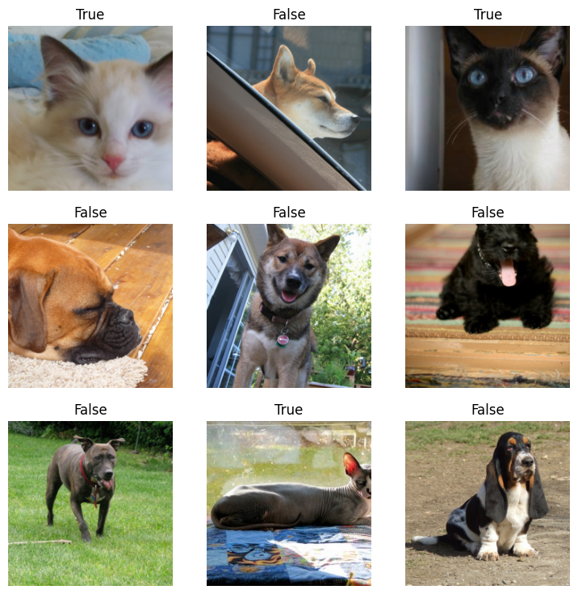
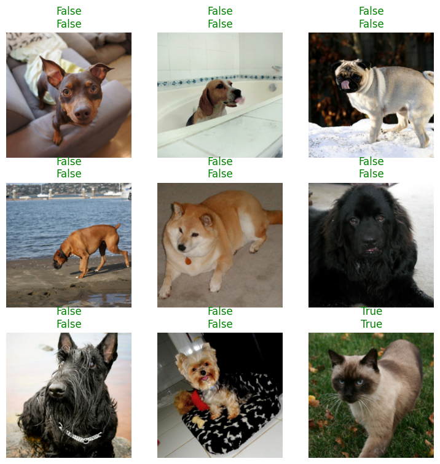

## 1. 필요한 모듈 import

공식 홈페이지에서 모듈을 import 할 때 구분하지 않고 한 번에 전부 불러와서 사용하기 때문에 가독성이 떨어지는 문제가 있었습니다. 그래서 저는 official GitHub을 통해 필요한 모듈들을 찾아 직접 import 하는 방식으로 진행했습니다.

```python
# Official GitHub
from fastai.vision.all import *

# TODO
import fastai

from fastai.callback.schedule import fine_tune

from fastai.metrics import error_rate

from fastai.data.external import untar_data, URLs
from fastai.data.transforms import get_image_files

from fastai.vision.data import ImageDataLoaders
from fastai.vision.augment import Resize
from fastai.vision.learner import vision_learner
from fastai.vision.models.tvm import resnet34
```

필요한 모듈들을 찾으면서 헷갈릴 수 있는 부분을 발견했습니다. ➡️ `fastai.vision.data`에서 `fastai.data`를 import 하기 때문에 `fastai.vision.all`을 import 하면 `fastai.data`에 있는 모듈들을 사용할 수 있게 되어 있습니다.

## 2. Loading data

제공되는 데이터를 사용하기 위해서는 `untar_data`와 `URLs`를 사용하면 됩니다. `untar_data`의 반환 값은 `Path`객체이며 정확히는 `pathlib.PosixPath`로 반환 됩니다.

💭 아마 `URLs`에 존재하는 확장자가 대부분 `.tar`이기 때문에 `.tar`을 압축 해제한다는 의미에서 `untar_data`라는 method name이 붙은 것 같습니다.

`untar_data`를 통해 기본적인 경로를 가져오고 나서 이미지가 있는 폴더에서 필요한 이미지를 가져오기 위해 `get_image_files`라는 method를 사용합니다.

```python
path = untar_data(url=URLs.PETS)
files = get_image_files(path=path/"images")

print(files[0])
  >> "/root/.fastai/data/oxford-iiit-pet/images/havanese_178.jpg"
print(len(files))
  >> 7390
```

fast.ai의 `ImageDataLoaders`을 통해 dataloader를 만들 수 있습니다.

그 중에서도 `files`를 보고 label을 판단하도록 하는 `from_name_func` method를 사용했습니다.

`from_name_func`의 `label_func`는 string type을 입력받아 label을 반환해주는 함수입니다. (해당 task에서 label은 cat-True / dog-False 입니다.)

```python
dls = ImageDataLoaders.from_name_func(path=path,
                                      fnames=files,
                                      # 고양이 이미지의 파일명 첫 글자가 대문자 / 강아지 이미지의 파일명 첫 글자가 소문자
                                      label_func=lambda x:x[0].isupper(),
                                      item_tfms=Resize(224))
```

## 3. Sample Image 살펴보기

`show_batch()`를 통해 labeling과 transform이 잘 되었는지 확인할 수 있으며 해당 method는 최대 10개까지 확인할 수 있습니다.

```python
dls.show_batch()
```

{: class="align-center"}

## 4. Training

### 4.1 Learner 준비

`vision_learner`를 통해 학습에 필요한 것들을 설정할 수 있습니다. 예를 들면, optimizer, initialization이 있습니다. 또한 대부분의 argument들의 값이 자주 사용하는 값으로 설정되어 있어 편리합니다.

torchvision에서 제공하는 모델을 가져와 사용하고 싶다면 `fastai.vision.models.tvm`에서 모델을 불러와 사용할 수 있습니다.

```python
learn = vision_learner(dls = dls,
                      arch = resnet34,
                      metrics=error_rate) # error_rate = 1 - accuracy
```

### 4.2 Fine-tuning

Learner의 `fine_tune` method를 사용해 학습을 시작할 수 있습니다.

`fine_tune`에는 미세 조저이 필요한 세부 파라미터들을 설정할 수 있는데 대표적으로 `epochs`, `base_lr`, `lr_mult` 등이 있습니다.

`fine_tune`의 결과 값은 `(epoch, train_loss, valid_loss, error_rate, time)`순으로 확인할 수 있습니다.

```python
learn.fine_tune(epochs=1)
  >> [0, 0.05005466565489769, 0.015708547085523605, 0.004736130125820637, '00:52']
```

## Prediction & Result

Learner의 `predict` method를 사용해 결과를 확인할 수 있고 `(label, index, probability)` 순으로 반환 해줍니다.

```python
learn.predict(files[0])
  >> ('False', tensor(0), tensor([1.0000e+00, 5.8280e-08]))
```

또한 위에서처럼 이미지와 함께 보고 싶다면 `learn.show_results()`를 사용해 볼 수 있습니다.

{: class="align-center"}

## ※ Reference

- [fast.ai](https://docs.fast.ai/)
- [fast.ai GitHub](https://github.com/fastai/fastai)
