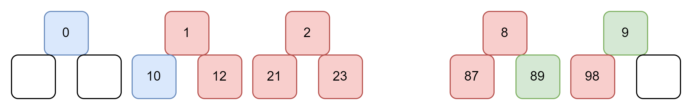
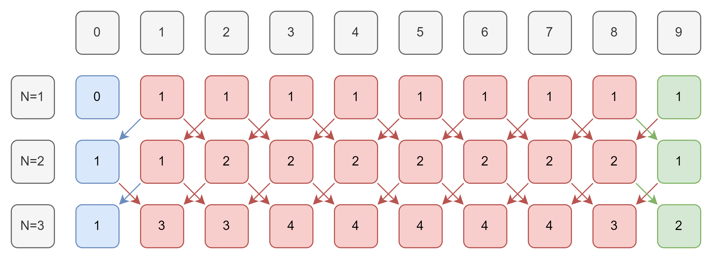

이번에 해결해 볼 문제는 백준에 있는 [10844번 쉬운 계단 수](https://www.acmicpc.net/problem/10844)입니다.

---

## 문제 설명

1. 45656과 같이 인접한 모든 자리의 차이가 1인 수를 계단 수라고 합니다.
2. N이 주어질 때, 길이가 N인 계단 수가 총 몇 개 있는지 구하면 됩니다.(단, 0으로 시작하는 수는 계단 수가 아닙니다.)

## 문제 해결 아이디어

- 문제 자체를 이해하는 것은 큰 어려움이 아닐 것 같습니다.
- 그러나 어떤 규칙성이 있는지를 이해하기 위해서는 가장 간단한 예시를 생각해보는 것이 좋습니다.
  {: class="align-center"}
  - 위의 그림에서 볼 수 있듯이 N이 1, 2, ..., N일 때 까지 차례대로 0과 9의 개수만 추적할 수 있다면 계단 수를 구할 수 있습니다.
  - 그러기 위해서는 끝자리가 0 ~ 9 중 어떤 숫자인지를 추적해야 합니다. 왜냐하면 계단수가 무한히 증가 또는 무한히 감소해서 0과 9가 될 수 있기 때문에 0과 9만 추적하기 보다는 끝자리 수를 계속해서 추적해야합니다.
- 위의 설명을 그림으로 나타내면 다음과 같습니다.
  {: class="align-center"}

## 문제 해결 코드

```python
import sys

input = sys.stdin.readline

N = int(input())

table1 = [0] + [1 for _ in range(9)]
table2 = [0] * 10

for _ in range(N - 1):
    table2[0] = table1[1]
    for i in range(1, 9):
        table2[i] = table1[i - 1] + table1[i + 1]
    table2[9] = table1[8]
    table1 = [i for i in table2]
    table2 = [0] * 10

print(sum(table1) % 1000000000)
```
