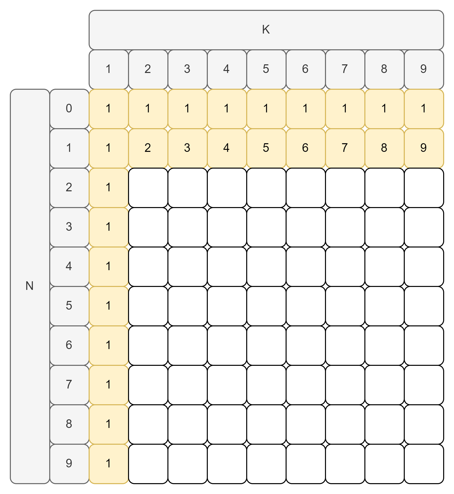
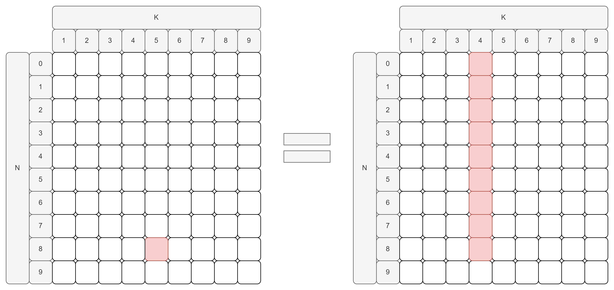
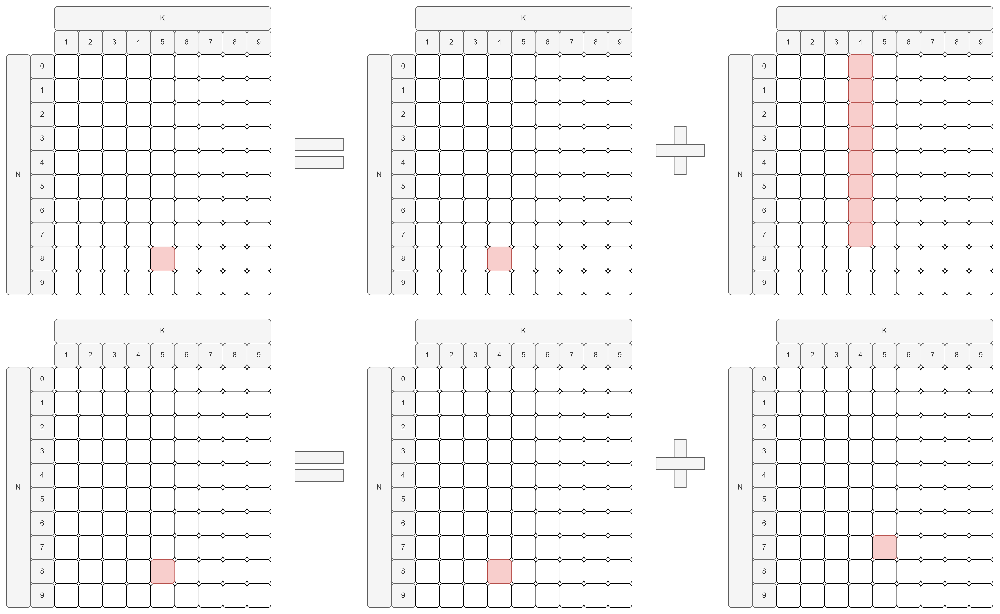
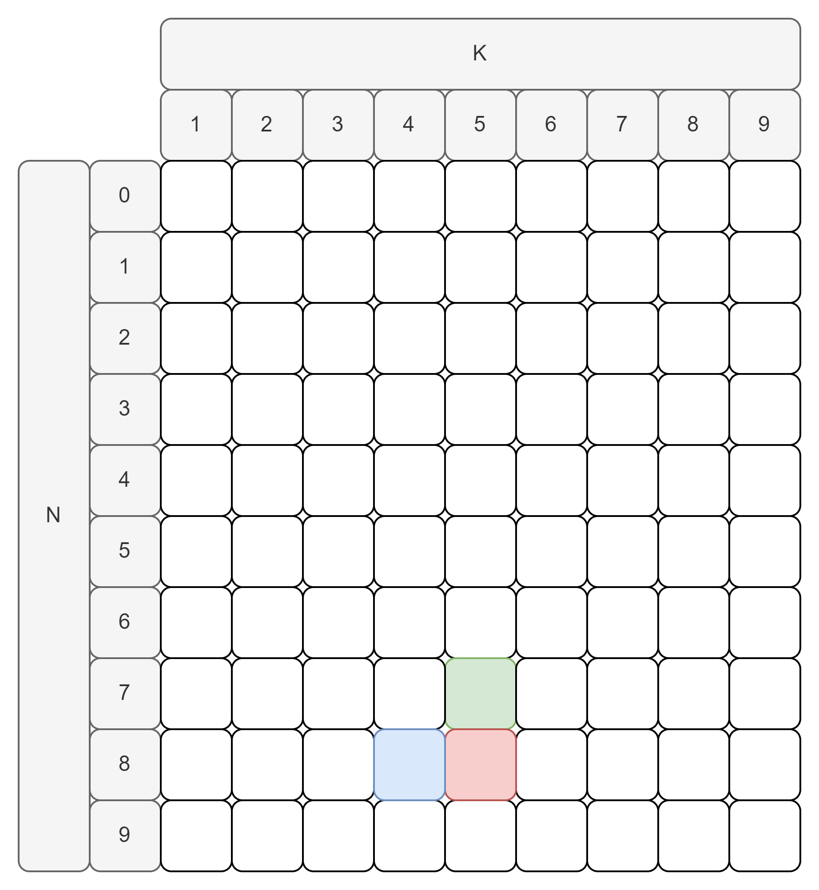

이번에 해결해 볼 문제는 백준에 있는 [2225번 합분해](https://www.acmicpc.net/problem/2225)입니다.

---

## 문제 설명

1. ０부터 Ｎ가지의 정수 Ｋ개를 더해서 그 합이 Ｎ이 되는 경우의 수를 구하면 됩니다.
2. 이때 덧셈의 순서가 바뀐 경우는 다른 경우로 세야 합니다.

---

## 문제 해결 아이디어

- $N = 1$인 경우와 $K = 1$인 경우는 경우의 수가 정해져 있습니다.

  - $N = 1$일 때 경우의 수는 $k$개 입니다. ($k \in K$)
  - $K = 1, n = 0$일 때 경우의 수는 1개 입니다. ($n \in N$)

{: class="align-center" width="500" height="500"}

- $N \ge 2$인 경우와 $K \ge 2$인 경우는 예시와 함께 살펴보겠습니다.

  - $N = 8, K = 5$일 때, 다음과 같이 표기할 수 있습니다.
    - 0이 한 개의 자리를 차지하는 경우 -> [0, 나머지 8이 4개로 나눠지는 경우] == [0, (8, 4)]
    - 1이 한 개의 자리를 차지하는 경우 -> [1, 나머지 7이 4개로 나눠지는 경우] == [1, (7, 4)]
  - 그렇다면 아래와 같이 표시할 수 있습니다.

    - $(8, 5) = [0, (8, 4)] + [1, (7, 4)] + \cdots + [7, (1, 4)] + [8, (0, 4)]$

  - 여기서 중요한 규칙을 발견할 수 있습니다.
    - $(8, 5) = \sum_{i=0}^8[i, (8-i, 4)]$
    - 위의 식을 일반화 하면, $(N, K) = \sum_{i=0}^N[i, (N-i, K-1)]$처럼 표현할 수 있습니다.
  - 위의 식이 직관적이지 않다면 아래와 같이 table 형태로 그릴 수 있습니다.

    {: class="align-center"}

  - 또한 위의 그림을 아래와 같이 계산 할 수 있습니다.

    {: class="align-center"}

  - 따라서 $(N, K) = (N-1, K) + (N, K-1)$로 나타낼 수 있으며 아래 그림과 같습니다.

    - <span style="background-color: #ffdce0; font-size:150%">(8, 5)</span> = <span style="background-color: #dcffe4; font-size:150%">(7, 5)</span> + <span style="background-color: #f1f8ff; font-size:150%">(8, 4)</span>

    {: class="align-center" width="500" height="500"}

---

## 문제 해결 코드

위의 아이디어를 종합하면 아래와 같이 코드를 작성할 수 있습니다.

```python
import sys

input = sys.stdin.readline

N, K = map(int, input().split())

table = [[0 for _ in range(K)] for _ in range(N + 1)]

for i in range(N + 1):
    table[i][0] = 1
for j in range(K):
    table[0][j] = 1
    table[1][j] = j + 1

for i in range(2, N + 1):
    for j in range(1, K):
        table[i][j] = table[i][j - 1] + table[i - 1][j]

print(table[N][K - 1] % 1000000000)
```

---

## 느낀 점

🤔 이번 문제는 약간의 운도 필요했던 것 같습니다. 저 같은 경우 입력의 크기가 크지 않았기 때문에 이를 2차원 행렬로 코드를 구성할 생각을 미리 한 상태에서 문제를 해결 하고자 했습니다. 또한 이렇게 구성된 행렬에서 $(N, K) = (N-1, K) + (N, K-1)$로 정답을 구할 수 있지 않을까 하는 막연한 생각에서 해당 문제를 해결해 나가기 시작했습니다.

🤔 그러나 시작점이 달랐다면 꽤 오랜시간이 걸리거나 해결하지 못했을 것 같습니다. 또한 해당 문제가 만약 코딩 테스트에 출제 된다면 꽤 높은 확률로 정확한 답보다는 "이렇게 하니깐 되네"하면서 해결하고 넘어갈 것 같습니다.

🤔 이러한 문제들을 많이 접하면서 코딩 테스트에 이러한 문제가 출제 되었을 때 당황하는 일이 없도록 해야할 것 같습니다.
