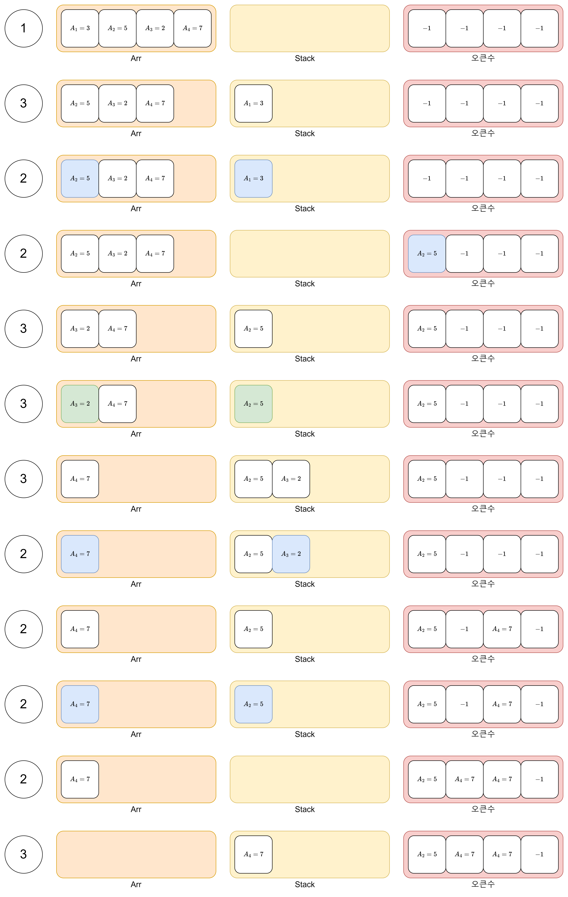

이번에 해결해 볼 문제는 백준에 있는 [17298번 오큰수](https://www.acmicpc.net/problem/17298)입니다.

---

## 문제 설명

- 크기가 N인 수열 $A = A_1, A_2, \dots , A_N$이 있을 때 각 원소 $A_i$에 대해서 오큰수를 구하면 됩니다.
- $A_i$의 오큰수는 $A_i$보다 오른쪽에 있으면서 $A_i$보다 큰 수 중에서 가장 왼쪽에 있는 수를 의미합니다.
- 오큰수가 없는 경우 오큰수는 -1로 합니다.

## 문제 해결 아이디어

- 비어있는 stack을 하나 준비합니다.
- 수열 $A$를 1부터 N까지 차례대로 하나씩 꺼내어 stack으로 집어 넣습니다.
  - 만약 $A_1$이 stack으로 들어가 있다고 할 때 $A_1$의 오큰수는 남은 수열 $A_2, A_3, \dots, A_N$에서 찾을 수 있습니다.
- 알고리즘의 순서는 다음과 같습니다.

  ① 초기 상태 (전부 오큰수가 없다고 가정합니다.)\
  ② Stack이 비어있지 않고 stack의 마지막 원소가 비교하고자 하는 원소 $A_i$보다 작으면 stack의 마지막 원소의 오큰수는 $A_i$가 됩니다.\
  ③ Stack이 비어있거나 stack의 마지막 원소가 $A_i$보다 크면 오큰수를 찾을 수 없으므로 $A_i$를 stack에 삽입합니다.

- 위의 방법을 그림으로 나타내면 아래와 같습니다.(그림에서의 1번, 2번, 3번은 위의 알고리즘의 순서를 뜻합니다.)

  {: class="align-center"}

## 문제 해결 코드

```python
import sys

input = sys.stdin.readline

N = int(input())
arr = list(map(int, input().split()))

result = [-1] * N
stack = []

for i in range(N):
    while stack and stack[-1][0] < arr[i]:
        val, idx = stack.pop()
        result[idx] = arr[i]
    stack.append((arr[i], i))

print(*result)
```
