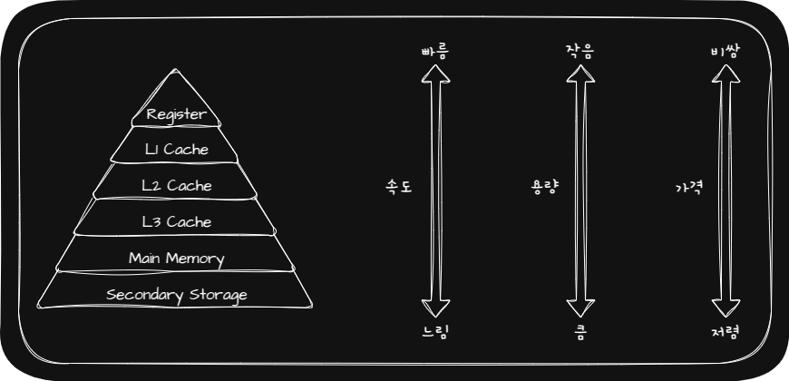

## 🖥️ CPU(Central Processing Unit; 중앙처리장치)

## 🖥️ ALU

ALU(Arithmetic Logic Unit; 산술논리연산장치)란 CPU의 계산을 담당하는 장치입니다.

- ALU가 받아들이는 정보
  - 레지스터(Register)에 저장된 Operand
  - 제어신호(수행할 연산이 무엇인지 제어장치(Control Unit)가 알려주는 신호)
- ALU가 내보내는 정보
  - 연산한 결괏값을 레지스터에 일시적으로 저장
  - 플래그(Flag)를 플래그 레지스터에 저장

## 🖥️ Control Unit

제어장치(Control Unit)란 제어신호를 내보내고 명령어를 해석하는 부품입니다. 

- 제어장치가 받아들이는 정보
  - Clock 신호
  - IR(Instruction Register; 명령어 레지스터)로부터 해석해야 할 명령어
  - 플래그 레지스터 속 플래그 값
  - CPU 외부 장치에서 제어 버스(Control Bus)로 전달된 제어신호
- 제어장치가 내보내는 정보
  - CPU 내부 장치에 전달하는 제어신호(Ex. ALU, Register)
  - 제어 버스로 전달하여 CPU 외부 장치에 전달하는 제어신호(Ex. Memory, I/O Device)

## 🖥️ Register

레지스터(Register)란 CPU 내부의 작은 임시 저장 장치로 프로그램 속 명령어와 데이터가 저장됩니다.

CPU 안에는 다양한 레지스터들이 있고 CPU 종류마다 서로 다른 레지스터들을 가지고 있습니다. 많은 CPU들이 공통적으로 가지고 있는 레지스터는 다음과 같습니다.

|       Register       | Store |
|:---------------------- | :----------|
| PC(Program Counter) \| IP(Insturction Pointer) | 가져올 명령어가 저장되어 있는 메모리 주소를 저장 |
| MAR(Memory Address Register) | PC에 저장된 메모리 주소를 저장 |
| MBR(Memory Buffer Register) \| MDR(Memory Data Register) | MAR에 저장된 메모리 주소에 저장되어 있는 명령어 또는 데이터를 저장 |
| IR(Instruction Register) | MBR에 저장된 명령어를 저장 |
| General Purpose Register | MAR, MBR과 다르게 데이터와 주소 상관없이 저장 |
| Flag Register | ALU 연산 결과 중 Flag를 저장 |
| Stack Pointer | Stack Area에 마지막으로 저장된 값의 주소를 저장 |
| Base Register | 프로그램의 첫 Physical Address를 저장 |
| Limit Register | Logical Address의 최대 크기를 저장 |

## 🖥️ Cache

Cache(캐시)의 등장 이유와 기본 스펙은 다음과 같습니다.

- 캐시 등장 이유: CPU의 연산 속도와 메모리 접근 속도 차이를 줄이기 위해 등장한 SRAM 기반의 저장 장치
- 캐시의 위치: CPU(CPU Core ━ L1 Cache ━ L2 Cache) ━ L3 Cache ━ Memory
- 캐시의 용량: Register < L1 Cache < L2 Cache < L3 Cache < Memory
- 캐시의 속도: Register > L1 Cache > L2 Cache > L3 Cache > Memory

캐시의 이점을 제대로 활용하기 위해서는 Cache Hit Ratio를 높여하는데 이를 위해 캐시는 다음과 같은 참조 지역성 원리(Locality Of Reference, Principle Of Locality)에 따라 메모리로부터 가져올 데이터를 결정합니다.

- 시간 지역성(Temporal Locality): CPU는 최근에 접근했던 메모리 공간에 다시 접근하려는 경향이 존재
- 공간 지역성(Spatial Locality): CPU는 최근에 접근했던 메모리 공간 근처를 접근하려는 경향이 존재

> 💡 Cache Hit Ratio  
> 📢 `Cache Hit Ratio` $=$ `Cache Hit` $/$ $($`Cache Hit` + `Cache Miss`$)$  

## 🖥️ Multi-Core

Multi-Core(Multi-Core Processor)란 CPU Core를 여러 개 포함하고 있는 CPU를 말합니다.

일반적으로 Core의 개수가 증가하면 성능이 증가하지만 연산 속도가 반드시 Core의 개수에 비례해서 증가하지는 않으며 작업량이 적은 경우 Core의 개수가 증가한다고 해서 성능이 좋아지지는 않습니다.

## 🖥️ Multi-Thread

Multi-Thread Processor(Multi-Thread CPU)란 하나의 Core로 여러 명령어를 동시에 처리하는 CPU를 말합니다.

하나의 Core로 여러 명령어를 처리하기 위해서는 하나의 명령어를 처리하는데 필요한 레지스터가 여러 개 있으면 되기 때문에 Multi-Thread Processor에서는 레지스터가 핵심 장치입니다.

> 💡 [하드웨어적 Thread(Logical Processor)](https://jjjuuuun.github.io/posts/Operating-System-Process-Thread/#-thread)  
> 📢 하나의 Core가 동시에 처리하는 명령어 단위

> 💡 소프트웨어적 Thread  
> 📢 하나의 프로그램에서 독립적으로 실행되는 단위