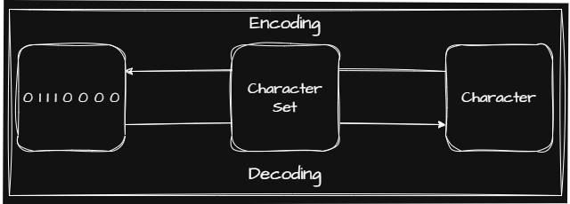

컴퓨터가 이해하는 0과 1로된 정보에는 데이터(Data)와 명령어(Instruction)이 있습니다. 해당 포스트에서는 데이터에 대해 알아보겠습니다.

## 🖥️ 정보 단위

1. 프로그램(Program)의 크기를 표현하는 단위
  
    - $10^3$을 기준으로 그룹화하는 단위

      |   Unit   |  Definition |
      |:-------: | :----------:|
      | $1$ Byte | $8$ Bit     |
      | $1$ KB   | $10^3$ Byte |
      | $1$ MB   | $10^3$ KB   |
      | $1$ GB   | $10^3$ MB   |
      | $1$ TB   | $10^3$ GB   |  

    - $2^{10}$을 기준으로 그룹화하는 단위

      |   Unit   |   Definition  |
      |:-------: | :----------:  |
      | $1$ Byte | $8$ Bit       |
      | $1$ KiB  | $2^{10}$ Byte |
      | $1$ MiB  | $2^{10}$ KiB  |
      | $1$ GiB  | $2^{10}$ MiB  |
      | $1$ TiB  | $2^{10}$ GiB  |

2. CPU(Central Processing Unit; 중앙처리장치)가 한 번에 처리할 수 있는 데이터의 크기를 표현하는 단위

    | Unit         | Definition                         | Example               |
    |:-----------: | :--------------------------------- | :-------------------: |
    | Word         | CPU가 한 번에 처리할 수 있는 데이터의 크기 | 32bit \| 64bit System |
    | Half Word    | Word의 절반 크기                      | |
    | Double Word  | Word의 2배 크기                      | |

## 🖥️ 데이터

컴퓨터는 2진법(Binary)을 사용해 데이터를 표현합니다. 가장 기본적으로 사용되는 데이터인 문자가 2진법으로 어떻게 표현되어 컴퓨터가 인식하는지 알아보겠습니다.

### 🖥️ 문자

컴퓨터가 문자를 인식하도록 하기 위해서는 먼저 사람이 사용하는 문자를 2진법으로 변환하는 규칙을 정해야 합니다. 

이처럼 정해진 규칙을 통해 컴퓨터가 인식할 수 있는 문자들을 문자 집합(Character Set)이라 합니다. 또한 정해진 규칙을 사용해 문자를 2진법으로 변환하는 것을 인코딩(Encoding), 2진법으로 표현된 숫자를 문자로 다시 변환하는 것을 디코딩(Decoding)이라 합니다. 

이를 그림으로 나타내면 다음과 같습니다.

| Charater Encoding | 표현 Bit 수               |언어에 독립적인지 여부   | 문자 집합에 부여된 값을 그대로 사용하는지 여부  | 특징   |
| :---------------: | :---------------------: | :-----------------: | :-----------------------------------: | :---: |
| ASCII             | $7$ Bit로 표현            | ❌ | ⭕  |   |
| Extended ASCII    | $8$ Bit로 표현            | ❌ | ⭕  |   |
| EUC-KR            | $16$ Bit로 표현           | ❌  | ⭕  | 초성, 중성, 종성의 조합으로 이루어진 완성된 하나의 글자를 인코딩하는 방식(완성형 인코딩) |
| CP949             | $16$ Bit로 표현           | ❌  | ⭕  |  |
| UTF-8             | $8$ Bit ~ $32$ Bit로 표현 | ⭕  | ❌(문잡 집합에 부여된 값을 인코딩하여 사용)  | Unicode(여러 나라의 문자들을 표현할 수 있는 통일된 문자 집합) 사용 |
