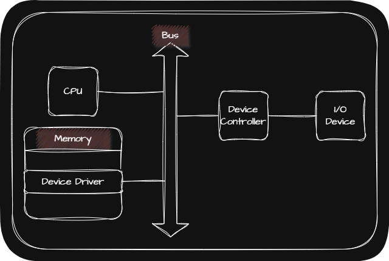
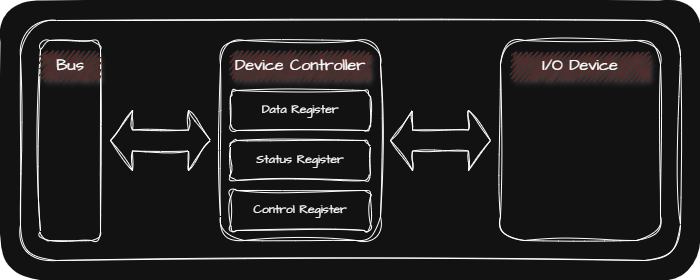
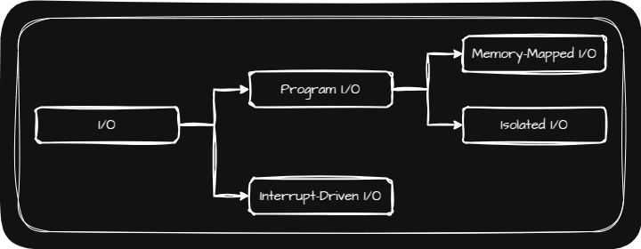

## 🖥️ Device Controller

I/O Device는 각자의 Device Controller를 통해 컴퓨터 내부와 정보를 주고 받습니다. 또한 Device Controller는 하나 이상의 I/O Device와 연결되어 있습니다.

Device Controller가 필요한 이유는 다음과 같습니다.
- 다양한 I/O Device와 정보를 주고 받는 방식을 규격화하기 위해서 필요
- CPU(Central Processing Unit; 중앙처리장치)나 메모리의 전송률(Transfer Rate)에 비해서 I/O Device가 낮은 전송률을 가지고 있기 때문에 필요

Device Controller의 역할은 다음과 같습니다.
- CPU와 I/O Device 간의 통신을 중개
- 오류를 검출
- CPU와 I/O Device의 전송률 차이를 Data Buffering으로 완화

Device Controller의 구조는 다음과 같습니다.

- Data Register
    - CPU와 I/O Device 사이에 주고 받을 데이터가 저장되는 Register
    - Data Buffering을 담당
    - 주고 받는 데이터가 많은 I/O Device에서는 Register 대신 RAM을 사용
- Status Register
    - I/O Device가 <u>I/O 작업을 할 준비가 되었는지</u>, <u>완료가 되었는지</u>, <u>오류가 없는지</u> 상태가 저장되는 Register
- Control Register
    - I/O Device가 수행할 내용에 대한 제어정보와 명령이 저장되는 Register

## 🖥️ Device Driver

Device Driver는 Device Controller의 동작을 감지하고 제어함으로써 Device Controller가 컴퓨터 내부와 정보를 주고받을 수 있게 하는 프로그램입니다.

OS(Operating System)가 연결된 I/O Device의 Device Driver를 인식하고 실행할 수 있다면 해당 장치는 어떤 회사에서 만들어진 제품이든 생김새가 어떻든 상관없이 컴퓨터 내부와 정보를 주고 받을 수 있습니다.

## 🖥️ 다양한 I/O의 종류

### 🖥️ Program I/O

Program I/O는 프로그램의 명령어로 I/O Device를 제어하는 방법입니다.

이 때 CPU가 프로그램 속 명령어를 수행하기 위해서는 I/O Device의 Register 주소를 알아야 하는데 해당 Register 주소를 CPU에게 알려주는 방식에 크게 두 가지 방식이 있습니다.

| Memory-Mapped I/O | Isolated I/O |
| :-:| :-:|
| 메모리를 위한 주소 공간과 I/O Device를 위한 주소 공간을    하나의 주소 공간으로 간주하는 방법  | 메모리를 위한 주소 공간과 I/O Device를 위한 주소 공간을    분리하는 방법 |
| 메모리 주소 공간이 축소 | 메모리 주소 공간이 축소되지 않음 |
| 메모리와 I/O Device에 같은 명령어를 사용 | I/O 전용 명령어 사용 |

### 🖥️ Interrupt-Driven I/O

Interrupt-Drive I/O란 Device Controller에 의해 발생한 Interrupt를 기반으로 하는 I/O를 말합니다.

## 🖥️ PIC(Programable Interrupt Controller)

PIC는 여러 Device Controller에 연결되어 각 Device Controller에서 보낸 Interrupt들의 우선순위를 판별한 뒤 CPU에게 먼저 처리해야할 Interrupt를 알려주는 H/W입니다.

PIC의 Interrupt 처리 과정은 다음과 같습니다.

1. PIC가 Device Controller로부터 온 Interrupt 요청 신호를 받아들임
2. PIC는 Interrupt 우선순위를 판단한 뒤 CPU에게 먼저 처리해야 할 Interrupt 요청 신호를 전달
3. Interrupt를 전달 받은 CPU는 PIC에게 전달 받았다는 확인 신호를 보냄
4. PIC는 Data Bus를 통해 CPU에게 Interrupt Vector를 보냄
5. CPU는 전달 받은 Interrupt Vector를 통해 ISR(Interrupt Service Routine)을 실행

> PIC는 NMI(Non-Maskable Interrupt)까지 우선순위를 판별하지 않으며 PIC가 우선순위를 조정해주는 Interrupt는 Maskable Interrupt입니다.
{: .prompt-info }

## 🖥️ DMA(Direct Memory Access)

DMA란 CPU를 거치지 않고 메모리와 I/O Device 간의 데이터를 주고받는 I/O 방식입니다. DMA를 사용하게 되면 CPU는 오로지 I/O의 시작과 끝에만 관여하면 되기 때문에 CPU의 부담을 줄일 수 있습니다.

DMA Controller는 원래 System Bus를 사용하여 DMA를 수행합니다. 그러나 <u>메모리와 데이터를 주고받을 때</u> 그리고 <u>I/O Device와 메모리를 주고받을 때</u> 총 두 번 System Bus를 사용하기 때문에 CPU의 System Bus 사용을 방해합니다.

이러한 문제점을 해결하기 위해 DMA Controller가 I/O Device와 데이터를 주고 받을 때는 I/O Bus라는 별도의 Bus를 사용합니다. 그 결과 System Bus의 사용을 한 번으로 줄이게 됩니다.

DMA의 과정은 다음과 같습니다.
1. CPU는 DMA Controller에게 I/O를 명령
2. DMA Controller는 CPU 대신 Device Contoller와 상호작용하며 I/O를 수행
3. I/O가 끝나면 DMA Controller는 CPU에게 Interrupt 요청 신호를 전달
