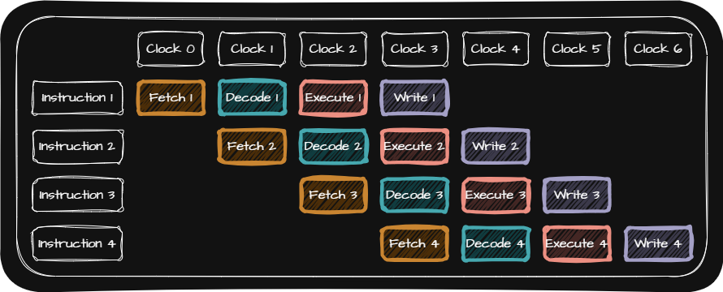

컴퓨터가 이해하는 0과 1로된 정보에는 데이터(Data)와 명령어(Instruction)이 있습니다. 해당 포스트에서는 명령어에 대해 알아보겠습니다.

## 🖥️ Programming Language

- Low-Level Programming Language
  - **기계어(Machine Code)**: 0과 1로 이루어진 명령어 집합
  - **어셈블리어(Assembly Language)**: 기계어를 읽기 편한 상태로 번역한 언어
- High-Level Programming Language
  - High-Level Programming Language ➜ Assembly Language ➜ Machine Code로 변환되어야 함
  - **Compiled Language**: Compiler가 `Source Code` 전체를 보며 오류를 확인하고 기계어로 변환된 결과인 `Object Code`를 얻음
  - **Interpreter Language**: Interpreter가 `Source Code`를 한 줄씩 기계어로 변환하고 실행

## 🖥️ 명령어 구조

명령어는 Opcode(Operation Code)와 Operand로 구성되어 있습니다.

### 🖥️ Opcode

Opcode는 명령어에서 명령 즉, 수행할 연산이 무엇인지를 나타내는 부분입니다. Opcode의 종류와 생김새는 CPU(Central Processing Unit; 중앙처리장치)마다 다르지만 크게 분류하면 다음과 같습니다.

- 데이터 전송
- 산술 / 논리 연산
- 제어 흐름 변경
- 입출력 제어

### 🖥️ Operand

Operand는 연산에 사용할 데이터 또는 주소(Address)를 나타내는 부분입니다. Opcode에 따라 필요한 Operand의 수가 달라질 수 있는데 달라지는 Operand의 개수에 따라 명령어를 다음과 같이 나누어 부릅니다.

  |       Instruction       | Operand 개수 |
  |:----------------------: | :----------:|
  | $0$-Address Instruction | $0$개        |
  | $1$-Address Instruction | $1$개        |
  | $2$-Address Instruction | $2$개        |
  | $3$-Address Instruction | $3$개        |

## 🖥️ 주소 지정 방식

Operand에는 주로 유효 주소(Effective Address)를 명시하며 주소 지정 방식이란 유효 주소(Effective Address)를 찾는 방법을 말합니다. 

> 💡 유효 주소(Effective Address)  
> 📢 연산의 대상이 되는 데이터가 저장된 위치(Ex. Memory Address, Register Address)

> ❓ Operand에 데이터 대신 주소를 포함시키는 이유가 무엇인가요?  
> 🗣️ 명령어의 고정된 길이 때문에 다양한 데이터를 표현하기 제한되기 때문입니다.

주소 지정 방식의 종류는 다음과 같습니다.

|       Addressing Mode                                     | Operand |
|:--------------------------------------------------------- | :----------|
| 즉시 주소 지정 방식(Immediate Addressing Mode)                | 연산의 대상이 되는 데이터를 직접 명시 |
| 직접 주소 지정 방식(Direct Addressing Mode)                   | 유효 주소(Memory Address)를 직접 명시 |
| 간접 주소 지정 방식(Indirect Addressing Mode)                 | 유효 주소(Memory Address)를 저장한 메모리 주소를 명시 |
| 레지스터 주소 지정 방식(Register Addressing Mode)              | 유효 주소(Register Address)를 직접 명시 |
| 레지스터 간접 주소 지정 방식(Register Indirect Addressing Mode) | 유효 주소(Memory Address)를 저장한 레지스터 주소를 명시 |
| 스택 주소 지정 방식(Stack Addressing Mode)                    | Operand 없이 Opcode를 통해 스택 주소 지정 방식임을 알아내고 Stack Pointer(Register)를 사용해 유효 주소(Memory Address)를 알아냄 |
| 변위 주소 지정 방식(Displacement Addressing Mode)             | Operand와 특정 레지스터의 값을 더하여 유효 주소를 얻는 방법(Ex. Relative, Base-Register Addressing Mode) |
| 상대 주소 지정 방식(Relative Addressing Mode)                 | Operand와 PC(Program Counter)의 값을 더하여 유효 주소를 얻는 방법(Ex. `if`문과 같이 분기하는 경우) |
| 베이스 레지스터 주소 지정 방식(Base-Register Addressing Mode)   | Operand와 Base Register의 값을 더하여 유효 주소를 얻는 방법 |

## 🖥️ Instruction Cycle

Instruction Cycle이란 하나의 명령어를 처리하는 정형화된 흐름을 말합니다. 

- **Fetch Cycle**: 메모리에 있는 명령어를 CPU로 가지고 오는 단계
  1. PC(Program Counter)에 다음 명령어의 메모리 주소를 저장
  2. PC에 저장되었던 메모리 주소를 MAR(Memory Address Register)로 이동
  3. MAR에 저장된 메모리 주소와 제어 신호를 통해 해당 메모리 주소에 저장되어있던 명령어를 가져와 MBR(Memory Buffer Register)에 저장
  4. PC가 증가하여 다음 명령어를 읽어들일 준비
  5. MBR에 저장된 명령어를 IR(Instruction Register)로 이동
- **Execution Cycle**: 제어 장치(Control Unit)가 IR에 담긴 값을 해석하고, 제어 신호를 발생시키는 단계
- **Indirect Cycle**: 추가적으로 메모리에 접근이 필요한 경우(Ex. 간접 주소 지정 방식(Indirect Addressing Mode))
- **Interrupt Cycle**: CPU는 Execution Cycle이 끝난 후 명령어를 Fetch 하기 전 항상 Interrupt 여부를 확인하고 Interrupt가 발생한 경우 실행하는 단계

### 🖥️ Interrupt

Interrupt란 CPU의 작업을 방해하는 신호를 말하며 Interrupt 종류는 다음과 같습니다.

#### 🖥️ Exception(Synchronous Interrupt)

Exception은 CPU에 의해서 발생하는 Interrupt로 Exception이 발생하면 CPU는 하던 일을 중단하고 해당 Exception을 처리합니다.

|      Exception     | Definition                                                                         | Example |
|:-----------------: | :--------------------------------------------------------------------------------- | :----- |
| Fault              | Exception을 처리한 직후 Exception이 발생한 명령어부터 실행을 재개하는 Exception              | 데이터가 메인 메모리가 아닌 보조기억장치에 있는 경우 Fault를 발생시킴 |
| Trap               | Exception을 처리한 직후 Exception이 발생한 다음 명령어부터 실행을 재개하는 Exception          | Debugging |
| Abort              | CPU가 실행중인 프로그램을 강제로 중단시킬 수 밖에 없는 심각한 오류를 발견했을 때 발생하는 Exception | |
| Software Interrupt | System call이 발생했을 때 발생하는 Exception                                            | |

#### 🖥️ Hardware Interrupt(Asynchronous Interrupt)

Hardware Interrupt는 주로 I/O Device에 의해서 발생하는 Interrupt입니다.

- **Non-Maskable Interrupt**: Hardware 고장으로 인한 Interrupt와 같이 반드시 먼저 처리해야 하는 Interrupt
- **Maskable Interrupt**: Interrupt Flag로 막을 수 있는 Interrupt
  1. I/O Device에서 CPU로 Interrupt 요청 신호 전달
  2. CPU는 Interrupt 요청 신호를 확인하고 Interrupt Flag를 통해 현재 Interrupt 여부를 확인
  3. Interrupt를 받아들일 수 있다면 CPU는 지금까지의 작업을 Stack Area에 백업
  4. CPU는 Interrupt Vector를 참조하여 Interrupt Service Routine을 실행
  5. Interrupt Service Routine이 끝나면 백업해 둔 작업을 복구하여 실행을 재개

> 💡 Interrupt Service Routine(Interrupt Handler)  
> 📢 Interrupt를 처리하기 위한 프로그램

> 💡 Interrupt Service Routine(Interrupt Handler)  
> 📢 Interrupt Service Routine가 저장된 메모리의 시작 주소

## 🖥️ 명령어 병렬 처리 기법(ILP)

명령어 병렬 처리 기법(ILP; Instruction-Level Parallelism)이란 명령어를 동시에 효율적으로 처리하는 기법을 말합니다.

명령어 병렬 처리 기법을 알아보기에 앞서 Instruction Cycle을 Clock 단위로 나눈 Instruction Pipeline을 살펴보면 다음과 같습니다.

1. 명령어 인출(Instruction Fetch)
2. 명령어 해석(Instruction Decode)
3. 명령어 실행(Execute Instruction)
4. 결과 저장(Write Back)

> ⚠️ 위와 같이 4단계가 아닌 2단계 혹은 5단계로 나누기도 합니다.

### 🖥️ Instruction Pipelining

Instruction Pipelining이란 위의 그림처럼 동시에 여러 개의 명령어를 겹쳐서 실행하는 기법입니다. 이러한 Instruction Piepelining은 성능 향상을 가져오지만 Pipeline Hazzard가 발생한 경우 성능 향상을 하지 못합니다.

Pipeline Hazzard에는 다음과 같은 것들이 포함되어 있습니다.

- Data Hazzard: 명령어들 사이에 Data Dependecy가 발생한 경우(Ex. `a = 1` ➜ `b = a + 1`)
- Control Hazzard: PC가 순차적으로 증가하지 않고 갑자기 변하는 경우(Ex. `if`문과 같은 분기)
- Structural Hazzard(Resource Hazzard): 서로 다른 명령어들이 동시에 같은 CPU Resource(Ex. ALU, Register)를 사용하는 경우

### 🖥️ Superscalar

Superscalar란 위의 그림처럼 여러 개의 Instruction Pipeline을 두는 기법이며 Superscalar 사용이 가능한 CPU를 Superscalar Processor(Superscalar CPU)라고 합니다.

Superscalar를 사용하면 같은 Clock에서 동시에 Fetch가 가능하기 때문에 이론적으로는 Instruction Pipeline의 개수에 비례하여 처리 속도가 증가합니다. 하지만 Pipeline Hazzard가 발생할 수 있기 때문에 실제로는 Instruction Pipeline의 개수에 비례하여 처리 속도가 증가하지는 않습니다.

### 🖥️ OoOE(Out-of-Order Execution)

OoOE(Out-of-Order Execution; 비순차적 명령어 처리)란 Instruction Pipeline의 중단을 방지하고자 명령어를 순차적으로 처리하지 않는 기법입니다.

OoOE는 오늘날 CPU 성능 향상에 크게 기여한 기법이자 대부분의 CPU가 사용하는 기법입니다.

## 🖥️ 명령어 집합 구조(ISA)

ISA(Instruction Set Architecture; 명령어 집합 구조)란 CPU가 이해할 수 있는 명령어의 모음입니다.

그렇기 때문에 CPU마다 ISA가 달라질 수 있습니다. 대표적으로 ISA가 달라지면 명령어의 형태, 제어장치가 명령어를 해석하는 방식, 사용되는 레지스터의 종류와 개수, 메모리 관리 방법 등이 달라집니다.

즉, ISA는 CPU의 언어 모음이자 H/W가 S/W를 어떻게 이해할지에 대한 약속이라 할 수 있습니다.

이러한 ISA는 어떻게 설계하는지에 따라 크게 CISC(Complex Instruction Set Computer)와 RISC(Reduced Instruction Set Computer)로 나눕니다.

|             CISC              | RISC(load-store 구조) |
|:----------------------------: | :----------:|
| 복잡하고 다양한 명령어             | 단순하고 적은 명령어(`load`, `store`) |
| 가변 길이 명령어                  | 고정 길이 명령어 |
| 다양한 주소 지정 방식              | 적은 주소 지정 방식 |
| 프로그램을 이루는 명령어의 수가 적음  | 프로그램을 이루는 명령어의 수가 많음 |
| 여러 Clock에 걸쳐 명령어 수행      | 1 Clock 내외로 명령어 수행 |
| Instruction Pipelining이 어려움 | Instruction Pipelining이 쉬움 |
| Intel의 CPU(x86, x86-64)       | Apple의 CPU(ARM) |
