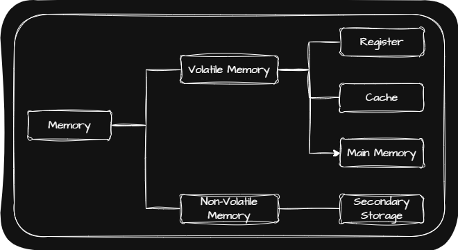

## 🖥️ 휘발성 메모리 VS 비휘발성 메모리

|              | Computer 부품 | Example |
|:----------------------: | :----------:| :----------:|
| Volatile Memory   (휘발성 메모리) | Register \| Cache \| Main Memory | RAM, ROM |
| Non-Volatile Memory   (비휘발성 메모리) | Secondary Storage | HDD, SSD, CD-ROM, USB |

휘발성 메모리와 비휘발성 메모리의 특징 때문에 일반적으로 비휘발성인 Secondary Storage에는 <u>보관할 대상</u>을 저장하고, 휘발성인 Register, Cache, Main Memory에는 <u>실행할 대상</u>을 저장하여 사용합니다.

## 🖥️ RAM

Main Memory에 사용하는 메모리 종류에는 크게 RAM과 ROM 두 가지가 있습니다. 그리고 Main Memory라 함은 보통 RAM을 말합니다.

앞서 말했듯이 Main Memory에는 <u>실행할 대상</u>을 저장하기 때문에 RAM의 용량이 커지면 많은 프로그램들을 동시에 빠르게 실행하는데 유리하며 반대로 용량이 작으면 <u>보관할 대상</u>을 저장하고 있는 Secondary Storage에 접근하는 일이 많아지기 때문에 실행 시간이 길어집니다.

## 🖥️ RAM의 종류

RAM에는 크게 DRAM(Dynamic RAM)과 SRAM(Static Dynamic RAM)이 있습니다.

|  | DRAM | SRAM |
| :----------:| :----------:| :----------:|
| 데이터 재활성화 | 필요함 | 필요하지 않음 |
| 속도 | 느림 | 빠름 |
| 가격 | 저렴함 | 비쌈 |
| 집적도 | 높음 | 낮음 |
| 소비 전력 | 적음 | 높음 |
| 사용 용도 | Main Memory | Cache |

### 🖥️ DRAM의 발전

DRAM은 SDRAM(Synchronous Dynamic RAM), DDR SDRAM(Double Data Rate SDRAM)으로 발전했습니다.

SDRAM은 Clock 신호와 동기화된 발전된 형태의 DRAM입니다. 이후 DDR SDRAM이 나오면서 SDR SDRAM(Single Data Rate SDRAM)이라 부릅니다.

DDR SDRAM은 대역폭(Data Rate)이 두 배 넓은 SDRAM입니다. Main Memory로서 DDR SDRAM을 가장 많이 사용하며 위의 그림과 같이 대역폭의 수를 $2$배씩 늘려가며 더 큰 대역폭을 가지는 DDR SDRAM을 사용합니다.

> **대역폭(Data Rate)**: 데이터를 주고 받는 길의 너비
{: .prompt-tip }

## 🖥️ RAM의 주소 공간

메모리의 주소는 물리주소(Physical Address)와 논리주소(Logical Address)로 나누어집니다.

물리주소는 정보가 실제로 저장된 H/W의 주소를 의미하고 논리주소는 CPU(Central Processing Unit; 중앙처리장치)와 실행중인 프로그램이 사용하는 주소입니다. 또한 각 프로그램이 실행중일 때 논리주소 시작이 $0$번지이기 때문에 논리주소를 프로그램의 시작접으로부터 떨어진 거리라고 할 수도 있습니다.

### 🖥️ MMU(Memory Management Unit; 메모리 관리 장치)

CPU가 물리주소를 사용하기 위해서는 논리주소를 물리주소로 변환해야 하는데 이 때 각 프로그램이 서로의 물리 주소를 침범해서는 안됩니다. 이처럼 논리주소를 물리주소로 변환해주는 장치를 MMU라 합니다.

정리하자면 MMU란 논리주소를 물리주소로 변환하는 장치이며 CPU와 Address Bus 사이에 위차한 H/W입니다.

MMU는 [Base-Register Addressing Mode](https://jjjuuuun.github.io/posts/Computer-Architecture-Instruction/#%EF%B8%8F-%EC%A3%BC%EC%86%8C-%EC%A7%80%EC%A0%95-%EB%B0%A9%EC%8B%9D)를 사용해 논리주소를 물리주소로 변경하는데 각 프로그램이 서로의 물리주소 영역을 침범하지 않기위해 [Limit Register](https://jjjuuuun.github.io/posts/Computer-Architecture-CPU/#%EF%B8%8F-register)와 비교하여 변환합니다.

