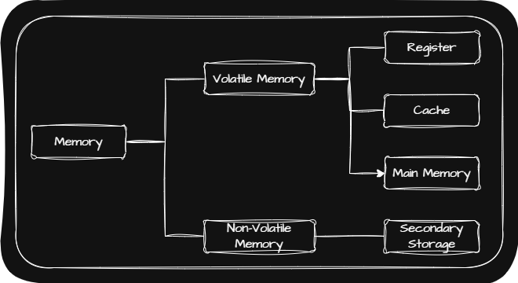
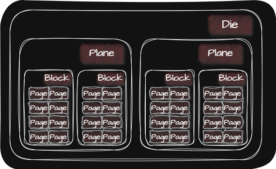
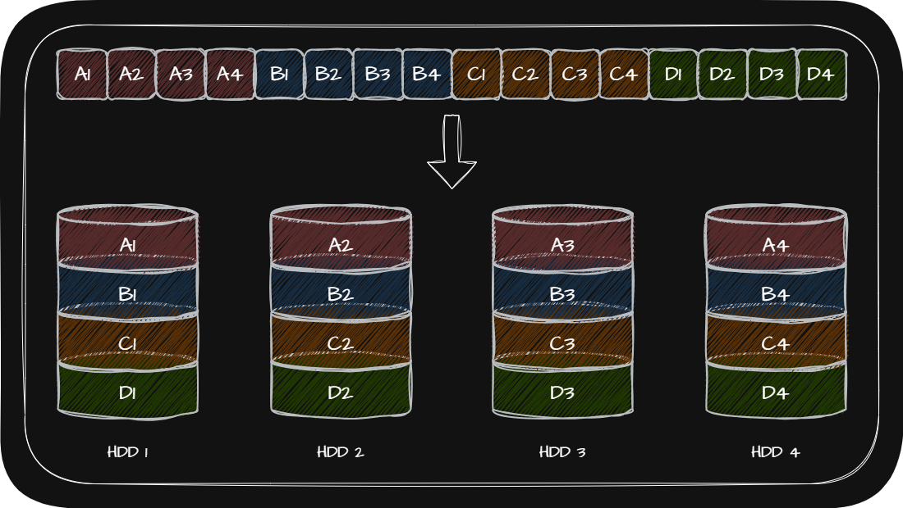
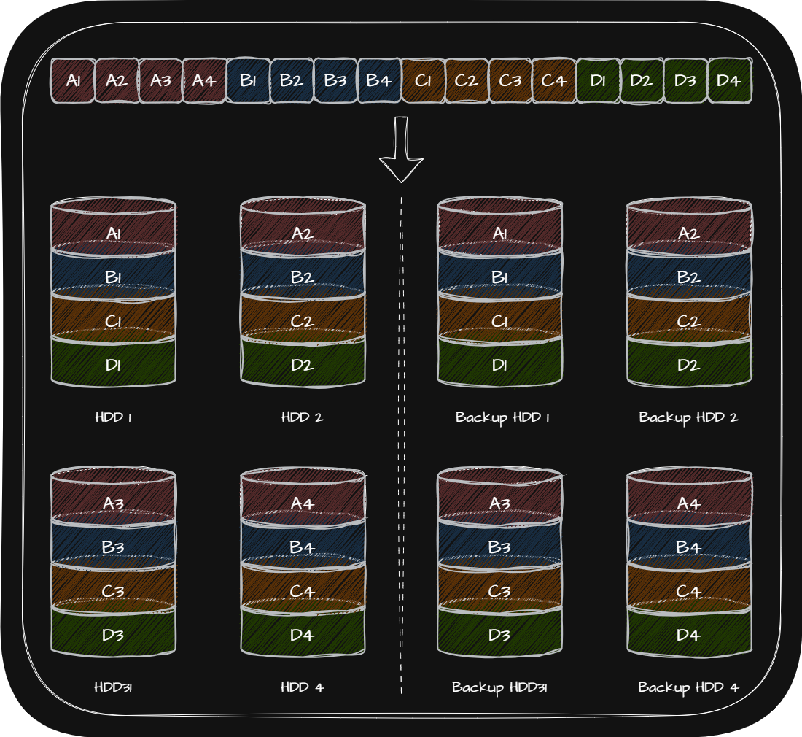
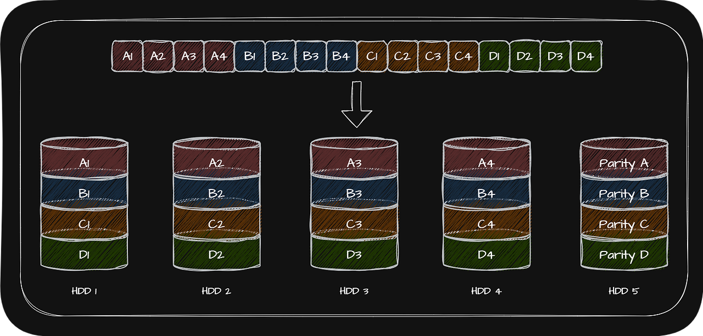
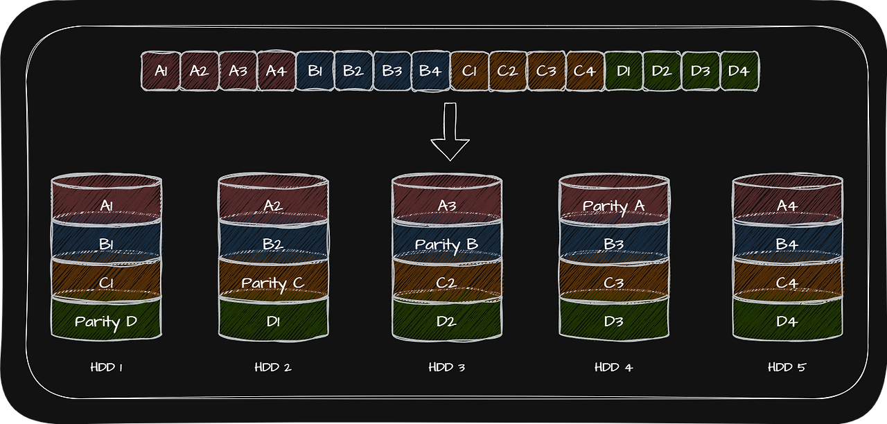
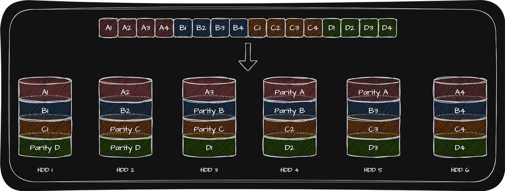

## 🖥️ 휘발성 메모리 VS 비휘발성 메모리

|              | Computer 부품 | Example |
|:----------------------: | :----------:| :----------:|
| Volatile Memory   (휘발성 메모리) | Register \| Cache \| Main Memory | RAM, ROM |
| Non-Volatile Memory   (비휘발성 메모리) | Secondary Storage | HDD, SSD, CD-ROM, USB |

휘발성 메모리와 비휘발성 메모리의 특징 때문에 일반적으로 비휘발성인 Secondary Storage에는 <u>보관할 대상</u>을 저장하고, 휘발성인 Register, Cache, Main Memory에는 <u>실행할 대상</u>을 저장하여 사용합니다.

## 🖥️ HDD(Hard Disk Drive)

HDD는 자기적인 방식으로 데이터를 저장하는 장치입니다. HDD는 주로 대용량 저장 장치가 필요한 작업이나 서버에서 많이 사용합니다.

HDD의 구성 요소는 다음과 같습니다.
- **Platter**: 데이터가 저장되는 구성 요소
- **Spindle**: Platter를 회전시키는 구성 요소
- **Head**: 데이터를 읽고 쓰는 구성 요소
- **Disk Arm**: Head를 원하는 위치로 이동시키는 구성 요소

Platter의 구성 요소는 다음과 같습니다.
- **Track**: Platter를 여러 동심원으로 나누었을 때 그 중 하나의 원
- **Sector**: Track을 일정한 조각으로 나눈 것이며, HDD의 가장 작은 전송 단위
- **Block**: 하나 이상의 Sector를 묶은 것
- **Cylinder**: 여러 겹의 Platter 상에서 같은 Track이 위치한 곳을 모아 연결한 논리적 단위

HDD에 저장된 데이터의 접근하는 시간은 크게 다음과 같이 나누어집니다.
- **Seek Time**: 접근하려는 데이터가 저장된 Track까지 Head를 이동시키는 시간
- **Rotational Letency**: Head가 있는 있는 곳으로 Platter를 회전시키는 시간
- **Transfer Time**: HDD와 컴퓨터 간에 데이터를 전송하는 시간

## 🖥️ SSD(Solid State Drive)

Flash Memory란 전기적으로 데이터를 쓸 수 있는 반도체 기반의 저장 장치입니다. Flash Memory에는 크게 NAND Flash Memory와 NOR Flash Memory가 있습니다.

NAND Flash Memory는 NAND Gate를 기반이며 대용량 저장 장치로 많이 사용됩니다. SSD가 바로 NAND Flash Memory로 구성됩니다.

NOR Flash Memory는 NOR Gate를 기반으로 만들어진 메모리입니다.

NAND Flash Memory의 구성은 다음과 같습니다.

Cell들이 모여 만들어진 단위를 Page, Page들이 모여 만들어진 단위를 Block, Block들이 모여 만들어진 단위를 Plane, Plane들이 모여 만들어진 단위를 Die라고 합니다.

### 🖥️ Cell

NAND Flash Memory는 데이터를 저장하는 가장 작은 단위로 Cell을 사용합니다. 하나의 Cell에 몇 Bit를 저장할 수 있는지에 따라서 다음과 같이 NAND Flash Memory의 종류가 나뉩니다.

|              | SLC(Single Level Cell) | MLS(Multiple Level Cell) | TLC(Triple Level Cell) |
|:----------------------: | :----------: | :----------: | :----------: |
| Cell당 Bit | 1 Bit | 2 Bit | 3 Bit |
| 수명 | 길다 | 보통 | 짧다 |
| I/O 속도 | 빠르다 | 보통 | 느리다 |
| 용량 대비 가격 | 높다 | 보통 | 낮다 |

### 🖥️ Page의 상태

NAND Flash Memory의 가장 큰 특징은 다음과 같습니다.

- I/O는 Page 단위로 실행
- 삭제는 Block 단위로 실행

NAND Flash Memory의 읽기/쓰기/삭제로 인해서 Page는 다음 $3$개의 상태를 가집니다.

- **Free 상태**: 어떠한 데이터도 저장하고 있지 않아 새로운 데이터를 저장할 수 있는 상태
- **Valid 상태**: 이미 유효한 데이터를 저장하고 있어 새로운 데이터를 저장할 수 없는 상태
- **Invalid 상태**: 유효하지 않은 데이터를 저장하고 있는 상태로 Garbage Collection을 이용해 Valid 상태의 Page만 새로운 Block으로 복사한 후 기존 Block을 삭제하여 공간을 정리해야 하는 상태

## 🖥️ RAID(Redundant Array of Independent Disks)

RAID는 데이터의 안정성 혹은 높은 성능을 위해 여러 개의 물리적 보조기억장치(HDD, SSD)를 마치 하나의 논리적 보조기억장치처럼 사용하는 기술을 말합니다.

### 🖥️ RAID $0$

RAID $0$은 여러 개의 HDD에 데이터를 단순히 나누어 저장하는 구성 방식이기 때문에 저장되는 데이터가 HDD 개수만큼 나뉘어 저장됩니다.

- **장점**: Striping 되면 저장된 데이터를 읽고 쓰는 속도가 빨라짐
- **단점**: 하나의 HDD가 고장난다면 논리적 연결이 끊기기 때문에 저장된 정보가 안전하지 않음

> 💡 Stripe  
> 📢 마치 줄무늬처럼 분산되어 저장된 데이터

> 💡 Striping  
> 📢 데이터를 분산하여 저장하는 것

### 🖥️ RAID $1$(Mirroring)

RAID $1$은 RAID0의 단점을 보완하기 위해 복사본을 만드는 방식입니다.

- **장점**: 복구가 간단함
- **단점**: 더 많은 HDD 용량이 필요 \| 비용이 증가 \| 쓰기 속도가 RAID $0$ 보다 느림

### 🖥️ RAID $4$

RAID $4$는 RAID $1$처럼 완전한 복사본을 만드는 대신 Parity Bit를 저장한 장치를 두는 구성 방식입니다.

- **장점**: RAID $1$보다 적은 용량의 HDD로 데이터를 안전하게 보관할 수 있음
- **단점**: 새로운 데이터가 저장될 때마다 Parity Bit를 저장하는 HDD에도 데이터를 쓰게 되므로 Parity Bit를 저장하는 HDD에 병목 현상이 발생할 수 있음

> 💡 Parity Bit   
> 📢 오류를 검출하고 복구하기 위한 정보

### 🖥️ RAID $5$

RAID $5$는 RAID $4$의 단점을 해결하고자 Parity Bit를 분산하여 저장하는 방식입니다.

### 🖥️ RAID $6$

RAID $6$은 RAID $5$와 같이 Parity Bit를 분산하여 저장하는 방식이지만 서로 다른 두 개의 Parity Bit를 사용하는 방식입니다. 주로 저장 속도를 조금 희생하더라도 데이터를 더욱 안전하게 보관하고 싶을 때 사용합니다.

- **장점**: RAID $4$나 RAID $5$보다 안전한 구성
- **단점**: 쓰기 속도가 RAID $4$나 RAID $5$보다 느림