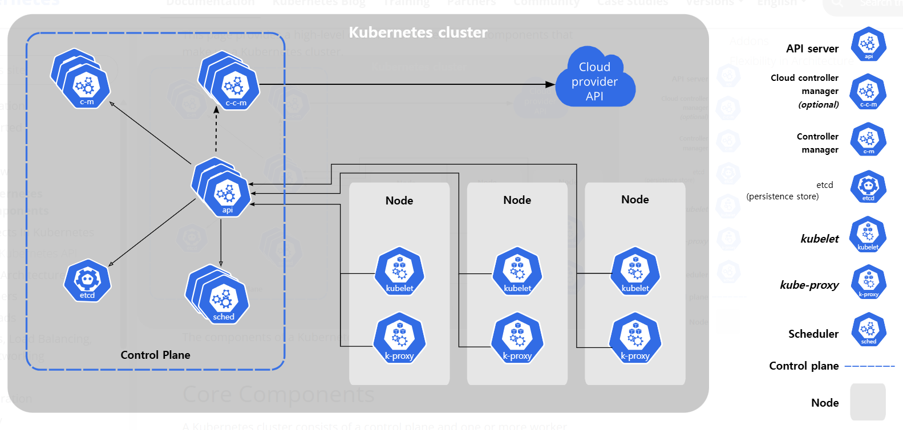

## ☸️ Kubernetes Core Components

K8s는 한 대의 Master Node(Control Plane)와 여러 대의 Worker Node로 구성됩니다.

그리고 Master Node의 Components와 Worker Node의 Components는 각각 Pod로 존재합니다.

_출처: [Kubernetes Doc](https://kubernetes.io/docs/concepts/overview/components/)_

### ☸️ Master Node(Control Plane)

Master Node는 Cluster의 전반적인 상태를 관리합니다.

|      Master Node의 Components       | 설명                                                                                                                                                                                                     |
| :--------------------------------- | :------------------------------------------------------------------------------------------------------------------------------------------------------------------------------------------------------- |
|           • `kube-apiserver`           | K8s의 HTTP API를 노출하는 Server                                                                                                                                                                         |
|               • `etcd`                | 모든 API Server의 데이터에 대해 일관되고 가용성이 높은 `Key-Value`형태로 저장                                                                                                                            |
|          • `kube-scheduler`           | • 수시로 Worker Node의 자원들을 파악   • `Watch`: `kube-apiserver`를 통해 `etcd`에 Pod 생성 요청이 들어오고 있는지 감시                                                                              |
|      • `kube-controller-manager`      | • K8s의 API 동작을 구현하기 위한 Controller 실행   • Controller 기능들이 각각의 Thread 형태로 존재   • `Watch`: `kube-apiserver`가 Contoller 생성 관련 정보가 들어오면 각 Thread에 알려주는 기능 |
| • `cloud-controllermanager`(Optional) | Cloud API에 연결                                                                                                                                                                                         |

### ☸️ Worker Node

Worker Node의 Components는 모든 Node에서 생성 및 실행되며, 실행중인 Pod를 유지하고 Container Runtime을 제공합니다.

| Worker Node의 Components | 설명                                                    |
| :---------------------- | :------------------------------------------------------ |
|         • `kublet`         | 해당 Worker Node에 포함되어 있는 Pod들의 실행을 보장    |
|   • `Container Runtime`    | Container 생성 및 실행을 담당하는 S/W                   |
|  • `kube-proxy`(Optional)  | 각 Worker Node에서 실행되고 있는 Proxy를 Service에 구현 |

## ☸️ Kubernetes Core Components의 Pod 생성

| Pod 생성 과정                     | 설명                                                                                                                                                                                      |
| :-------------------------------- | :---------------------------------------------------------------------------------------------------------------------------------------------------------------------------------------- |
| 1️⃣ User ➜ `kube-apiserver`        | Pod 생성 요청                                                                                                                                                                             |
| 2️⃣ `kube-apiserver` ➜ `etcd`      | Pod에 대한 정보를 저장                                                                                                                                                                    |
| 3️⃣ `kube-scheduler`               | • `Watch`로 Pod 생성 요청이 들어왔음을 파악하고 아직 Node에 Binding 되지 않은 Pod가 있다면 적합한 Node를 Pod에 Binding   • `etcd`에 저장된 Pod 정보에 Binding된 Node 정보만 추가한 것 |
| 4️⃣ `kublet`                       | `Watch`로 `etcd`에 저장되어 있는 Pod 정보 중 아직 Worker Node에 할당되지 않은 Pod 정보를 가져와서 Pod를 해당 Worker Node에 생성                                                           |
| 5️⃣ `kublet` ➜ `Container Runtime` | Pod에 있는 Container 생성                                                                                                                                                                 |
| 6️⃣ `kublet` ➜ `kube-proxy`        | Pod에 있는 Container의 통신이 가능하도록 만들어줌                                                                                                                                         |

## ☸️ Kubernetes Core Components의 Deployment 생성

| Deployment 생성 과정                                                | 설명                                                                                                                                                                                      |
| :------------------------------------------------------------------ | :---------------------------------------------------------------------------------------------------------------------------------------------------------------------------------------- |
| 1️⃣ User ➜ `kube-apiserver`                                          | Deployment 생성 요청                                                                                                                                                                      |
| 2️⃣ `kube-apiserver` ➜ `etcd`                                        | Deployment에 대한 정보를 저장                                                                                                                                                             |
| 3️⃣ `kube-controller-manager`의 Deployment Thread ➜ `kube-apiserver` | `Watch`로 Deployment 생성 요청이 들어왔음을 파악하고 ReplicaSet 생성 요청을 보냄                                                                                                          |
| 4️⃣ `kube-apiserver` ➜ `etcd`                                        | `etcd`의 Deployment 정보에 `ReplicaSet` 정보 추가                                                                                                                                         |
| 5️⃣ `kube-controller-manager`의 ReplicaSet Thread ➜ `kube-apiserver` | `Watch`로 ReplicaSet 생성 요청이 들어왔음을 파악하고 Pod 생성 요청을 보냄                                                                                                                 |
| 6️⃣ `kube-apiserver` ➜ `etcd`                                        | `etcd`의 ReplicaSet 정보에 Pod 정보 추가                                                                                                                                                  |
| 7️⃣ `kube-scheduler`                                                 | • `Watch`로 Pod 생성 요청이 들어왔음을 파악하고 아직 Node에 Binding 되지 않은 Pod가 있다면 적합한 Node를 Pod에 Binding   • `etcd`에 저장된 Pod 정보에 Binding된 Node 정보만 추가한 것 |
| 8️⃣ `kublet`                                                         | `Watch`로 `etcd`에 저장되어 있는 Pod 정보 중 아직 Worker Node에 할당되지 않은 Pod 정보를 가져와서 Pod를 해당 Worker Node에 생성                                                           |
| 9️⃣ `kublet` ➜ `Container Runtime`                                   | Pod에 있는 Container 생성                                                                                                                                                                 |
| 🔟 `kublet` ➜ `kube-proxy`                                          | Pod에 있는 Container의 통신이 가능하도록 만들어줌                                                                                                                                         |
