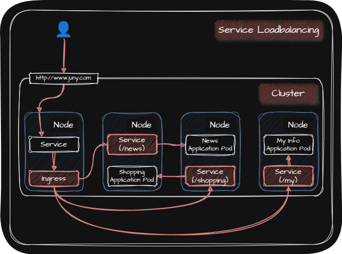
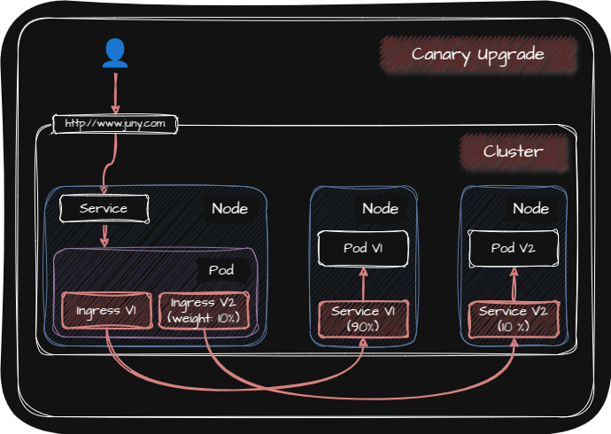
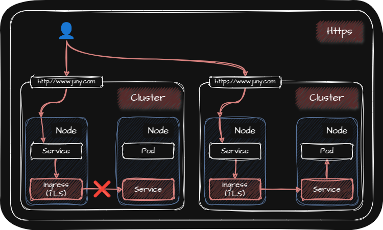

## ☸️ Controller

Controller는 Auto Healing, Software Update, Auto Scaling, Job과 같은 기능들을 제공하기 때문에 서비스를 운영하고 관리하는데 큰 도움을 줍니다.

그리고 K8s의 Controller에는 크게 다음과 같은 것들이 있습니다.

| • [Deployment](#️-deployment) |
| • [DemonSet](#️-demonset) |
| • [CronJob](#️-cronjob) |
| • [StatefulSet](#️-statefulset) |
| • [Ingress](#️-ingress) |
| • [Autoscaler](#️-autoscaler) |

## ☸️ Deployment

Deployment는 ReplicaSet을 관리하는 Controller입니다.

### ☸️ ReplicaSet

ReplicaSet은 동일한 Application이 돌아가는 여러 개의 Pod를 똑같은 방식으로 생성하고 해당 Pod들을 관리하는 역할을 하는 Controller입니다.

그리고 ReplicaSet에 의해 관리되고 생성되는 Pod들을 Replicas라고 합니다.

또한 ReplicaSet은 지속적으로 운영 하는 것을 목표로 합니다.

## ☸️ DemonSet

DemonSet은 Cluster 내에 있는 모든 Worker Node 또는 일부 Worker Node에서 단일 Pod로 동작하는 Controller를 말합니다.

DemonSet은 각 Worker Node에서 정보를 수집하여 중앙 수집 모듈에 전달하는 목적으로 많이 사용됩니다. 예를 들어 각 Worker Node마다 하나의 Pod를 생성하여 해당 Worker Node의 데이터(Performance, Log 등)를 수집할 수 있습니다.

원하는 데이터를 수집하기 위해서는 필요한 Application들을 Pod를 통해 구동하게 되는데 이러한 Application에는 다음과 같은 것들이 있습니다.

_Prometheus / fluentd / GlusterFS_

| • Prometheus | Worker Node의 Performance 수집을 통한 모니터링 서비스 |
| • fluentd | Woker Node의 Log 수집 |
| • GlusterFS | 각 Worker Node를 Storage로 사용 |

## ☸️ CronJob

CronJob은 Job을 관리하는 Controller입니다. 

CronJob은 concurencyPolicy와 Cron 포맷으로 작성된 Schedule(Ex. * / 1 * * * *)에 따라 Job을 생성할 수 있으며 만약 CronJob을 삭제하면 CronJob이 관리하는 Job, Job이 관리하는 Pod가 모두 함께 삭제됩니다.

다만 다른 Controller와 달리 CronJob은 Job에 label을 부여하지 않기 때문에 만약 CronJob이 관리하는 Job을 찾으려면 수작업으로 찾아야합니다.

concurencyPolicy에는 다음과 같은 것들이 있습니다.

| • Allow | • Default 값   • Schedule에 설정된 시간마다 Job 생성 |
| • Forbid | • Schedule에 설정된 시간마다 이전 Job이 완료되었는지 확인   • 만약 완료되지 않았다면 Job을 생성하지 않고 Skip |
| • Replace | • 이전 Job이 실행중이라면 이전 Job을 중지시키고 새로운 Job을 생성 |

### ☸️ Job

Job은 데이터 백업 및 복원 작업에 적합한 Controller입니다.

Job은 하나의 Process를 시작해서 종료하는 것을 목표로 하며 Job이 Process를 완료해서 종료되었을 때 해당 Job에의해 관리되는 Pod들은 삭제되지 않고 그대로 유지됩니다. 이렇게 유지된 Pod들을 통해 해당 Pod의 로그나 결과등을 확인할 수 있고 이후 삭제를 직접할 수 있습니다.

이러한 Job을 통해 수행하는 작업에는 Backup, Checking, Messaging이 있습니다.

## ☸️ StatefulSet

StatefulSet은 Stateful Application에 스케일링을 제공하는 Controller입니다.

StatefulSet의 특징은 다음과 같습니다.

| • Pod의 이름은 `StatefulSet의 이름` + `번호(0~N)`으로 생성 |
| • Pod는 0번부터 차례대로 생성되면 이전 Pod가 Running 상태가 되면 다음 Pod가 생성되기 시작 |
| • Pod를 제거하면 제거된 Pod와 동일한 이름과 설정을 가지는 Pod가 생성 |
| • StatefulSet의 Pod 수를 줄이면 뒷 번호부터 차례대로 제거 |
| • StatefulSet에 Headless Service를 연결하면 각 Pod가 DNS에 Domain Name(`Pod의 이름` + `.` + `Service의 이름`)이 등록 |
| • 각 Pod에는 별도의 PV와 PVC가 생성되며 PV와 PVC 또한 Pod의 이름처럼 규칙적으로 이름이 생성 |

StatefulSet의 Pod들은 생성될 때 동일하게 3개의 Init Container로 초기화를 진행합니다. 각 Init Container는 생성되는 Pod의 순서에 따라 다음과 같이 다르게 동작합니다.

|  | Pod-0 | Pod-1 ~ Pod-N |
| :-: | :- | :- |
| 1️⃣ 첫 번째 Init Container | Main Instance임을 나타내는 Log를 찍고 종료 | • Main Instance의 Domain Name을 조회하여 접근이 가능한지 확인   • Main Instance가 Running 상태인지 확인 |
| 2️⃣ 두 번째 Init Container | DB 생성 | DB 복제본 생성 |
| 3️⃣ 세 번째 Init Container | 해당 Pod가 Main Instance로 설정되도록 설정 파일을 만듬 | • 해당 Pod를 Secondary Instance로 설정되도록 설정 파일을 만듬   • Main Instance의 IP Address와 동기화 |

## ☸️ Ingress

Ingress란 Cluster 외부에서 내부 서비스로 접근하는 요청들을 어떻게 처리할지 정의해둔 규칙들의 모음을 말하고 Ingress Controller는 Ingress를 동작하도록 하는 Controller를 말합니다.

이러한 Ingress Controller를 통해 다음과 같은 기능들을 구현할 수 있습니다.

| • [Service Loadbalancing](#️-service-loadbalancing) |
| • [Canary Upgrade](#️-canary-upgrade) |
| • [Https를 통해 들어오는 요청만 허용](#️-https를-통해-들어오는-요청만-허용) |

또한 Ingress를 구현한 Ingress Controller 플러그인으로는 대표적으로 Nginx와 Kong이 있습니다.

_Nginx / Kong_

### ☸️ Service Loadbalancing

### ☸️ Canary Upgrade

### ☸️ Https를 통해 들어오는 요청만 허용

## ☸️ Autoscaler

Autoscaler에는 다음과 같은 것들이 있습니다.

| • HPA(Horizontal Pod Autoscaler) | Controller를 감시하고 있다가 Controller가 관리하는 Pod의 자원 사용량에 따라 Scale In / Scale Out을 수행 | • 기동이 빠르게 되는 Application   • Stateless Application |
| • VPA(Vertical Pod Autoscaler) | Controller를 감시하고 있다가 Controller가 관리하는 Pod의 자원 사용량에 따라 Scale Up / Scale Down을 수행 | • 한 Controller에 HPA와 VPA를 함께 사용하지 못함   • Stateful Application |
| • CA(Cluster Autoscaler) | • Worker Node가 부족할 때 `kube-scheduler`가 CA한테 Worker Node 추가 요청을 보냄   • CA와 Cloud Provider와 연결을 해놓은 경우 Cloud Provider에 Worker Node를 생성   • 기존의 Worker Node에 자원적 여유가 생기면 Cloud Provider의 Pod를 기존의 Worker Node로 옮기고 Cloud Provider의 Worker Node를 삭제 |
