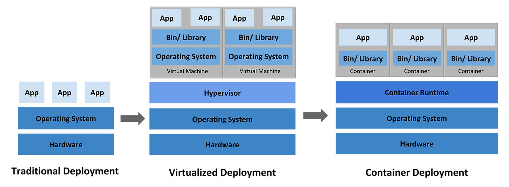

## ☸️ Kubernetes

Kubernetes란 이름은 Helmsman(키잡이)나 Pilot(조종사)를 뜻하는 그리스어에서 유래되었습니다.

Kubernetes는 K8s로 표기하는데 `K`, `ubernetes`, `s`를 나타내는 줄임말입니다.

## ☸️ History of Kubernetes

K8s 등장 과정은 다음과 같습니다.

_출처: [Kubernetes Doc](https://kubernetes.io/docs/concepts/overview/#going-back-in-time)_

| 등장 과정                 | 설명                                                                 | 장점                                                                                                                                                                                                                                | 단점                                                                                                   |
| :------------------------ | :------------------------------------------------------------------- | :---------------------------------------------------------------------------------------------------------------------------------------------------------------------------------------------------------------------------------- | :----------------------------------------------------------------------------------------------------- |
| 1️⃣ Traditional Deployment | 여러 개의 Host OS 위에서 Application들을 실행                        |                                                                                                                                                                                                                                     | • Host의 자원을 충분히 활용하지 못해 확장하지 못하는 문제   • 많은 Server들을 유지하지 못하는 문제 |
| 2️⃣ Virtualized Deployment | 단일 Server에서 VM(Virtual Machine)을 실행                           | • VM간의 Application이 격리되면서 일정 수준의 보안을 제공   • 하나의 VM을 하나의 Server처럼 사용이 가능해 효율적으로 Server의 자원을 활용   • Application을 쉽게 추가 & 업데이트하여 확장이 가능   • Server 비용을 절감 | Host OS 위에 여러 개의 Guest OS가 실행되면서 무거워져 전체적인 속도가 저하                             |
| 3️⃣ Container Deployment   | Container는 VM과 유사하지만 Guest OS를 사용하지 않으면서 격리를 완화 | • Guest OS를 사용하지 않기 때문에 속도가 향상   • Cloud나 OS에 종속되지 않기 때문에 이식성(Portability)이 향상                                                                                                                  | Host OS를 공유하기 때문에 VM을 사용했을 때보다는 보안 수준이 감소                                      |

Container는 Application을 포장(Bundle)하고 실행(Run)하는 좋은 방법이지만 Production 환경에서는 많은 Container를 관리하는 도구가 필요했습니다. 이처럼 Container를 관리하기위해 등장한 도구가 바로 **Kubernetes**입니다.

## ☸️ Kubernetes의 기능

Kubernetes의 대표적인 기능으로는 다음과 같은 것들이 있습니다.

| 기능                                | 설명                                                                              |
| :---------------------------------- | :-------------------------------------------------------------------------------- |
| • Service Discovery                   | K8s는 DNS나 자체 IP Address를 사용해 Container 노출이 가능                        |
| • Load Balancing                      | Container에 대한 트래픽이 많으면 K8s는 트래픽을 분산                              |
| • Storage Orchestration               | 원하는 Storage System을 자동으로 Mount                                            |
| • Automated Rollout and Rollback      | 배포된 Container의 상태를 원하는 상태로 변경 가능                                 |
| • Automatic Bin Packing               | 각 Container들이 필요로 하는 자원을 가장 잘 사용할 수 있도록 관리해주는 Node 제공 |
| • Self-Healing                        | 배포에 실패한 Container를 다시 시작하거나 교체하는 기능                           |
| • Secret and configuration management | Password, OAuth Token, SSH Key와 같은 중요한 정보들을 저장하고 관리               |
| • Batch Execution                     | Service 뿐만 아니라 Batch와 CI Workload들을 관리                                  |
| • Horizontal Scaling                  | 사용량에 따라 자동으로 Application을 Scale Up / Down                              |
| • IPv4 / IPv6 Dual-Stack              | IPv4와 IPv6를 함께 할당하는 것이 가능                                             |
| • Designed for Extensibility          | 이전의 Code들을 변경하지 않고 기능을 추가하는 것이 가능                           |

Kubernetes에서 제공하는 기능들을 한 마디로 정리하자면 Automatically Manage Container라고 할 수 있습니다.

또한 K8s는 자체적으로 Container들을 관리해주는 기능을 가지고 있을 뿐 아니라 사용자의 선택을 가능하게 함으로써 유연성을 가지고 있습니다.

## ☸️ Reference

- [https://kubernetes.io/docs/concepts/overview/](https://kubernetes.io/docs/concepts/overview/)
