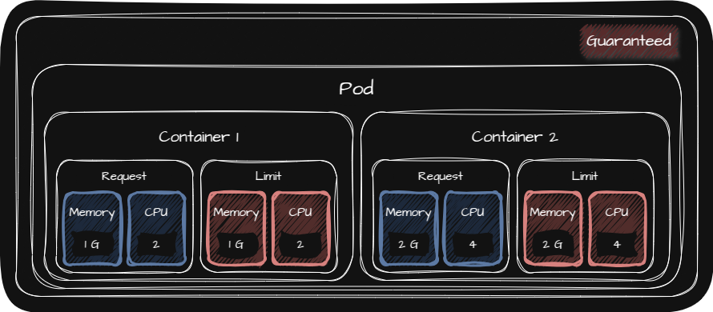
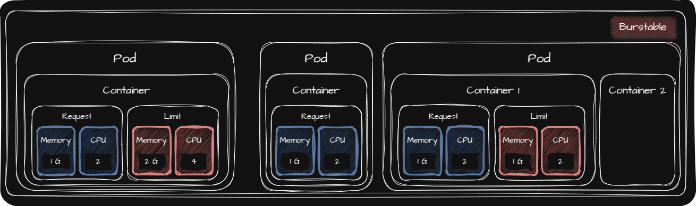
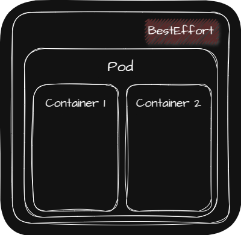

## ☸️ About Pod

Pod는 K8s가 하나 이상의 Container를 관리하는데 사용하는 단위입니다.

Pod는 Cluster를 이루는 Worker Node 중 하나의 Worker Node에서 실행되며 하나의 Pod에 속한 모든 Container는 같은 Worker Node에서 실행됩니다.

### ☸️ Container 🔗 Pod

Container와 Pod의 관계는 다음과 같습니다.

| 특징 | 설명 |
| :- | :- |
| • Pod는 하나 이상의 Container를 포함 |
| • 하나의 Pod에 속한 모든 Container는 같은 가상환경을 공유 | • 한 Container의 실행이 또 다른 Container에 영향을 줄 수 있음   • Container가 같은 IP Address(Pod의 IP Address)를 공유   • Container들끼리 localhost로 통신이 가능   • File System 일부를 공유|

### ☸️ Pod 🔗  Worker Node

Pod와 Node의 관계는 다음과 같습니다.

| 특징 |
| :- |
| • [Pod가 생성되면 한 Node에 배정(Node Scheduling)](#️-node-scheduling) |
| • Worker Node에서 Pod들을 관리 |

### ☸️ Pod 🔗  Network

Pod와 네트워크의 관계는 다음과 같습니다.

| 특징 |
| :- |
| • Pod는 자신만의 가상 IP Address를 가짐 |
| • Cluster 내에서만 가상 IP Address로 접근이 가능하며 외부에서는 접근이 불가능 |
| • Pod 간 통신에 TCP와 UDP를 지원 |
| • Pod가 재생성되면 가상 IP Address가 변경(휘발성) |

## ☸️ Pod에서 실행되는 Container 유형

Pod에서 실행되는 Container의 유형은 다음과 같습니다.

| Container Type | 정의 | 설명 |
| :- | :- | :- |
| • Init Container | Pod에서 가장 먼저 실행되어 초기화 역할을 담당하는 Container | • Init Container가 모두 실행된 후 Application Container를 실행   • Init Container의 Image를 변경하면 Pod 자체를 재시작   • Init Container는 Pod 정의에 기재된 순서대로 실행 | 
| • Application Container | Application을 구동하는 Container | Application Container의 Image를 변경하면 해당 Application Container만 재시작 |
| • Sidecar Container | 기존 Pod의 기능을 확장할 때 사용하는 보조 Container |  |
| • Adapter Container | 서로 다른 출력을 가지는 Container들의 상호 호환성을 만들어주는데 사용하는 Container |  |
| • Ambassador Container | Application Container와 Cluster 외부의 통신을 제어하고 단순화하는데 사용하는 Container | • 네트워크 트래픽을 처리하는 Proxy 역할   • DB Ambassador Container에서는 UPDATE Query는 Master DB로 보내고, SELECT Query는 Slave DB로 보내는 역할 |

## ☸️ Pod의 LifeCycle

### ☸️ Pod의 Status

| Phase | 설명 | 예시 |
| :- | :- | :- |
| • `Pending` | Pod의 최초 상태 | `PodScheduled` ➜ `Initialized` ➜ Image Downloading까지의 상태 |
| • `Running` | `Pending`이후 Container가 실행 또는 재시작 상태 |  |
| • `Succeeded` | Pod에 있는 모든 Container가 성공적으로 종료된 상태 | `Terminated` - `Completed` |
| • `Failed` | Pod에 있는 Container 중 하나 이상의 Container에 문제가 생겨 종료된 상태 | `Terminated` - `Error` |
| • `Unknown` | Pod에 통신 문제가 발생한 경우 |  |

| Conditions Type | 설명 |
| :- | :- |
| • `PodScheduled` | Pod를 여러 Worker Node 중 한 Worker Node에 할당 여부 |
| • `Initialized` | Init Container의 실행 성공 여부 |
| • `ContainerReady` | Container들이 실행 준비가 되었는지 여부 |
| • `Ready` | Pod가 서비스할 준비가 되었는지 여부 |

| Reason |
| :- |
| • `ContainerCreating` |
| • `ContainersNotReady` |
| • `PodCompleted` |

### ☸️ Container의 Status

| State | 설명 |
| :- | :- |
| • `Waiting` | • Image Downloading 상태   • 문제가 생겨 재시작 되는 상태 |
| • `Running` | Container가 정상적으로 실행중인 상태 | 
| • `Terminated` | Container가 종료된 상태 |

| Reason | 설명 |
| :- | :- |
| • `ContainerCreating` | Container가 생성되고 있는 상태 |
| • `CrashLoopBackOff` | Container가 재시작 되고 있는 상태 |
| • `Error` | Container에 문제가 생긴 경우 |
| • `Completed` | Container가 작업을 모두 마친 경우 |

## ☸️ Probe

Probe는 Container에서 `kubelet`에 의해 주기적으로 수행되는 진단(diagnostic)입니다.

진단을 수행하기 위해서 `kubelet`은 Container에 의해서 구현된 Handler를 호출합니다. Handler에는 다음과 같이 세 가지 타입이 있습니다.

| Handler | 설명 | 성공 상태 |
| :- | :- | :- |
| • ExecAction | Container에서 지정된 명령어를 실행 | 명령어 상태 코드가 0으로 종료 |
| • TCPSocketAction | 지정된 포트에서 Container의 IP Address에 대해 TCP 검사를 수행 | 포트가 활성화되어 있는 경우 |
| • HTTPGetAction | 지정된 포트 및 경로에서 Container의 IP Address에 대해 HTTP GET 요청을 수행 | HTTP Response Status Code가 200보다 크고 400보다 작은 경우 |

### ☸️ Probe 종류

Probe에는 다음 세 가지 종류가 있습니다.

| Probe | 진단 대상 | 실패한 경우 |
| :- | :- | :- |
| • Readiness Probe | Container가 요청을 처리할 준비가 되었는지 여부 | Container가 속한 Pod에 연관된 모든 Service들의 Endpoint에서 해당 Pod의 IP Address를 제거 |
| • Liveness Probe | Container의 동작 여부 | `kublet`이 해당 Container를 죽이고 재시작 되도록 함 |
| • Startup Probe | Container 내의 Application이 시작되었는지 여부 | • 성공할 때까지 다른 Probe는 활성화 되지 않음   • `kublet`이 해당 Container를 죽이고 재시작 되도록 함 |

### ☸️ Probe 사용 용도

Probe들의 사용 용도는 다음과 같습니다.

| Probe | 사용 용도 |
| :- | :- |
| • Readiness Probe | Probe가 성공한 경우에만 Pod에 트래픽을 전송하려고 하는 경우 |
| • Liveness Probe | Application이 Deadlock 상태에 머무르는 것을 감지하여 재시작하려고 하는 경우 |
| • Startup Probe | Service를 시작하는 데 시간이 오래 걸리거나 불규칙적인 Container를 사용하는 경우 |

## ☸️ QoS(Quality of Service) Classes

QoS는 Pod의 Scheduling과 제거 우선순위를 판단하는데 사용되는 값입니다.

QoS의 종류는 다음과 같습니다.

| QoS | 제거 순위 | Class 정의 |
| :- | :-: | :- |
| • [Guaranteed](#️-guaranteed) | $3$ 순위 | • Pod에 존재하는 모든 Container에 Memory와 CPU의 Request와 Limit의 값이 설정된 경우 • 각 Container 내에 Memory와 CPU의 Request와 Limit의 값이 같은 경우 |
| • [Burstable](#️-burstable) | $2$ 순위   (OOM Score가 큰 Pod부터 제거) | • Request < Limit 인경우   • Request만 설정된 경우   • Pod에 존재하는 Container 중 한 Container에 Request와 Limit 값이 설정되어 있지 않은 경우 |
| • [Best-Effort](#️-best-effort) | $1$ 순위 | Pod에 존재하는 모든 Container에 Memory와 CPU의 Request와 Limit의 값 모두 설정되지 않은 경우 |

> 💡 OOM(Out-Of-Memory) Score  
> 📢 Memory 실제 사용량($=$ Application의 Memory 사용량 $/$ Request Memory)  
> 📢 OOM Score가 클수록 제거 순위가 높음

### ☸️ Guaranteed

### ☸️ Burstable

### ☸️ Best-Effort

## ☸️ Node Scheduling

### ☸️ Pod가 할당될 Worker Node를 직접 선택하는 방법

| • NodeName | NodeName이 일치하는 Worker Node에 Pod를 할당하는 방법 |
| • NodeSelector | NodeSelector가 일치하는 Worker Node에 Pod를 할당하는 방법 |
| • NodeAffinity | • `matchExpressions` : `key`로 비교(`operator`: `Exists`, `DoesNotExist`, `In`, `NotIn`, `Gt`, `Lt`)   • `required`: `matchExpressions`에 해당하는 Node가 없는 경우 Pod가 할당되지 않음   •  `preferred`: `matchExpressions`에 해당하는 Node가 없더라도 적절한 Node에 Pod가 할당(`weight`를 통해 가중치를 부여할 수 있음) |

### ☸️ 여러 Pod들을 집중 또는 분산해서 Worker Node에 할당하는 방법

다음 두 방법은 기본적으로 NodeAffinity의 특징들을 그대로 가지고 있기 때문에 `matchExpressions`, `required`, `preferred` 모두 사용 가능합니다.

| • Pod Affinity | • 여러 Node들에 존재하는 Pod들 중 `matchExpressions`에 해당하는 Pod가 있는 Node에 할당   • `topologyKey`를 통해 Node의 범위를 제한할 수 있음 |
| • Anti-Affinity | • 여러 Node들에 존재하는 Pod들 중 `matchExpressions`에 해당하는 Pod가 있는 Node를 제외한 Node에 할당   • `topologyKey`를 통해 Node의 범위를 제한할 수 있음 |

### ☸️ 특정 Worker Node에 할당될 수 있는 Pod를 제한하는 방법

| • Taint | • `effect` - `NoSchedule`: Toleration이 정의된 Pod와 Taint가 정의된 Node를 비교했을 때 적절하지 않으면 해당 Node에 해당 Pod가 할당되지 않음(Ex. Master Node에 기본적으로 정의되어 있음)   • `effect` - `PreferNoSchedule`: Toleration이 정의된 Pod와 Taint가 정의된 Node를 비교했을 때 적절하지 않으면 해당 Node에 해당 Pod가 가급적 할당되지 않음   • `effect` - `NoExecute`: 해당 Node에 존재하는 Pod들까지 비교하여 적절한지 확인(다른 `effect`의 경우 이미 존재하는 Pod들까지 확인하지 않음) |
| • Toleration | • Taint가 정의된 Node에 Pod를 할당하고 싶을 때 사용   • Taint의 label과 비교하는 `operator`: `Equal`, `Exists`   • Taint의 label 뿐 아니라 `effect`까지 일치해야 적절하다고 판단하여 Taint가 정의된 Node에 할당할 수 있음   • Pod가 적절하더라도 다른 Node에 할당될 수 있기 때문에 Taint가 정의된 Node에 할당하기 위해서는 별도의 옵션(Ex. nodeSelector)을 함께 사용해야 함 |
