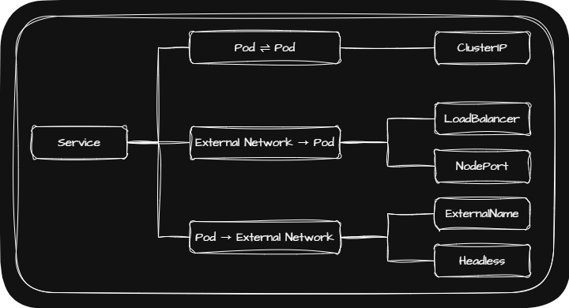
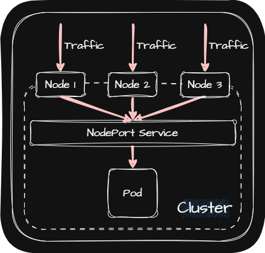
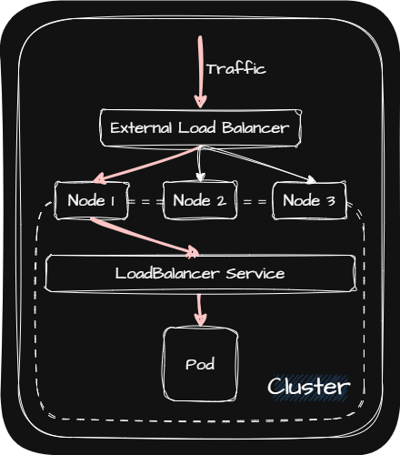

## ☸️ Service

Service는 Cluster 외부에서 Pod로 전달되는 것과 Pod에서 외부로 전달하는 네트워크 트래픽의 Routing을 맡는 Component입니다.

> 기본적으로 K8s는 Pod 간의 네트워킹으로 TCP와 UDP를 지원합니다.
{: .prompt-info }

Service의 특징은 다음과 같습니다.

| • Service는 자신만의 가상 IP Address를 갖음 |
| • Service의 IP Address는 정적 |
| • Pod의 IP Address는 동적이기 때문에 Service와 Pod를 연결하여 Service를 통해 Pod에 접근 |

Service에는 다음과 같은 것들이 있습니다.

| • [ClusterIP](#️-clusterip) |
| • [NodePort](#️-nodeport) |
| • [LoadBalancer](#️-loadbalancer) |
| • [Headless](#️-headless) |
| • [ExternalName](#️-externalname) |

## ☸️ ClusterIP

ClusterIP란 Master Node, Worker Node에서만 접근할 수 있는 Service를 말합니다.

ClusterIP의 특징은 다음과 같습니다.

| • ClusterIP와 연결된 Pod가 어느 Worker Node에 있더라도 접근이 가능하지만 Cluster 내에서만 유효 |
| • K8s의 Dashboard 관리하는데 사용 |
| • 각 Pod의 서비스 상태를 디버깅할 때 사용 |

## ☸️ NodePort

NodePort란 Master Node, Worker Node에 접근할 수 있는 권한은 없는 경우 각 Node마다 포트를 열어 해당 포트로 내부망에서 접근할 수 있도록 하는 Service를 말합니다.

NodePort의 특징은 다음과 같습니다.

| • NodePort를 사용해 Node에 접근할 수 있음 |
| • Worker Node의 IP Address는 보안적으로 내부망에서만 접근할 수 있도록 네트워크를 구성 |
| • 트래픽이 곧바로 NodePort에 해당하는 Worker Node로 들어옴 |
| • NodePort에 해당하는 포트가 모든 Worker Node에서 개방되어 해당 포트를 주시 |
| • 데모나 임시 연결용으로 사용 |

## ☸️ LoadBalancer

LoadBalancer란 외부에서 들어오는 트래픽을 Pod로 전달하는 Service를 말합니다.

LoadBalancer의 특징은 다음과 같습니다.

| • 외부 또는 다른 Node에서 들어오는 트래픽을 Pod로 전달 |
| • Cluster로 트래픽을 전달해 주는 External Load Balancer와 함께 동작 |
| • External Load Balancer에 Plugin을 통해 할당한 External IP Address 할당(Ex. GCP, AWS, Azure, OpenStack) |
| • External IP Address로 들어오는 트래픽을 Cluster로 전달 |
| • 외부에 시스템을 노출하는 용도로 사용 |

## ☸️ Headless

Headless란 Pod가 서로 다른 Pod에 직접 접근하기 위한 Service를 말합니다.

Pod의 IP Address는 동적이기 때문에 `pod1`에서 `pod2`로 접근할 때 `pod2`의 IP Address를 사용해서 접근하게 되면 이후 `pod2`의 IP Address가 변경되었을 때 접근을 못하게됩니다.

이러한 문제점을 해결하기위해 Headless는 DNS Server를 사용합니다.

DNS Server를 사용하기 위해서는 <u>직접 접근하려고 하는 Pod</u>(Ex. `pod2`, `pod3`)에 다음과 같이 설정값을 넣어서 Headless와 Pod를 연결해야 합니다.

| • `hostname`: Domain Name(Ex. `pod1Domain`, `pod2Domain`) |
| • `subdomain`: Headless Service의 이름(Ex. `headlessService`)|

이처럼 Headless와 연결된 Pod들은 DNS Server에 다음과 같이 등록됩니다.

|  Type   | FQDN(Full Quailfied Domain Name)                                                                                                                                                               | IP Address                                                                      |
| :-----: | :--------------------------------------------------------------------------------------------------------------------------------------------------------------------------------------------- | :------------------------------------------------------------------------------ |
| Service | • `Service 이름` + `.` + `Namespace 이름` + `.` + `svc`(Service를 나타냄) + `.` + `DNS Server 이름`   • Ex. ` headlessService``.``default``.``svc``.``cluster.local `                      | • 해당 Service와 연결된 Pod의 IP Address   • Ex. 20.109.5.11 \| 20.109.5.12 |
|   Pod   | • `hostname` + `.` + `subdomain` + `.` + `Namespace 이름` + `.` + `pod`(Pod를 나타냄) + `.` + `DNS Server 이름`   • Ex. ` pod2``.``headlessService``.``default``.``pod``.``cluster.local ` | Pod 2의 IP Address (20.109.5.11)                                                |
|   Pod   | • `hostname` + `.` + `subdomain` + `.` + `Namespace 이름` + `.` + `pod`(Pod를 나타냄) + `.` + `DNS Server 이름`   • Ex. ` pod3``.``headlessService``.``default``.``pod``.``cluster.local ` | Pod 3의 IP Address (20.109.5.12)                                                |

## ☸️ ExternalName

Endpoint로 외부 Domain과 Service를 연결할 때 IP Address는 언제든 바뀔 수 있다는 문제가 있습니다. 이러한 문제를 해결하고자 등장한 것이 ExternalName입니다.

또한 Pod가 연결해야 하는 외부 Domain이 변경되어야 하는 경우 Pod와 ExternalName이 연결만 되어 있다면 Pod의 수정 없이 ExternalName의 `externalName`의 값만 바꿔주면 되므로 외부 Domain과 연결할 때 매우 유용한 Service입니다.

### ☸️ Endpoint

기본적으로 Label-Selector로 Service와 Pod를 연결시키면 Service와 같은 이름을 가지고 있는 Endpoint가 생성되어 Service와 Pod의 연결고리 역할을 합니다. 그리고 해당 Endpoint에는 Service와 연결된 Pod의 IP Address와 포트가 저장되어 있습니다.

Label-Selector로 Service와 연결을 했지만 실제로는 Service-Endpoint-Pod로 연결된 것을 알 수 있습니다. 그렇기 때문에 Label-Selector가 아니더라도 직접 Endpoint를 사용하면 Service와 Pod를 연결할 수 있습니다.

또한 Endpoint에 외부 Domain의 IP Address를 저장한다면 Service와 외부 Domain을 연결할 수도 있습니다.
