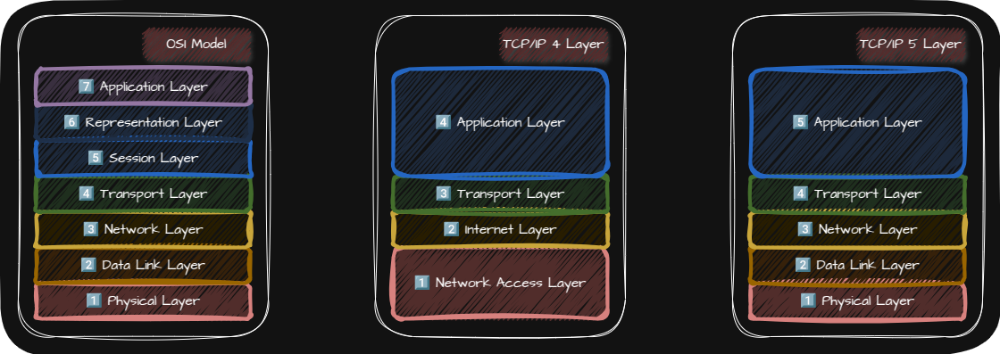
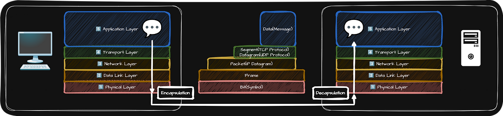
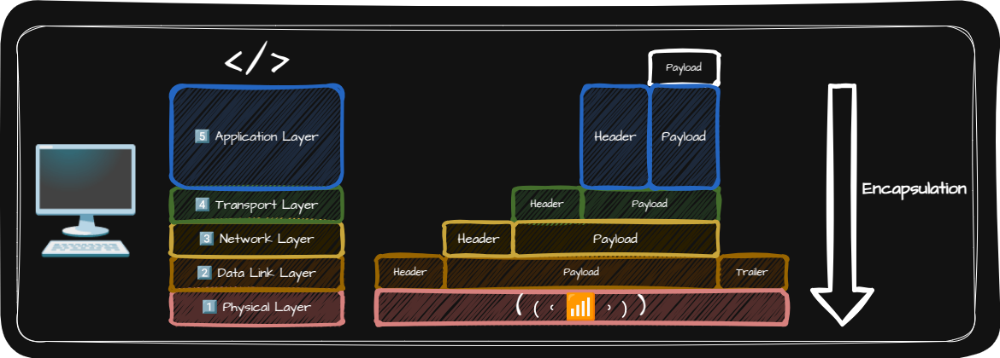
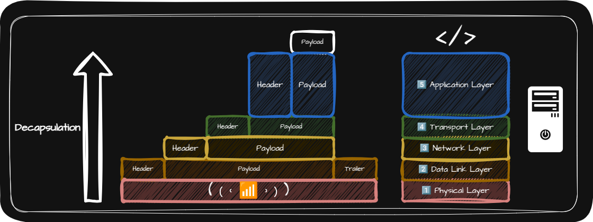

## 🌐 Network Reference Model

네트워크 참조 모델(Network Reference Model)이란 네트워크를 통해 정보를 주고받을 때 정형화된 여러 단계를 거치는데 이를 계층으로 표현한 것을 말하며 Network Layer Model이라고 부르기도 합니다.

네트워크 참조 모델과 같이 여러 단계로 나눈 이유는 크게 두 가지입니다.

- 각 계층이 수행해야 할 역할이 정해져 있으므로 계층의 목적에 맞게 프로토콜(Protocol)과 네트워크 장비를 계층별로 구성할 수 있기 때문
- 네트워킹 과정에서 문제가 발생하더라도 문제의 원인을 계층별로 진단하기가 수월해지기 때문

> ⚠️ 네트워크 참조 모델은 모든 프로토콜과 네트워크 장비가 반드시 지켜야 하는 규칙이나 법규가 아니라 하나의 가이드라인

> ⚠️ 네트워크 참조 모델은 통신이 일어나는 단계를 역할별로 구획한 큰 그림일 뿐 네트워크를 작동시키는 주체가 아님

대표적인 네트워크 참조 모델로는 OSI Model과 TCP/IP 모델이 있습니다.

## 🌐 OSI Model

OSI Model은 국제 표준화 기구(ISO)에서 만든 <u>이론적 설계</u>를 위한 네트워크 참조 모델입니다.

| 7️⃣ Application Layer | • 사용자가 이용할 Application Software에 다양한 네트워크 서비스를 제공   • 타 계층에 비해 Application Layer에 속한 프로토콜이 많음 |
| 6️⃣ Representation Layer | 사람이 이해할 수 있는 언어인 문자를 컴퓨터가 이해할 수 있는 코드로 변환하거나 압축, 암호화와 같은 작업이 이루어지는 계층 |
| 5️⃣ Session Layer | Session을 관리하기 위해 존재하는 계층 |
| 4️⃣ Transport Layer | • 패킷의 흐름을 제어하거나 전송 오류를 점검해 신뢰성 있고 안정적인 전송이 이루어지도록 하는 계층   • Port를 통해 실행 중인 Application Software의 식별이 이루어짐 |
| 3️⃣ Network Layer | • 네트워크 간의 통신이 이루어지는 계층   • IP 주소를 통해 수신지 호스트를 식별하고 최적의 경로 결정 |
| 2️⃣ Data Link Layer | • 네트워크 내 주변 장치 간의 정보를 올바르게 주고 받기위한 계층   • MAC 주소를 통해 Network 내 송수신지를 특정 할 수 있음|
| 1️⃣ Physical Layer | 통신 매체를 통한 송수신이 이루어지는 계층 |

## 🌐 TCP/IP Model

TCP/IP Model은 <u>실용적 구현</u>에 중점을 둔 네트워크 참조 모델입니다. TCP/IP Model은 TCP/IP 4계층, Internet Protocol Suite, Protocol Stack이라 부르기도 합니다.

기존의 TCP/IP Model에는 OSI Model의 <u>1️⃣ Physical Layer</u> 역할을 수행하는 Layer가 없었는데 <u>1️⃣ Physical Layer</u>를 추가해서 TCP/IP 4계층이 아닌 TCP/IP 5계층으로 확장해 TCP/IP Model을 사용합니다.

|                                                                                     | PDU(Protocol Data Unit)                | 네트워크 장비       | 주소 개념 유무 | 프로토콜                                                                                                                                                                                                                                                                                                                                                                                    |
| :---------------------------------------------------------------------------------- | :------------------------------------- | :------------------ | :------------: | :------------------------------------------------------------------------------------------------------------------------------------------------------------------------------------------------------------------------------------------------------------------------------------------------------------------------------------------------------------------------------------------ |
| 5️⃣ [Application Layer](https://jjjuuuun.github.io/posts/Network-Application-Layer/) | Data(Message)                          |                     |       ⭕       | [DNS](https://jjjuuuun.github.io/posts/Network-Application-Layer/#-dnsdomain-name-system), [HTTP](https://jjjuuuun.github.io/posts/Network-Application-Layer/#-httphyper-text-transfer-protocol), [HTTPS](https://jjjuuuun.github.io/posts/Network-Application-Layer/#-httpshttp-secure), SSL(Secure Sockets Layer)                                                                         |
| 4️⃣ [Transport Layer](https://jjjuuuun.github.io/posts/Network-Transport-Layer/)     | • TCP - Segment   • UDP - Datagram |                     |       ⭕       | [TCP](https://jjjuuuun.github.io/posts/Network-Transport-Layer/#-tcptransmission-control-protocol), [UDP](https://jjjuuuun.github.io/posts/Network-Transport-Layer/#-udpuser-datagram-protocol), TLS(Transport Layer Security)                                                                                                                                                              |
| 3️⃣ [Network Layer](https://jjjuuuun.github.io/posts/Network-Network-Layer/)         | Packet(IP Datagram)                    | Router              |       ⭕       | [IP](https://jjjuuuun.github.io/posts/Network-Network-Layer/#-ipinternet-protocol), [DHCP](https://jjjuuuun.github.io/posts/Network-Network-Layer/#-dhcpdynamic-host-configuration-protocol), [ARP](https://jjjuuuun.github.io/posts/Network-Network-Layer/#-arpaddress-resolution-protocol), [Routing Protocol](https://jjjuuuun.github.io/posts/Network-Network-Layer/#-routing-protocol) |
| 2️⃣ [Data Link Layer](https://jjjuuuun.github.io/posts/Network-Data-Link-Layer/)     | Frame                                  | NIC, (L2)Switch, AP |       ⭕       | [CSMA/CD Protocol](https://jjjuuuun.github.io/posts/Network-Data-Link-Layer/#-csmacd-protocol),                                                                                                                                                                                                                                                                                             |
| 1️⃣ [Physical Layer](https://jjjuuuun.github.io/posts/Network-Physical-Layer/)       | Bit(Symbol)                            | Hub                 |       ❌       |                                                                                                                                                                                                                                                                                                                                                                                             |

## 🌐 Encapsulation & Decapsulation

### 🌐 Encapsulation

어떤 정보를 송신할 때 각 계층에서는 상위 계층으로부터 내려받은 Packet을 Payload로 삼아 Header 또는 Trailer를 덧붙인 후 하위 계층으로 전달하는 과정을 Encapsulation(캡슐화)라고 합니다.

### 🌐 Decapsulation

캡슐화 과정에서 붙였던 Header 및 Trailer를 각 계층에서 확인한 뒤 제거하는 과정을 Decapsulation(역캡슐화)라고 합니다.
