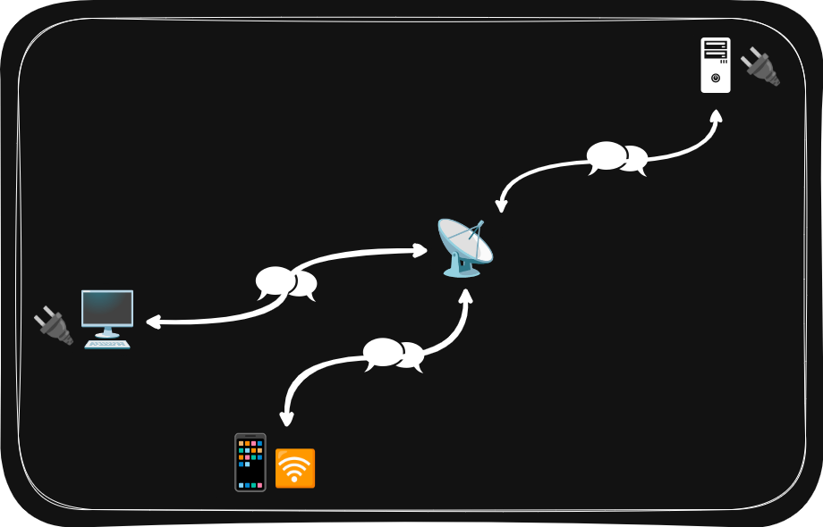
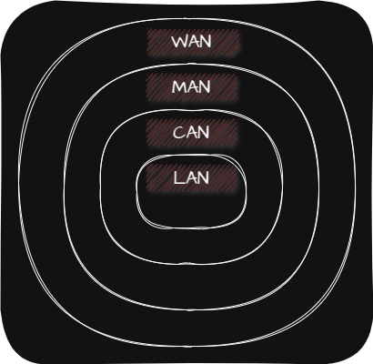

## 🌐 Network 구성

네트워크는 여러 장치가 연결되어 정보를 주고 받을 수 있는 통신망을 의미합니다.

네트워크의 구성은 다음과 같습니다.

| Node(Vertex) | • Host(Ex. Server, Client)   • Network 장비(Ex. Ethernet Hub, Switch, Router) |
| Edge(Link) | • 통신 매체(유선, 무선)   • 메세지(Ex. File, Web Page, E-mail) |

## 🌐 거리에 따른 Network

| LAN(Local Area Network) | 한정된 공간에서의 네트워크 |
| CAN(Campus Area Network) | 학교 또는 회사의 여러 건물 단위로 연결되는 규모의 네트워크 |
| MAN(Metropolitan Area Network) | 도시나 대도시 단위로 연결되는 규모의 네트워크 |
| WAN(Wide Area Network) | • 멀리 떨어진 LAN을 연결할 수 있는 네트워크   • ISP(Internet Service Provide; 인터넷 서비스 업체)가 구축하고 관리   • Ex. Internet |

## 🌐 수신자 범위에 따른 Network

| Unicast | 가장 일반적인 형태로 1대 1 송수신 방식 |
| Broadcast | 자신을 제외한 네트워크 상의 모든 Host에게 전송하는 방식 |
| Multicast | 네트워크 내의 동일 그룹에 속한 Host에게만 전송하는 방식 |
| Anycast | 네트워크 내의 동일 그룹에 속한 Host 중 가장 가까운 Host에게만 전송하는 방식 |

## 🌐 Network의 메세지 교환 방식

네트워크의 메세지 교환 방식에는 <u>회선 교환 방식(Circuit Switching)</u>과 <u>패킷 교환 방식(Packet Switching)</u>이 있습니다.

회선 교환 방식이란 Circuit Switch를 통해 Host 사이에 1대 1 회선을 확보하고 이를 통해 메세지를 주고 받는 방식을 말합니다. 회선 교환 방식의 경우 Host 사이에 연결을 확보한 후 메세지를 주고 받기 때문에 주어진 시간동안 전송되는 정보의 양이 일정하지만 회선의 이용율이 떨어지는 문제가 있습니다. 회선 교환 방식에 사용되는 Circuit Switch로는 전화망이 있습니다.

패킷 교환 방식이란 메세지를 Packet이라는 작은 단위로 쪼갠 후 Packet Switch를 통해 수신지까지의 최적의 경로를 찾아 전달하는 방식을 말합니다. 회선 교환 방식과 달리 정해진 경로로만 메세지를 주고 받지 않기 때문에 수시로 경로가 바뀔 수 있습니다. 패킷 교환 방식에 사용되는 Packet Switch로는 Router, Switch가 있습니다.
