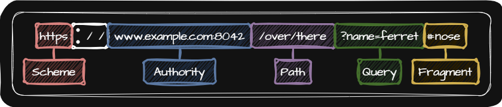
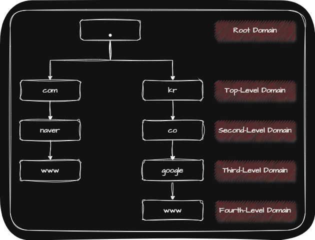
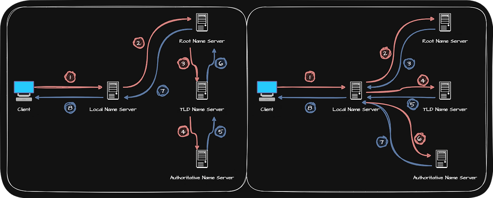

## 🖧 URI

URI(Uniform Resource Identifier)란 자원을 식별할 수 있는 정보를 말합니다. 

URI는 식별에 사용되는 정보에 따라 [위치 기반 식별자인 URL(Uniform Resource Locator)](#-url)과 [이름 기반 식별자인 URN(Uniform Resource Name)](#-urn)으로 나누어집니다.

> 💡 자원(Resource)   
> 📢 네트워크 상의 메세지를 통해 주고 받는 대상을 의미합니다.  
> 📢 오늘날 인터넷 환경을 이루는 대부분의 통신은 HTTP를 기반으로 이루어지므로 HTTP 요청 메세지의 대상을 의미하기도 합니다.

### 🖧 URL

URL의 표기 방법은 다음과 같습니다.

| URL 구성요소 | 정의 | 사용 |
| :-: | :- | :- | :- |
| Scheme | 자원에 접근하는 방법 | 일반적으로 가용할 Protocol이 명시 |
| Authority | Host를 특정할 수 있는 정보 | IP Address 혹은 [Domain Name](#-domain-name) |
| Path | 자원이 위치한 경로 | `/`를 기준으로 계층적으로 표현 |
| Query | Query String(Query Parameter)를 이용해 더 자세히 자원을 요청 | • `?`로 시작   • `key = value`형태이며 `&`로 연결 |
| Fragment | 자원의 한 조각을 가리키기 위한 정보 | 흔히 HTML과 같은 자원에서 특정 부분을 가리키기 위해 사용 |

### 🖧 URN

URL의 가장 큰 문제점은 자원의 위치가 변한다면 더 이상 유요하지 않다는 점입니다. 

그러나 URN은 자원에 고유한 이름을 붙이는 이름 기반 식별자이기에 자원의 위치와 무관하게 자원을 식별할 수 있다는 장점이 있습니다.

다만 아직 널리 채택된 방식은 아닙니다.

## 🖧 Domain

네트워크 상의 어떤 Host를 특정하기 위해서는 IP Address를 사용합니다. 그러나 통신하고자 하는 모든 Host의 IP 주소를 기억하고 있기는 어렵기 때문에 일반적으로 IP Address보다는 Domain Name을 더 많이 사용합니다.

Name Server에서 IP Address와 Domain Name을 관리하고 있기 때문에 Name Server에 Domain Name을 물어보면 해당 Domain Name에 대한 IP Address를 알려줍니다.

Domain Name과 IP Address를 대응시키는 것은 IP Address가 바뀌더라도 바뀐 IP Address에 Domain Name을 다시 대응시키면 되므로 IP Address만으로 Host를 특정하는 것보다 더 간편합니다.

### 🖧 Domain Name

Domain Name은 `.`을 기준으로 다음 이미지와 같이 계층적으로 분류됩니다. 또한 `www.naver.com`과 같이 Domain Name을 모두 포함하는 것을 FQDN(Fully-Qualified Domain Name)이라 하며 Host Name이라 부르기도 합니다.

### 🖧 DNS(Domain Name System)

DNS는 계층적인 Domain Name에 대한 관리 체계이자 이를 관리하는 프로토콜입니다.

Resolving 과정에서 다양한 Name Server들이 사용되는데, 중요한 역할을 담당하는 4개의 Name Server를 알아보겠습니다.

| Name Server | 설명 |
| :-: | :- |
| Local Name Server(Local DNS Server, Resolver) | • Client와 맞닿아 있는 Name Server   • Client가 Domain Name을 통해 IP Address를 알아내고자 할 때 가장 먼저 찾게 되는 Name Server   Local Name Server의 주소는 일반적으로 ISP(Internet Service Provider)에서 할당   • Public DNS Server로 대체할 수 있음 |
| Root Name Server(Root DNS Server) | • Root Domain을 관장하는 Name Server   • Local Name Server가 Domain Name과 대응되는 IP Address를 모르는 경우 TLD Name Server의 IP Address를 반환 |
| TLD Name Server(TLD Server) | • TLD(Top-Level Domain)를 관리하는 Name Server   • TLD의 하위 Domain Name을 관리하는 Name Server의 IP Address를 반환 |
| Authoritative Name Server | • 특정 Domain Zone을 관리하는 Name Server로, 자신이 관리하는 Domain Zone에 대해서는 다른 Name Server에게 떠넘기지 않고 곧바로 답할 수 있는 Server   • Local Name Server가 마지막으로 질의하는 Name Server |

> 💡 Resolving   
> 📢 IP Address를 모르는 상태에서 Domain Name에 대응되는 IP Address를 알아내는 과정

#### 🖧 Resolving

_Recursive Query / Iterative Query_

Resolving 과정에서 Local Name Server가 다른 Name Server들에게 질의하는 방법에는 크게 Recursive Query와 Iterative Query가 있습니다.

그러나 여러 단계를 거치는 Resolving 과정을 반복적으로 여러 Client가 질의할 경우 Name Server에 과부하가 발생할 수 있기 때문에 DNA Cache를 활용합니다. 이때 DNA Cache에 저장된 값은 TTL(Time To Live)동안 유지됩니다.

## 🖧 Protocol

### 🖧 HTTP(Hyper Text Transfer Protocol)

#### 🖧 HTTP Version

HTTP의 발전해온 Version은 다음과 같습니다.

| HTTP / Version | 설명 |
| :-: | :- |
| HTTP / $0.9$ | • 거의 사용되지 않는 초창기 HTTP Version   • 사용 가능한 메서드가 `GET` 뿐   • 요청 메세지는 한 줄로 구성   • Header가 지원되지 않음 |
| HTTP / $1.0$ | • `HEAD`, `POST`와 같은 `GET`이외의 메서드가 도입   • Header 지원   • 비지속 연결 |
| HTTP / $1.1$ | • 지속 연결   • Pipelining 기능 추가 |
| HTTP / $2.0$ | • 송수신 효율을 높이기 위해 Header를 압축하여 전송(Text 기반의 메세지 ➜ Binary 기반의 메세지)   • Server Push 기능 추가   • Multiplexing 기능 추가
| HTTP / $3.0$ | UDP를 기반으로 구현된 QUIC(Quick UDP Internet Connections) 프로토콜을 기반으로 동작 |

> 💡 Pipelining     
> 📢 특정 요청에 대한 응답이 수신되기 전에 다음 요청을 보낼 수 있는 기능

> 💡 Server Push     
> 📢 Client가 요청하지 않았더라도 미래에 필요할 것으로 예상되는 자원을 미리 전송해주는 기능

> 💡 Multiplexing     
> 📢 여러 Stream을 이용해 병렬적으로 메세지를 주고받는 기술   
> 📢 HOL(Hot-Of-Line) Blocking 문제를 해결   
> 📢 여러 개의 Stream별로 독립적인 송수신이 가능하며 Stream별 메세지들은 일정한 순서를 유지할 필요가 없음

> 💡 HOL(Hot-Of-Line) Blocking     
> 📢 HTTP / $1.1$까지 고질적인 문제   
> 📢 같은 큐에 대기하며 순차적으로 처리되는 여러 데이터가 있을 때, 첫 번째 데이터의 처리 지연으로 인해 나머지 데이터들의 처리도 모두 지연되는 문제

#### 🖧 HTTP 특징

HTTP의 특징은 다음과 같습니다.

| HTTP 특징 | 설명 |
| :-: | :- |
| 요청 - 응답 기반 | Client와 Server가 서로 HTTP 요청 메세지와 HTTP 응답 메세지를 주고 받는 구조로 동작 |
| 미디어 독립 | • HTTP는 주고받을 자원의 특정과 무관하게 그저 주고받을 수단(Interface)의 역할만을 수행   • MIME Type |
| Stateless | • Client의 모든 HTTP 요청은 기본적으로 독립적인 요청으로 간주   • Stateless를 보완하기 위한 기술: [Cookie](#-cookie) |
| 지속 연결 | • HTTP는 비연결형 프로토콜이지만 기본적으로 TCP 상에서 동작   • HTTP 1.0 이하는 비지속 연결 / HTTP 1.1 이상은 지속 연결 |
| 확장성(Scalability) | HTTP의 중요 설계 목표로 언제든 쉽게 Server를 추가할 수 있음을 뜻함 |
| 견고성(Robustness) | HTTP의 중요 설계 목표로 Server 중 하나에 문제가 생겨도 쉽게 다른 Server로 대체가 가능함을 뜻함 |

> 💡 MIME Type(Multipurpose Internet Mail Extensions Type)     
> 📢 HTTP에서 메세지로 주고받는 자원의 종류

> 💡 비지속 연결     
> 📢 Three-Way Handshake를 통해 TCP 연결 수립 후 요청에 대한 응답을 받으면 연결을 종료하는 방식으로 동작하며 추가적인 요청-응답을 하기 위해서는 다시 TCP 연결을 해야함

> 💡 지속 연결(Persistent Connection 또는 Keep-Alive)     
> 📢 하나의 TCP 연결상에서 여러 개의 요청-응답을 주고받을 수 있는 기술

#### 🖧 HTTP Message

HTTP 메세지의 구성은 다음과 같습니다.

| 구성 | 내용 |
| :-: | :- |
| Start-Line | • **Request**: `HTTP-Method 공백 Request-Target 공백 HTTP/Version`   • **Response**: `HTTP/Version 공백 Status-Code 공백 Reason-Phrase` |
| Field-Line | [`HTTP-Header`](#-http-header) |
| Message-Body | 메세지 본문은 존재하지 않을 수도 있고, 다양한 콘텐츠 타입이 사용될 수 있음

#### 🖧 HTTP Method

HTTP Method는 다음과 같습니다.

| HTTP Method | 설명 |
| :-: | :- |
| `GET` | 자원의 특정 표현을 습득하기 위한 메서드 |
| `HEAD` | GET과 동일하나, Header만을 응답받는 메서드 |
| `POST` | Server로 하여금 특정 작업을 처리하도록 하는 메서드 |
| `PUT` | • 요청 자원이 없다면 메세지 본문으로 자원을 생성   • 이미 자원이 있다면 메세지 본문으로 자원을 완전히 대체 |
| `PATCH` | 자원에 대한 부분적 수정을 위한 메서드 |
| `DELETE` | 자원을 삭제하기 위한 메서드 |
| `CONNECT` | 자원에 대한 양방향 연결을 시작하는 메서드 |
| `OPTIONS` | 사용 가능한 메서드 등 통신 옵션을 확인하는 메서드 |
| `TRACE` | 자원에 대한 루프백 테스트를 수행하는 메서드 |

#### 🖧 HTTP Status Code

HTTP Status Code는 다음과 같습니다.

| Status Code | 정의 | 예시 |
| :-: | :- | :- |
| `100` ~ `199` | 정보성 상태 코드 |  |
| `200` ~ `299` | 성공 상태 코드 | • `200 OK`: 요청이 성공   • `201 Created`: 요청이 성공했으며, 새로운 자원이 생성되었음   • `202 Accepted`: 요청을 잘 받았으나 아직 요청한 작업을 끝내지 않았음   • `204 No Content`: 요청이 성공했지만, 메세지 본문으로 표시할 데이터가 없음 |
| `300` ~ `399` | Redirection 상태 코드 | • `301 Moved Permanently`: Permanent Redirection으로 재요청 메서드가 `GET`으로 변경될 수 있음   • `308 Permanent Redirect`: Permanent Redirection으로 재요청 메서드가 변경되지 않음   • `302 Found`: Temporary Redirection으로 재요청 메서드가 `GET`으로 변경될 수 있음   • `303 See Other`: Temporary Redirection으로 재요청 메서드가 `GET`으로 변경   • `307 Temporary Redirect`: Temporary Redirection으로 재요청 메서드가 변경되지 않음 |
| `400` ~ `499` | Client 에러 상태 코드 | • `400 Bad Request`: Client 요청이 잘못되었음   • `401 Unauthorized`: 요청한 자원에 대한 유효한 인증이 없음   • `403 Forbidden`: 요청이 Server에 의해 거부됨(접근 권한이 없는 경우)   • `404 Not Found`: 요청 받은 자원을 찾을 수 없음   • `405 Method Not Allowed`: 요청한 메서드를 지원하지 않음 |
| `500` ~ `599` | Server 에러 상태 코드 | • `500 Internal Server Error`: 요청을 처리할 수 없음   • `502 Bad Gateway`: 중간 Server의 통신 오류   • `503 Service Unavailable`: 현재는 요청을 처리할 수 없으나 추후 가능할 수도 있음 |

> 💡 Redirection     
> 📢 Client가 요청한 자원이 다른 곳에 있는 경우 Client의 요청을 다른 곳으로 이동시키는 것을 의미

> 💡 Permanent Redirection     
> 📢 자원이 완전히 새로운 곳으로 이동하여 경로가 영구적으로 재지정되는 것을 의미

> 💡 Temporary Redirection     
> 📢 자원의 위치가 임시로 변경되었거나 임시로 사용할 URL이 필요한 경우에 사용

#### 🖧 HTTP Header

HTTP의 Header는 다음과 같습니다.

| 요청 시 활용되는 HTTP Header | `Host`: Domain Name(+ Port Number)   `User-Agent`: OS, Browser 종류 및 버전과 Rendering Engine과 같은 정보가 명시   `Referer`: Client가 요청을 보낼 때 머무르고 있던 URL 명시   `Authorization`: Client의 인증 정보 명시 |
| 응답 시 활용되는 HTTP Header | `Server`: 요청을 처리하는 Server의 S/W와 관련된 정보를 명시   `Allow`: Client에게 허용된 HTTP Method 목록을 명시   `Retry-After`: 해당 자원의 사용 날짜 혹은 시각을 명시   `Location`: Client에게 자원의 위치를 명시   `WWW-Authenticate`: 자원에 접근하기 위한 인증 방식을 명시 |
| 요청과 응답 모두에서 활용되는 HTTP Header | `Date`: 생성된 날짜와 시각에 대한 정보를 명시   `Connection`: Client의 요청과 응답 간의 연결 방식을 명시(`keep-alive`, `close`)   `Content-Length`: HTTP Message-Body의 크기(Byte)를 명시   `Content-Type`: HTTP Message-Body에서 사용된 Media Type을 명시   `Content-Language`: 어떤 국가에서 사용되는 어떤 언어를 사용하고 있는지 명시(언어-국가)   `Content-Encoding`: HTTP Message-Body을 압축하거나 변환한 방식을 명시 |

### 🖧 HTTPS

SSL(Secure Sockets Layer)과 TLS(Transport Layer Security)는 인증과 암호화를 수행하는 프로토콜이며, TLS는 SSL을 계승한 프로토콜입니다.

SSL/TLS를 사용하는 대표적인 Protocol은 HTTPS(HTTP over TLS)입니다. 

SSL/TLS의 작동과정은 사용되는 암호 알고리즘 버전에 따라 세부적인 차이가 있기는 하지만 큰틀은 비슷하기 때문에 주로 사용되는 TLS $1.3$을 기반으로 HTTPS 메세지가 송수신되는 과정을 살펴보겠습니다.

| 1️⃣ TCP Three-Way Handshake |  |
| 2️⃣ TLS Handshake | ➀ Client는 Server에게 사용 가능한 암호화 방식과 해시함수를 담은 정보인 암호 스위트(Cipher Suite)와 지원되는 TLS 버전 등을 포함한 메세지를 전달   ➁ Server는 Client에게 제시된 정보들에서 사용하고자 하는 정보들을 선택하는 메세지와 인증서와 인증서 검증을 위한 디지털 서명 메세지를 함게 전달   ➂ Client는 인증서를 검증   ➃ 검증을 한 Client는 Server에게 TLS Handshake의 마지막을 의미하는 Finished 메세지를 주고 받음 |
| 3️⃣ TLS Handshake를 통해 얻은 Key를 기반으로 암호화된 메세지 송수신 |  |

## 🖧 Cache

Cache란 불필요한 대역폭 낭비와 응답 지연을 방지하기 위해 정보의 사본을 임시로 저장하는 기술을 말합니다.

Cache는 웹 브라우저에 저장되어 있기도 하고, Client와 Server 사이에 위치한 중간 Server에 저장되어 있기도 합니다. 웹 브라우저에 저장되어 있는 경우 Private Cache라 하고 중간 Server에 저장되어 있는 경우 Public Cache라 부릅니다.

Cache는 정보의 사본을 임시로 저장하기 때문에 원본 데이터와 똑같이 유지해야 합니다. 따라서 Cache된 데이터가 얼마나 최신 원본 데이터와 유사한지를 표현하는 Cache Freshness(캐시 신선도)를 유지해야 합니다.

먼저 원본 데이터를 Cache할 때 유효 기간을 설정해 유효 기간이 끝나면 다시 Cache 하는 방식으로 Cache Freshness를 유지할 수 있습니다. 유효 기간을 부여하기 위해서는 유효 날짜를 표기하는 `Expires`Header와 유효 시각을 표기하는 `Cache-Control`Header의 `Max-Age` 중 하나를 선택해 사용할 수 있습니다.

유효 기간이 만료된 Cache는 여전히 최신 상태인지 재검사해야 하는데 재검사하는 방법에는 크게 두 가지가 있습니다.

| 재검사 방법 | 설명 |
| :-: | :- |
| 날짜를 기반으로 재검사 | Client는 `If-Modified-Since`Header를 통해 Server에게 특정 시점(날짜와 시각) 이후로 원본 데이터에 변경이 있었는지 확인 | 
| 버전을 기반으로 재검사 | `If-None-Match` Header를 통해 Etag(Entity Tage) 값과 일치하는 자원이 있는지 확인 |

> 📢 자원을 변경될 때마다 자원의 버전을 식별하는 Etag(Entity Tage)값이 변경

## 🖧 Cookie

Cookie란 Server에서 생성되어 Client 측에 저장되는 데이터로, 상태를 유지하지 않는 HTTP의 특성(Stateless)을 보완하기 위한 수단을 말합니다.

Cookie는 `<이름, 값>` 쌍의 형태로 정보를 가지고 있고 추가적으로 적용 범위와 만료 기간 등 다양한 속성을 가질 수 있습니다.

Cookie로 전달되는 대표적인 정보로 `Session Id`가 있습니다. Server는 Client로 부터 전달받은 Cookie 속 `Session Id`와 DB에 저장된 `Session ID`를 비교하여 Client를 식별하여 번거로운 인증 과정을 거칠 필요가 없어집니다.

Cookie는 응답 메세지의 `Set-Cookie` Header와 요청 메세지의 `Cookie` Header를 통해 전달됩니다.

이러한 Cookie의 대표적인 한계는 보안입니다. Cookie에 개인 정보를 비롯해 보안에 민감한 정보를 담아 송수신하고 저장하는 것이 바람직하지 않기 때문에 이를 보완하기 위한 속성으로 `Secure`와 `HttpOnly`가 있습니다.

| `Secure` | HTTPS가 사용되는 경우에만 Cookie를 전송 |
| `HttpOnly` | Cookie 관련 데이터는 HTTP-Header 뿐만 아니라 JavaScript를 통해서도 접근이 가능한데 JavaScript를 통해 접근이 불가능 하도록 하는 속성 |

## 🖧 Content Negotiation

콘텐츠 협상(Content Negotiation)이란, 같은 URI에 대해 가장 적합한 자원의 형태를 제공하는 메커니즘을 말합니다. 

예를 들어 같은 URI로 식별 가능한 HTML 문서라 해도, 영어로 요청하면 영어로 된 형태로 제공하고, 한국어로 요청하면 한국어로 된 형태를 제공하는 것입니다. 

즉, 콘텐츠 협상은 Client에게 가장 적합한 자원의 표현을 제공하는 메커니즘을 의미합니다.

콘텐츠 협상과 관련된 Header로는 `Accept`, `Accept-Language`, `Accept-Charset`, `Accept-Encoding`이 있습니다.