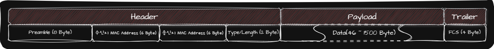
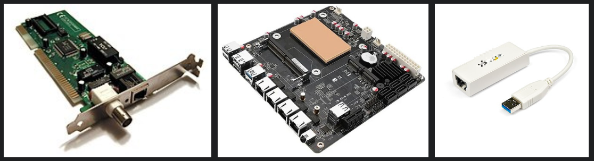
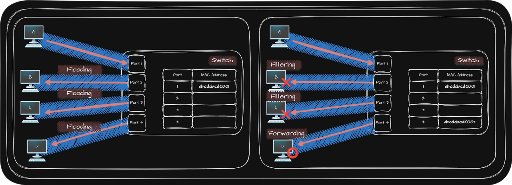
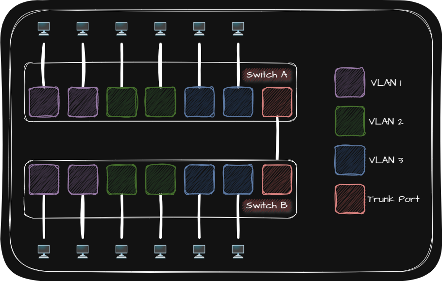
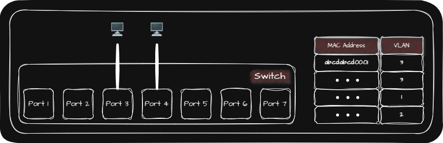

## 🌐 Ethernet

오늘날의 유선 LAN 환경은 대부분 이더넷(Ethernet)을 기반으로 구성되며 Physical Layer와 Data Link Layer에서 사용됩니다.

자세히 말하자면 Physical Layer에 이더넷 규격 케이블을 사용하고 Data Link Layer에서 주고 받는 Frame은 Ethernet Frame의 형태식을 따르는 LAN 환경을 구축하여 Ethernet을 이용합니다.

서로 다른 컴퓨터가 서로 다른 제조사의 네트워크 장비를 사용할 때 동일한 형식의 Frame을 주고 받도록 하기 위해서 Ethernet은 국제적으로 표준화 되어 있습니다. 그렇기 때문에 모든 네트워크 장비들을 Ethernet 표준을 따르고 있습니다.

## 🌐 (Ethernet) Frame

|   Header    |                                                                                                                                                                                                                    |
| :---------: | :----------------------------------------------------------------------------------------------------------------------------------------------------------------------------------------------------------------- |
|  Preamble   | • Preamble을 통해 수신자는 Frame이 오고 있음을 알 수 있음   • Frame의 시작을 알리는 $8$ Byte 크기의 정보(`10101010` $\times\ 7$ / `10101011`)                                                                  |
| MAC Address | • 일반적으로 변경되지 않는 고유한 물리적 주소로써 Network Interface마다 부여(변경이 가능하긴 하지만 일반적이지 않음)   • NIC(Network Interface Controller)가 여러 개 있다면 MAC Address도 여러 개 있을 수 있음 |
| Type/Length | • **Length**: Field Value $\le 1500$   • **Type**: Field Value $\ge 1536$ (상위 계층에서 사용된 프로토콜이 명시)                                                                                               |

| Payload |                                                                                                                                 |
| :-----: | :------------------------------------------------------------------------------------------------------------------------------ |
|  Data   | • 상위 계층에서 전달받거나 상위 계층으로 전달해야 할 내용   • 반드시 $46$ Byte 이상이어야 함($46$ Byte 이하인 경우 Padding) |

|            Trailer             |                                                                                                                                                                                                                                                                                                                                                                          |
| :----------------------------: | :----------------------------------------------------------------------------------------------------------------------------------------------------------------------------------------------------------------------------------------------------------------------------------------------------------------------------------------------------------------------- |
| FCS (Frame Check Sequence) | • 수신한 Frame에 오류가 있는지 확인하는 필드   • 필드에는 CRC(Cyclic Redundancy Check; 순환 중복 검사) 값이 들어감   • 송신지: Preamble과 FCS를 제외한 나머지 필드 값들을 바탕으로 CRC 값을 계산한 후 명시   • 수신지: Preamble과 FCS를 제외한 나머지 필드 값들을 바탕으로 CRC 값을 계산한 후 송신지에서 명시한 CRC 값과 비교하여 일치하지 않으면 Frame 폐기 |

## 🌐 Protocol

### 🌐 CSMA/CD Protocol

CSMA/CD Protocol은 Physical Layer의 네트워크 장비(Hub)가 가지고 있는 단점인 Collision을 해결하기 위해 사용하는 Data Link Layer의 Protocol입니다.

|         CSMA/CD         | Definition                                                                                             |
| :---------------------: | :----------------------------------------------------------------------------------------------------- |
|    CS(Carrier Sence)    | 반송파를 감지하여 현재 전송이 가능한 상태인지를 확인                                                   |
|   MA(Multiple Access)   | 다수의 Host가 네트워크에 접속하려는 상황                                                               |
| CD(Collision Detection) | Host가 Collision을 감지하면 전송이 중단되고, Collision을 검출한 Host는 다른 Host에게 Jam Signal을 보냄 |

> - **반송파**: 통신 매체상에서 흐르는 신호  
> - **Jam Signal**: 다른 Host에게 Collision이 발생했음을 알리는 신호
{: .prompt-tip }

CSMA/CD Protocol은 3단계로 Collision을 해결합니다.

1. Host는 먼저 현재 전송이 가능한 상태인지를 확인
2. 다른 Host가 전송 중이지 않을 때 메세지를 전송
3. 만약 다수의 Host가 접근하여 Collision이 발생하면 임의의 시간 만큼 대기한 후에 다시 전송

## 🌐 네트워크 장비

Data Link Layer에는 주소 개념이 있기 때문에 Data Link Layer의 장비들은 송수신지를 특정할 수 있고 주소를 바탕으로 송수신되는 정보에 대한 조작과 판단을 할 수 있습니다.

Data Link Layer의 네트워크 장비로는 다음과 같은 것들이 있습니다.

| 🕹️ [NIC(Network Interface Controller)](#-nic) |
| 🖲️ [(L2) Switch](#-l2-switch) |
| 🛜 [AP(Access Point)](#-apaccess-point) |

### 🌐 NIC

_Card 형태의 NIC / 마더보드에 내장된 NIC / USB로 연결이 가능한 NIC_

NIC(Network Interface Controller)는 Host와 유무선 통신 매체를 연결하고 <u>통신 매체의 신호 ↔️ Frame 변환</u>을 담당하는 네트워크 장비입니다.

이처럼 Host는 NIC가 있어야 네트워킹을 할 수 있으므로 NIC를 다른 말로 Host를 네트워크에 연결하기 위한 H/W라고 부르기도 합니다.

### 🌐 (L2) Switch

Switch는 전이중 모드(Full Duplex)를 지원하기 때문에 Switch를 이용하면 Port 별로 Collision Domain이 나누어지고 CSMA/CD Protocol이 필요하지 않습니다.

또한 CSMA/CD Protocol의 대기 시간이 없어졌기 때문에 성능도 향상되어 오늘날까지도 Ethernet Network 구성시 자주 사용합니다.

> **전이중 모드(Full Duplex)**: 송수신을 동시에 양방향으로 할 수 있는 통신 방식(🆚 Half Duplex)
{: .prompt-tip }

Switch의 특징은 다음과 같습니다.

|                      특징                      | 정의                                                                                          |
| :--------------------------------------------: | :-------------------------------------------------------------------------------------------- |
| [MAC Address Learning](#-mac-address-learning) | 특정 포트에 연결된 Host의 MAC Address를 기억하여 이후 원하는 Host에게만 Frame을 전달하는 기능 |
|     [VLAN(Virtual LAN)](#-vlanvirtual-lan)     | 한 대의 물리적 Switch를 여러 대의 Switch가 있는 것처럼 논리적 단위로 LAN을 구획하는 기능      |

#### 🌐 MAC Address Learning

MAC Address Learning은 특정 포트에 연결된 Host의 MAC Address를 기억하여 이후 원하는 Host에게만 Frame을 전달하는 기능입니다.

| MAC Address Learning |                                                                                                                                             |
| :------------------: | :------------------------------------------------------------------------------------------------------------------------------------------ |
|  MAC Address Table   | Switch는 MAC Address Learning을 위해 <u>특정 포트</u>와 <u>해당 포트에 연결된 Host의 MAC Address</u> 연결 관계를 메모리에 table 형태로 저장 |
|       Flooding       | 수신지 Host가 어느 포트에 연결되어 있는지 모르기 때문에 송신지 포트를 제외한 모든 포트로 Frame을 전송하는 기능                              |
|      Filtering       | Switch가 전달받은 Frame을 어디로 내보내고 어디로 내보내지 않을지 결정하는 기능                                                              |
|      Forwarding      | Frame이 전송되어야 하는 Port에 실제로 Frame을 내보내는 기능                                                                                 |
|        Aging         | MAC Address Table에 등록된 특정 포트에서 일정 시간 동안 Frame을 전송 받지 못하면 해당 포트와 관련된 Table 정보를 삭제                       |

#### 🌐 VLAN(Virtual LAN)

VLAN은 한 대의 물리적 Switch를 여러 대의 Switch가 있는 것처럼 논리적 단위로 LAN을 구획하는 기능입니다.

굳이 같은 LAN에 속할 필요가 없는 Host들을 분리하고 싶을 때 VLAN을 사용하며 서로 다른 VLAN에 속한 Host끼리 통신하고자 할 때는 Data Link Layer보다 상위 계층의 네트워크 장비가 필요하게 됩니다.

즉, VLAN을 구성하게되면 Broadcast Domain도 함께 달라집니다.

VLAN 구성 방법으로는 Port Based VLAN과 MAC Based VLAN이 있습니다.

##### 🌐 Port Based VLAN

Port Based VLAN은 Switch의 포트가 VLAN을 결정하는 방식입니다.

그러나 포트의 수가 연결하고 싶은 Host의 수보다 적을 때 문제가 생깁니다. 이러한 문제를 Port Based VLAN에서는 VLAN Trunking으로 해결합니다.

VLAN Trunking은 두 대 이상의 VLAN Switch를 효율적으로 연결하여 확장하는 방법입니다. 자세히 말하자면 Switch 간의 통신을 위한 포트인 Trunk Port(Tagged Port)에 VLAN Switch를 서로 연결하여 Switch를 확장합니다. 이 경우 Trunk Port로 전달받은 Frame이 어떤 VLAN에 속하는지 알기 위해 기존의 Frame에서 확장된 Frame을 사용합니다.

##### 🌐 MAC Based VLAN

MAC Based VLAN은 사전에 설정된 MAC Address에 따라 VLAN이 결정되는 방식입니다.

### 🌐 AP(Access Point)

AP는 무선 통신 기기들을 연결하여 무선 네트워크를 구성하는 장비입니다.

AP를 경유하여 통신이 이루어지는 무선 네트워크 통신 방식을 Infrastructure Mode라 하며 오늘날 많은 무선 LAN이 AP가 중개하는 Infrastructure Mode로 동작합니다.

AP와 연결된 여러 장치들이 무선 네트워크를 형성하게 되는데 이 때 AP를 통해 연결된 모든 네트워크 장비들의 집합을 Service Set이라 합니다. 이러한 Service Set을 구분할 수 있는 수단으로 SSID(Service Set IDentifier)를 사용하는데 우리가 흔히 Wi-Fi 이름이라 생각하고 있는 것입니다.

무선 네트워크 연결을 하기 위해 Wi-Fi 목록을 확인해 보면 연결하지 않은 다양한 SSID가 있는 것을 확인할 수 있습니다. 이처럼 연결하지도 않은 Wi-Fi들을 Host가 인식하고 있는 이유는 AP가 주기적으로 전송하는 Beacon Frame을 Host가 받았기 때문입니다.

> **Beacon Frame**: 불특정 다수에게 자신을 알리는 Broadcast 메세지(SSID, AP의 MAC Address 등이 포함)
{: .prompt-tip }
