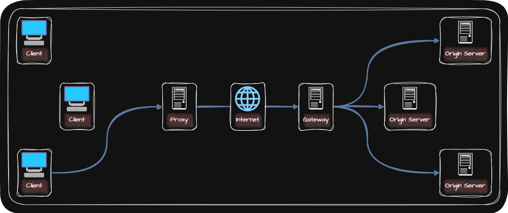

## 🖧 Load Balancing

로드 밸런싱(Load Balancing)은 Load Balancer에 의해 트래픽을 고르게 분배하는 기술입니다. 

Load Balancing은 L4 Switch, L7 Switch라 불리는 네트워크 장비(Load Balancer)로 수행할 수 있지만 Load Balancing 기능을 제공하는 S/W를 설치하면 일반 Host를 Load Balancer로 사용할 수 있습니다. 

대표적으로 다음과 같은 것들이 있습니다.

_HAProxy / Envoy / Nginx_

일반적으로 Load Balancer는 다중화된 Server와 Client 사이에 위치하여 Client들은 Load Balancer에 요청을 보내고, Load Balancer는 해당 요청을 각 서버에 균등하게 분배합니다.

Load Balancing Algorithm에는 다양한 방법이 있으며 Load Balancer마다 이해하는 알고리즘에는 차이가 있을 수 있습니다. 대표적인 알고리즘은 다음과 같습니다.

| Round Robin | 단순히 Server를 돌아가며 트래픽을 전달 |
| Weighted Round Robin | Server마다 가중치를 부여해 가중치가 높은 Server가 더 많이 선택되도록 하는 Round Robin Algorithm |
| Least Connection | 연결이 적은 Server부터 우선적으로 트래픽를 전달 |
| Weighted Least Connection | Server마다 가중치를 부여해 가중치가 높은 Server가 더 많이 선택되도록 하는 Least Connection Algorithm |

## 🖧 Proxy

Client와 Server 사이에는 수많은 Server들이 존재하며 Client가 최종적으로 메세지를 주고받는 Server를 Origin Server라 합니다. 이때, Origin Server를 향하는 메세지를 <u>Inbound</u>, Client를 향하는 메세지를 <u>Outbound</u>라 합니다.

Client와 Origin Server 사이에 있는 대표적인 중간 Server의 유형으로 Proxy와 Gateway가 있습니다. Proxy는 Forward Proxy, Gateway는 Reverse Proxy라고도 부릅니다.

|  | Proxy(Forward Proxy) | Gateway(Reverse Proxy) |
|:-:|:-:|:-:|
| 역할 | Client가 선택한 메세지 전달 대리자 | • 일반적으로 네트워크 간의 통신을 가능하게 하는 입구 역할을 하는 H/W 혹은 S/W를 의미   • Outbound 연결에 대해 Origin Server 역할을 하지만, 수신된 요청을 변환하여 다른 Inbound Server들로 전달하는 중재자 역할 |
| 위치 | Client에 더 가까이 위치 | Origin Server에 더 가까이 위치 |
| 기능 | 주로 Cache 저장, Client 암호화 및 접근 제한 등의 기능을 제공 | Cache 저장, Loadbalancer로 동작 |
