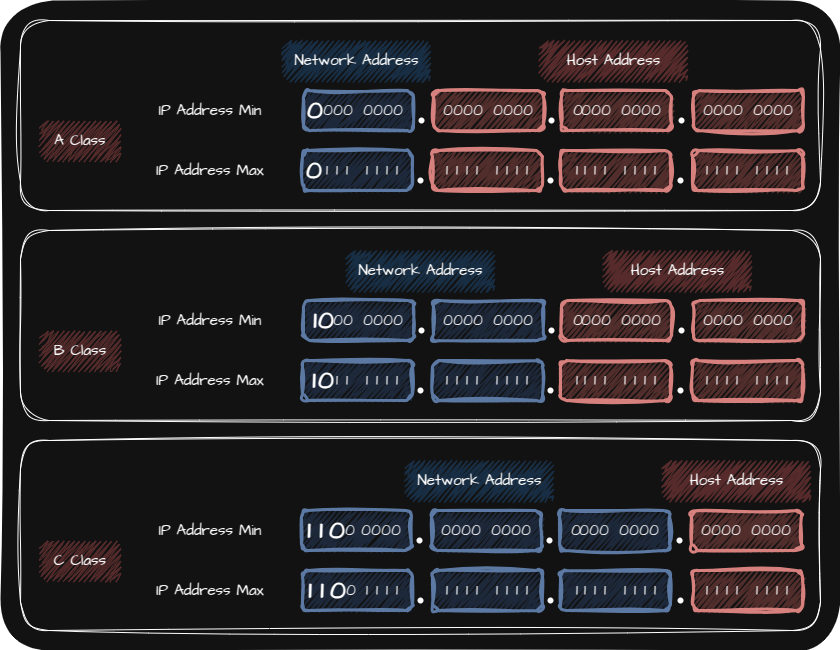
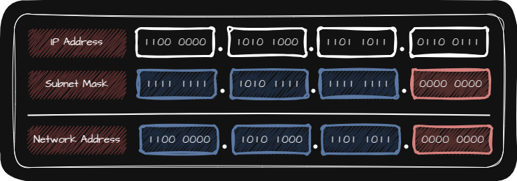
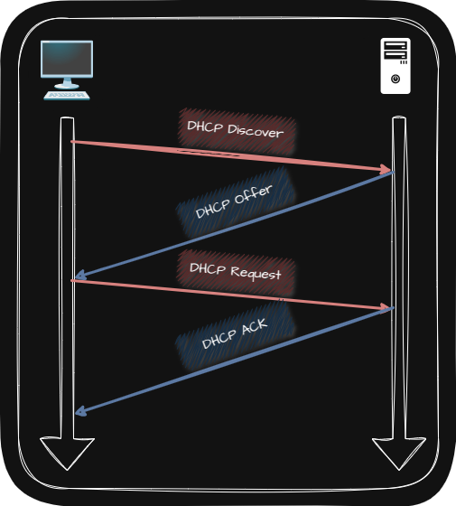
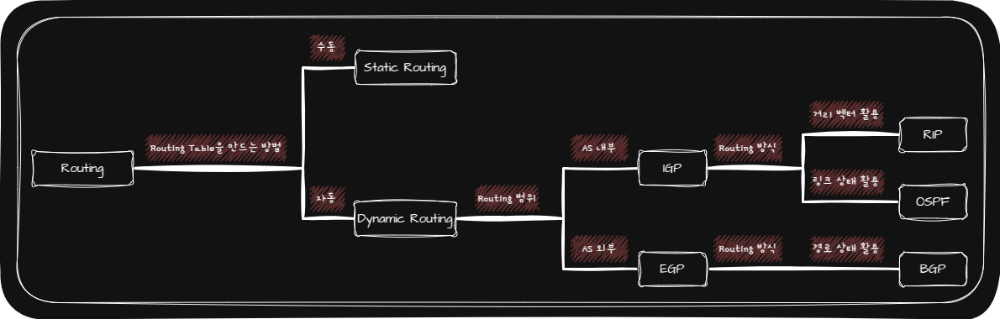
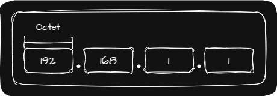
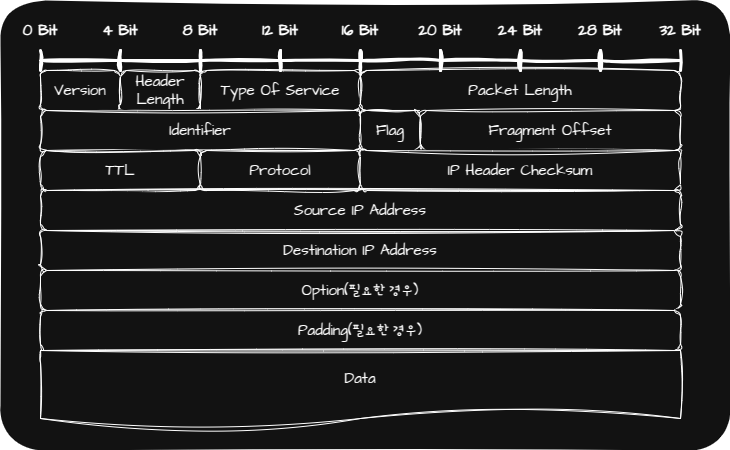
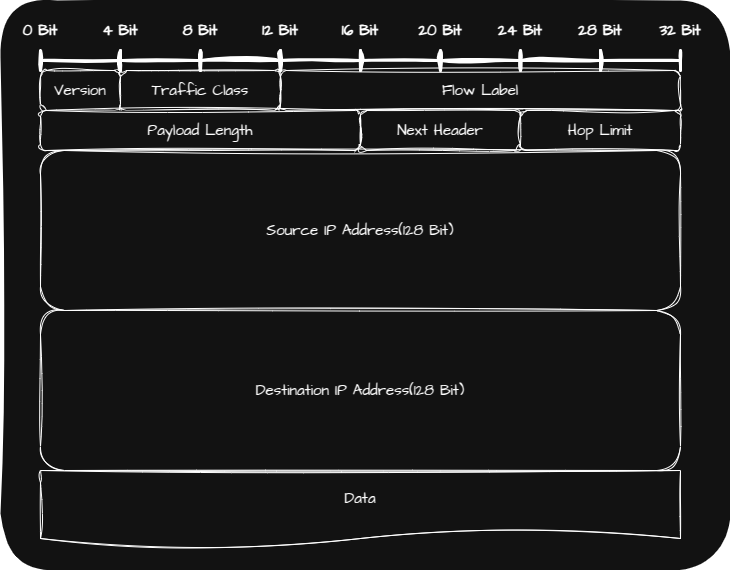
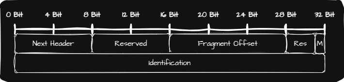

## 🌐 Network Layer

Physical Layer와 Data Link Layer만으로는 LAN을 넘어서서 통신하기 어렵습니다. 그렇기 때문에 Network Layer가 필요합니다.

또한 Data Link Layer의 MAC Address만으로는 모든 네트워크에 속한 Host의 위치를 특정하기 어렵기 때문에 IP Address를 함께 사용합니다.(IP Address를 MAC Address보다 우선적으로 사용)

## 🌐 Protocol

### 🌐 IP(Internet Protocol)

IP에는 IP 버전 4([IPv4](#-ipv4))와 IP 버전 6([IPv6](#-ipv6)) 두 가지 버전이 있습니다.

그리고 IP의 기능은 다양하지만 다음과 같은 기능이 대표적입니다.

|      IP의 대표적 기능       | 정의                                                                                   |
| :-------------------------: | :------------------------------------------------------------------------------------- |
| IP Addressing(IP 주소 지정) | IP 주소를 바탕으로 송수신 대상을 지정하는 것                                           |
| IP Fragmentation(IP 단편화) | 전송하고자 하는 Packet의 크기가 MTU보다 큰 경우 Packet을 MTU보다 작은 크기로 나누는 것 |

> 💡 MTU(Maximum Transmission Unit)  
> 📢 한 번에 전송 가능한 Packet의 최대 크기(Header 포함)  
> 📢 일반적인 MTU는 $1500$ Byte  
> 📢 MTU 이하로 나누어진 Packet은 수신지에 도착하면 다시 재조합

#### 🌐 IP Address

IP Address는 크게 `Network Address`와 `Host Address`로 나누어집니다.

`Network Address`는 Network ID, Network Identifier라고 불리기도 하며 Host가 속한 특정 네트워크를 식별하는 역할을 합니다.

`Host Address`는 Host ID, Host Identifier라고 불리기도 하며 네트워크 내에서 특정 Host를 식별하는 역할을 합니다.

`Host Address`가 전부 $0$인 IP Address는 해당 네트워크 자체를 의미하는 `Network Address`로 사용되고 `Host Address`가 전부 $1$인 IP Address는 Broadcast를 위한 주소로 사용됩니다.

IP Address에서 `Network Address`와 `Host Address`를 나누는 방법에 따라 다음과 같이 나누어집니다.

| [Classful Addressing](#-classful-addressing) | 네트워크 크기에 따라 IP Address를 분류하는 IP Addressing |
| [Classless Addressing](#-classless-addressing) | Subnet Mask를 사용해 `Network Address`와 `Host Address`를 구분 짓는 IP Addressing |

이처럼 Host가 정할 수 있는 IP Address가 있는 반면 이미 예약되어 있어 바꿀 수 없는 IP Address도 있습니다.

| 예약된 IP Address | Description                   | Usecase                                                                             |
| :---------------: | :---------------------------- | :---------------------------------------------------------------------------------- |
|    0.0.0.0 / 8    | This host on this network     | Host가 IP Address를 할당받기 전에 임시로 사용하는 경우가 많음                       |
|    0.0.0.0 / 0    | 모든 임의의 IP Address        | 주로 Packet이 이동할 경로를 결정하는 Routing에서 Default Route를 나타내기 위해 사용 |
|   127.0.0.0 / 8   | Loopback Address \| Localhost | 자기 자신을 가리키는 특별한 주소로 주로 테스트나 디버깅 용도로 사용                 |

> 💡 Default Route  
> 📢 Packet을 어떤 IP Address로 전달할지 결정하기 어려울 경우 기본적으로 Packet을 전달할 경로를 의미

#### 🌐 Classful Addressing

Classful Addressing은 네트워크 크기에 따라 IP Address를 분류하는 IP Addressing입니다.

여기서 Class는 네트워크 크기에 따라 IP Address를 분류하는 기준입니다. Class를 이용하면 필요한 Host IP 개수에 따라 네트워크 크기를 가변적으로 조정해 `Network Address`와 `Host Address`를 구분지을 수 있습니다.

#### 🌐 Classless Addressing

Classful Addressing을 사용하는 경우 Class 별 네트워크의 크기가 고정되어 있기 때문에 다수의 IP Address가 낭비될 가능성이 큽니다. 또한 A, B, C Class 외에는 다른 크기의 네트워크를 구성할 수 없는 문제가 있는데 이를 해결한 방식이 Classelss Addressing 입니다.

Subnet Mask를 이용해 Network Address와 Hsot Address를 구분 짓는 방법은 IP Address와 Subnet Mask를 다음과 같이 AND 연산을 하면 됩니다.

Subnet Mask에서 1은 `Network Address`를 나타내고 0은 `Host Address`를 나타내는데 다음과 같이 두 개의 방식으로 표기할 수 있습니다.

|          |  10 진수로 직접 표기하는 방법   | CIDR(Classless Inter-Domain Routing Notation) |
| :------: | :-----------------------------: | :-------------------------------------------: |
| Notation |    IP Address & Subnet Mask     |      IP Address / Subnet Mask의 1의 개수      |
| Example  | 192.168.219.103 & 255.255.255.0 |             192.168.219.103 / 24              |

#### 🌐 Public IP Address VS Private IP Address

|      |                          Public IP Address                          |                                      Private IP Address                                      |
| :--: | :-----------------------------------------------------------------: | :------------------------------------------------------------------------------------------: |
| 사용 |               네트워크 간의 통신(Internet)할 때 사용                |                          사설 Network에서 사용하기 위한 IP Address                           |
| 할당 | ISP(Internet Service Provider)나 공이 IP 주소 할당 기관을 통해 할당 |                                      Router를 통해 할당                                      |
| 특징 |                          전 세계에서 고유                           | • 다른 네트워크의 IP Address와 중복될 수 있음   • 외부 네트워크와 통신하기 위해 NAT 사용 |

> 💡 NAT(Network Address Translation)  
> 📢 NAT 테이블을 사용해 주로 Private IP Address와 Public IP Address를 변환하는데 사용

> 💡 NAPT(Network Address Port Translation) 혹은 APT(Address Port Translation)  
> 📢 포트를 활용해 하나의 Public IP Address를 여러 Private IP Address가 공유할 수 있도록 하는 NAT의 일종

#### 🌐 Static IP Address VS Dynamic IP Address

|      | Static IP Address                      | Dynamic IP address                                                                                                                                                                 |
| :--: | :------------------------------------- | :--------------------------------------------------------------------------------------------------------------------------------------------------------------------------------- |
| 정의 | Host에 직접 IP Address를 부여하는 방식 | 직접 부여하지 않고 IP Address가 동적으로 할당되는 방식                                                                                                                             |
| 특징 |                                        | • 사용되지 않을 경우 회수   • 할당받을 때마다 다른 IP Address를 받을 수도 있음   • Dynamic IP Address를 할당할 때 [DHCP](#-dhcpdynamic-host-configuration-protocol)를 사용 |

### 🌐 DHCP(Dynamic Host Configuration Protocol)

DHCP는 Host가 Dynamic IP Address를 할당받을 때 사용합니다.

DHCP를 통해 Dynamic IP Address를 할당 받는 순서는 다음과 같습니다.

| Message          | Client ↔ DHCP Server | Description                                                                                                                                                                                     |
| :--------------- | :------------------: | :---------------------------------------------------------------------------------------------------------------------------------------------------------------------------------------------- |
| 1️⃣ DHCP Discover | Client ➜ DHCP Server | • Client는 DHCP Discover 메세지를 Broadcast로 전송하여 DHCP Server를 찾음   • Client는 아직 IP Address를 할당 받지 못했으므로 DHCP Discover 메세지의 송신지 IP Address는 $0.0.0.0$으로 설정 |
| 2️⃣ DHCP Offer    | DHCP Server ➜ Client | DHCP Discover 메세지를 전달받은 DHCP Server는 Client에게 할당해 줄 IP Address가 괜찮은지 제안하는 DHCP Offer 메세지를 전송                                                                      |
| 3️⃣ DHCP Request  | Client ➜ DHCP Server | 제안받은 IP Address를 정말 사용해도 되는지 되묻는 DHCP Request 메세지를 Broadcast로 전송                                                                                                        |
| 4️⃣ DHCP ACK      | DHCP Server ➜ Client | DHCP Server는 최종 승인하는 DHCP ACK 메세지를 전송하고 Client는 할당 받은 IP Address를 자신의 IP Address를 설정한 뒤 임대 기간 동안 IP Address를 사용                                           |
| ✚ Lease Renewal  |                      | IP Address의 임대 기간이 끝나기 전에 기본적으로 두 차례 자동으로 수행하며 임대 갱신을 실패하면 사용하던 IP Address는 DHCP Server에게 반납                                                       |

### 🌐 ARP(Address Resolution Protocol)

ARP는 IP Address를 통해 MAC Address를 알아내는 프로토콜입니다. ARP를 사용하면 동일 네트워크 내에 있는 Host의 IP Address를 통해 MAC Address를 알아낼 수 있습니다.

ARP의 동작 과정은 다음과 같습니다.

|                            Message                            | Description                                                                                                                                                                  |
| :-----------------------------------------------------------: | :--------------------------------------------------------------------------------------------------------------------------------------------------------------------------- |
|                     ARP 요청(ARP Request)                     | 네트워크 내의 모든 Host에게 Broadcast 메세지를 보냄                                                                                                                          |
|                      ARP 응답(ARP Reply)                      | IP Address가 일치하는 Host는 자신의 MAC Address를 담은 Unicast 메세지를 ARP Request를 전송했던 Host에게 전송                                                                 |
| ARP 테이블 갱신   (ARP Table, ARP Cache, ARP Cache Table) | • ARP Request를 전송했던 Host는 ARP Reply를 전달한 Host의 IP Address와 MAC Address를 ARP Table에 추가   • ARP Table은 일정 시간이 지나면 삭제되고, 임의로 삭제할 수 있음 |

추가적으로 만약 동일 네트워크에 있지 않은 상황에서 MAC 주소를 알아내기 위해 ARP를 사용하는 경우 Router를 이용해 ARP 통신을 할 수 있습니다.

### 🌐 Routing Protocol

Routing Protocol은 Router끼리 자신의 정보를 교환하며 Packet이 이동할 최적의 경로를 찾기 위한 프로토콜입니다.

Routing Protocol은 크게 AS 내부에서 수행되면 [IGP](#-igpinterior-gateway-protocol), AS 외부에서 수행되면 [EGP](#-egpexteriror-gateway-protocol)로 나눕니다.

|                     IGP(Interior Gateway Protocol)                     |                EGP(Exterior Gateway Protocol)                |
| :--------------------------------------------------------------------: | :----------------------------------------------------------: |
| [RIP(Routing Information Protocol)](#-riprouting-information-protocol) | [BGP(Border Gateway Protocol)](#-bgpborder-gateway-protocol) |
| [LSRP(Link State Routing Protocol)](#-lsrplink-state-routing-protocol) |                                                              |

> 💡 AS(Autonomous System)  
> 📢 동일한 Routing 정책으로 운용되는 Router들의 집단 네트워크

> 📢 Router들은 AS 내부에서만 통신할 수도 있고, ASBF(AS Boundary Router)을 사용해 AS 외부와도 통신할 수 있습니다.

#### 🌐 IGP(Interior Gateway Protocol)

##### 🌐 RIP(Routing Information Protocol)

RIP는 거리 벡터를 활용해 최적의 경로를 찾는 프로토콜입니다.

인접한 Router끼리 경로 정보를 주기적으로 교환하며 Routing Table을 갱신하고 이를 통해 Router는 특정 수신지까지의 Hop 수를 알 수 있는데 RIP는 특정 수신지까지의 경로 중 Hop 수가 가장 적은 경로를 최적의 경로로 판단합니다.

> 💡 Hop  
> 📢 Packet이 Host 또는 Router에 한 번 전달되는 것

##### 🌐 LSRP(Link State Routing Protocol)

LSRP는 OSPF(Open Shortest Path First)라고도 불립니다.

Router들의 연결 관계, 연결 비용 등 현재 네트워크의 상태를 그래프로 표현하기 위한 데이터를 LSDB(Link State DB)에 저장하고 Router는 LSDB를 기반으로 현재 네트워크 구성을 마치 지도처럼 그린 뒤에 최적의 경로를 선택합니다.

최적의 경로를 선택할 때는 대역폭을 기반으로 Metric을 계산하고 대역폭이 높은 Link일수록 Metric이 낮은 경로로 인식합니다. 즉, 대역폭이 큰 Link를 최적의 경로로 선택합니다.

LSRP를 사용할 때는 AS를 area라는 단위로 나누고 구분된 area 내부에서만 Link State를 공유하며 ABR(Area Border Router)가 area 간의 연결을 담당합니다. 또한 Link State를 공유하는 area에서 네트워크 구성에 변경이 있을 때 Routing Table을 갱신합니다.

#### 🌐 EGP(Exteriror Gateway Protocol)

##### 🌐 BGP(Border Gateway Protocol)

AS 간의 통신에서 사용되는 대표적인 프로토콜입니다. BGP는 AS간 Routing을 할 때 거치게 될 Router의 수가 아닌 AS의 수를 고려하고 [RIP(Routing Information Protocol)](#-riprouting-information-protocol)처럼 단순히 수신지에 이르는 거리가 아닌, 메세지가 어디를 거쳐 어디로 이동하는지를 나타내는 경로를 고려합니다.

BGP의 종류는 다음과 같습니다.

|      BGP 종류      |          설명           |
| :----------------: | :---------------------: |
| eBGP(External BGP) | AS 간의 통신을 위한 BGP |
| iBGP(Internal BGP) | AS 내의 통신을 위한 BGP |

추가적으로 BGP는 경로 결정 과정에서 수신지 주소와 더불어 다양한 속성과 정책이 고려되는데 BGP의 속성은 다음과 같습니다.

|           BGP 속성           |                                                                                 |
| :--------------------------: | :------------------------------------------------------------------------------ |
|           AS-PATH            | 메세지가 수신지에 이르는 과정에서 통과하는 AS들의 목록                          |
|           NEXT-HOP           | 다음으로 거칠 Router의 IP Address를 나타냄                                      |
| LOCAL-PREF(LOCAL PREFerence) | AS 외부 경로에 있어 AS내부에서 어떤 경로를 선호할지에 대한 척도를 나타내는 속성 |

## 🌐 IPv4

IPv4 Address는 4 Byte(32 Bit)로 표현되고, 0 ~ 255 범위 안에 있는 4개의 10진수로 표기됩니다.

각 10진수는 `.`으로 구분되며, `.`으로 구분된 8 Bit를 Octet이라고 합니다.

### 🌐 IPv4 Packet

IPv4 Packet은 크게 IPv4 Header와 IPv4 Payload로 구성되어 있습니다.

또한 IPv4 Header는 필요한 경우에만 전달할 수 있는 정보들이 포함되어 있기 때문에 가변적인 특징을 가지고 있습니다.

IPv4 Header 중 중요한 부분만 살펴보겠습니다.

_IPv4 Packet_

|             Header             | 설명                                                                                                                                                                                                                                                                                                                                    |
| :----------------------------: | :-------------------------------------------------------------------------------------------------------------------------------------------------------------------------------------------------------------------------------------------------------------------------------------------------------------------------------------- |
|       식별자(Identifier)       | • Packet에 할당된 번호   • 단편화를 통해 도착한 IPv4 Packet들을 식별하기 위해 사용                                                                                                                                                                                                                                                  |
|          플래그(Flag)          | • 총 3개의 Bit로 구성된 필드   • **첫 번째 Bit**: 항상 0으로 예약된 Bit로 현재 사용되지 않음   • **두 번째 Bit**: DF(Don't Fragment)로 $1$이면 IP 단편화를 수행하지 않고 $0$이면 IP 단편화가 가능함을 표시   • **세 번째 Bit**: MF(More Fragment)로 $1$이면 쪼개진 Packet이 더 있고 $0$이면 해당 Packet이 마지막임을 의미함 |
| 단편화 오프셋(Fragment Offset) | • Packet이 단편화되기 전에 해당 Packet이 몇 번째 Packet인지를 나타냄   • 단편화되어 전송되는 Packet들은 수신지에 순서대로 도착하지 않을 수 있기 때문에 재조합을 위해 사용                                                                                                                                                           |
|       TTL(Time To Live)        | •무의미한 Packet이 네트워크 상에 지속적으로 남아있는 것을 방지하기 위한 것   • TTL의 값은 Hop마다 1씩 감소   • TTL의 값이 0이 되면 해당 Packet은 폐기                                                                                                                                                                           |
|            Protocol            | • 상위 계층의 프로토콜이 무엇인지를 나타내는 필드   • Ex. TCP - 6, UDP - 17                                                                                                                                                                                                                                                         |
|       Source IP Address        | 송신지 IP Address                                                                                                                                                                                                                                                                                                                       |
|     Destination IP Address     | 수신지 IP Address                                                                                                                                                                                                                                                                                                                       |

> 💡 Hop  
> 📢 Packet이 Host 또는 Router에 한 번 전달되는 것

## 🌐 IPv6

할당 가능한 IPv4 주소는 총 $2^32$개로 약 $43$억개 입니다. 약 $43$억개의 주소가 많아보이지만 많은 네트워크 장치들을 감당하기에는 턱없이 부족한 숫자입니다. 그래서 등장한 것이 IPv6입니다.

IPv6 주소는 $16$ Byte($128$ Bit)로 주소를 표현할 수 있고, 콜론으로 구분된 $8$개의 그룹의 $16$진수로 표기됩니다.

할당 가능한 IPv6 주소는 총 $2^128$개로 IPv4에 비해 훨씬 많은 네트워크 장치들을 감당할 수 있습니다.

### 🌐 IPv6 Packet

IPv6 Packet은 크게 기본 Header, 확장 Header, Payload로 구성되어 있습니다.

또한 IPv4에 비해 IPv6 Packet은 매우 간소화되어 있으며 IPv4와 달리 $40$ Byte로 기본 Header의 크기가 고정적입니다.

IPv6 Header 중 중요한 부분만 살펴보겠습니다.

_IPv6 Packet_

|         Header         | 설명                                                                                                                                                      |
| :--------------------: | :-------------------------------------------------------------------------------------------------------------------------------------------------------- |
| 다음 헤더(Next Header) | • 상위 계층의 Protocol을 가리키거나 확장 Header를 가리킴   • 확장 Header는 기본 Header와 Payload 사이에 위치하며 여러 개의 확장 Header를 가질 수 있음 |
|       Hop Limit        | IPv4 Packet의 TTL와 비슷하게 Packet의 수명을 나타냄                                                                                                       |
|     Source Address     | 송신지 IP Address                                                                                                                                         |
|  Destination Address   | 수신지 IP Address                                                                                                                                         |

확장 Header의 종류는 다음과 같은 것들이 있습니다.

|                                 확장 Header                                 | 설명                                                                 |
| :-------------------------------------------------------------------------: | :------------------------------------------------------------------- |
|                             Hop-by-Hop Options                              | 송신지에서 수신지에 이르는 모든 경로의 네트워크 장비가 Packet을 검사 |
|                             Destination Options                             | 수신지에서만 Packet을 검사                                           |
|                                   Routing                                   | Routing 관련 정보를 운반                                             |
|                                  Fragment                                   | 단편화                                                               |
| EXP(Encapsulating Security Payload)   &   AH(Authentication Header) | 암호화와 인증                                                        |

IPv6는 IPv4와 달리 기본 Header에 단편화 관련 필드가 없고, 단편화 확장 Header를 통해 단편화가 이루어지는데 단편화 확장 Header(Fragment Extension Header)의 상세 포함 내용은 다음과 같습니다.

_Fragment Extension Header_

| Reserved | 0으로 설정되어 사용되지 않음 |
| Res | 0으로 설정되어 사용되지 않음 |
| M Flag | IPv4의 MF(More Fragment) Flag역할 |
| Identification | IPv4의 Identifier 역할 |

## 🌐 네트워크 장비 - Router

Router의 핵심 기능은 Packet이 이동할 최적의 경로를 설정한 뒤 해당 경로로 Packet을 이동시키는 Routing이라 할 수 있습니다.

### 🌐 Routing Table

Routing의 핵심은 Router가 저장하고 관리하는 Routing Table입니다.

Routing Table이란 특정 수신지까지 도달하기 위한 정보를 명시한 일종의 표와 같은 정보입니다.

Router는 Routing Table을 참고하여 수신지까지의 도달 경로를 판단하는데 Routing 방식에 따라, Host 환경에 따라 Routing Table의 포함되는 정보가 달라질 수 있습니다. 일반적으로 포함되는 정보는 다음과 같습니다.

|                    포함 정보                     | 설명                                                                                                                                          |
| :----------------------------------------------: | :-------------------------------------------------------------------------------------------------------------------------------------------- |
| Destination IP Address   &   Subnet Mask | 최종적으로 Packet을 전달할 대상                                                                                                               |
|                Next Hop(Gateway)                 | 최종 수신지까지 가기 위해 다음으로 거쳐야 할 Host의 IP Address나 Interface를 의미                                                             |
|                Network Interface                 | • Packet을 내보낼 통로   • NIC(Network Interface Controller) 이름이 직접적으로 명시되거나 Interface에 대응하는 IP Address가 명시되기도 함 |
|                      Metric                      | • 해당 경로로 이동하는 데에 드는 비용   • Routing Table에 있는 경로 중 Packet을 내보낼 때 Metric이 낮은 경로를 선호                       |

Routing Table이 만들어지는 방법에는 크게 두 가지가 있습니다.

| Routing Table 만드는 방법 | 설명                                                                                                                                                                                                                 |
| :-----------------------: | :------------------------------------------------------------------------------------------------------------------------------------------------------------------------------------------------------------------- |
|      Static Routing       | 사용자가 수동으로 직접 채워 넣은 Routing Table의 항목을 토대로 Routing 되는 방식                                                                                                                                     |
|      Dynamic Routing      | • 자동으로 Routing Table항목을 만들고, 이를 이용하여 Routing하는 방식   • Routing Table이 수시로 변함   • 대규모 네트워크를 관리하는 데 있어서 더욱 편리   • [Routing Protocol](#-routing-protocol) 사용 |
