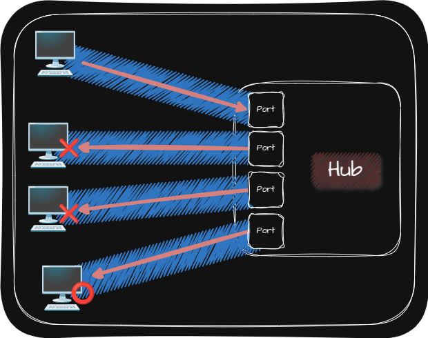

## 🌐 Ethernet

오늘날의 유선 LAN 환경은 대부분 이더넷(Ethernet)을 기반으로 구성되며 Physical Layer와 Data Link Layer에서 사용됩니다.

자세히 말하자면 Physical Layer에 이더넷 규격 케이블을 사용하고 Data Link Layer에서 주고 받는 Frame은 Ethernet Frame의 형태식을 따르는 LAN 환경을 구축하여 Ethernet을 이용합니다.

서로 다른 컴퓨터가 서로 다른 제조사의 네트워크 장비를 사용할 때 동일한 형식의 Frame을 주고 받도록 하기 위해서 Ethernet은 국제적으로 표준화 되어 있습니다. 그렇기 때문에 모든 네트워크 장비들을 Ethernet 표준을 따르고 있습니다.

## 🌐 네트워크 장비

Physical Layer에는 주소 개념이 없기 때문에 Physical Layer의 네트워크 장비는 송수신 정보에 대한 어떠한 조작이나 판단을 하지 않습니다.

### 🌐 Hub

Hub는 여러 대의 Host를 연결하는 장치이며 Repeater Hub, Ethernet Hub라고도 합니다.

Hub의 특징은 다음과 같습니다.

- 주소개념이 없는 Hub는 수신지를 특정하지 못하기 때문에 전달받은 신호를 모든 포트(Port)로 그대로 다시 전달
  > Hub를 통해 신호를 전달받은 모든 Host는 Data Link Layer에서 Frame의 MAC Address를 확인하고 자신과 없으면 폐기합니다.
  {: .prompt-info }
- 반이중 모드(Half Duplex)로 통신
  > Hub에 신호를 동시에 송신하면 Collision(충돌)이 발생하며 Collision Domain의 범위가 클수록 Collision이 발생할 가능성이 높아집니다.  
  {: .prompt-danger }
  > Data Link Layer의 [CSMA/CD(Carrier Sense Multiple Access with Collision Detection) Protocol](https://jjjuuuun.github.io/posts/Network-Data-Link-Layer/#-csmacd-protocol)로 Collision을 해결합니다.
  {: .prompt-info }

> - **반이중 모드(Half Duplex)**: 송수신을 번갈아 가면서 하는 통신 방식(🆚 Full Duplex)
> - **Collision Domain**: 같은 Hub에 연결된 모든 Host
{: .prompt-tip }

## 🌐 통신 매체 - Cable

Physical Layer의 통신매체로는 유선 연결을 해주는 Cable이 있습니다.

Cable의 종류에는 다음과 같은 것들이 있습니다.

|      | Twisted Pair Cable                     | Fiber Optic Cable                                                             |
| :--: | :------------------------------------- | :---------------------------------------------------------------------------- |
| 정의 | 구리 선으로 전기 신호를 주고받는 Cable | 광신호를 이용해 정보를 주고받는 Cable                                         |
| 장점 |                                        | • 속도가 빠름   • 먼 거리까지 전송이 가능   • Noise로부터 간섭이 적음 |
| 단점 | 구리 선에 전자적 간섭이 생길 수 있음   | 비용이 비쌈                                                                   |
