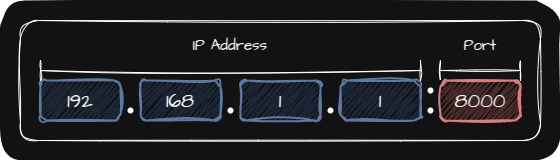
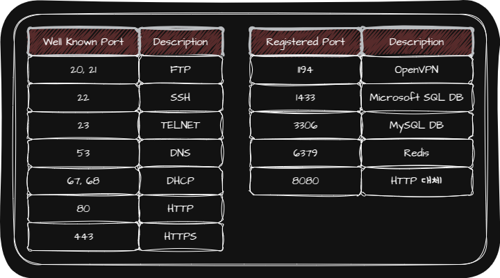
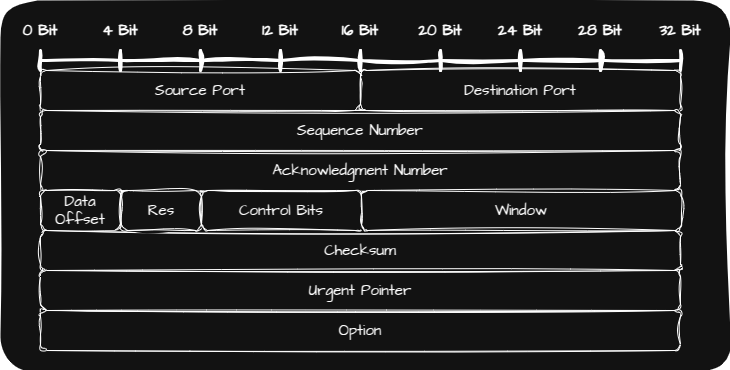
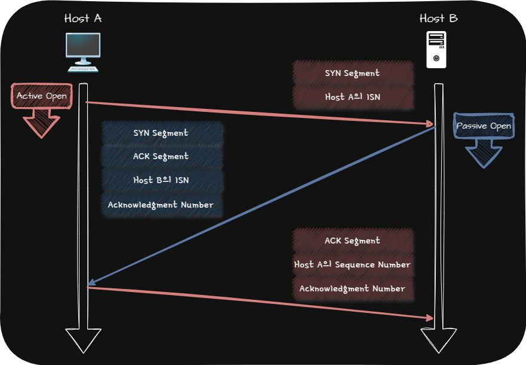
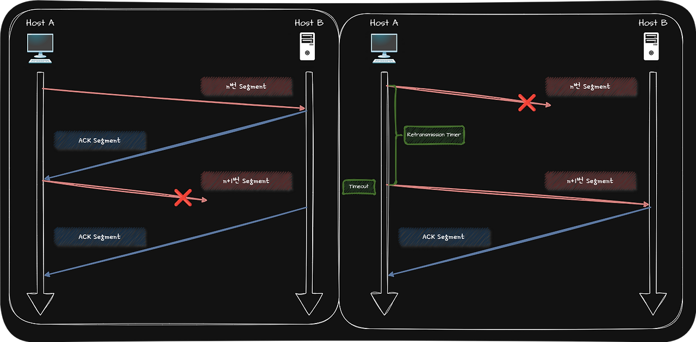
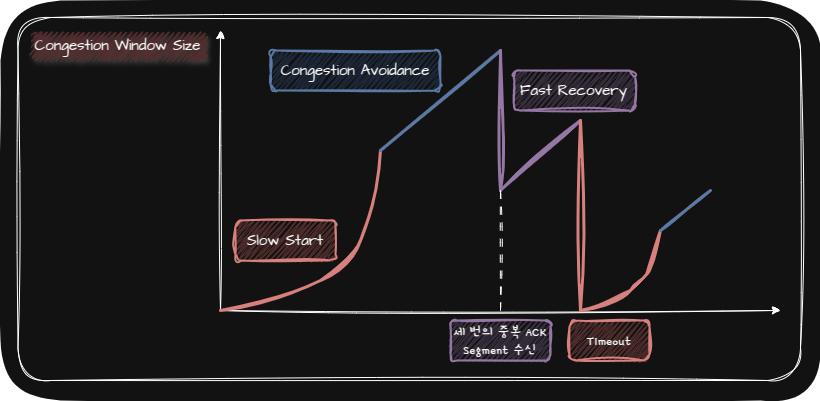
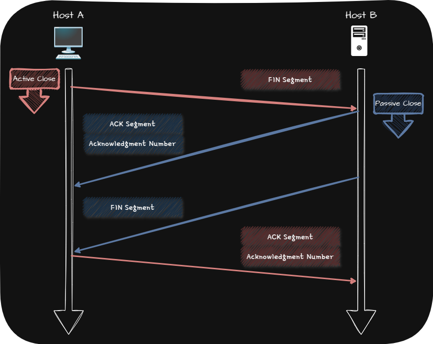
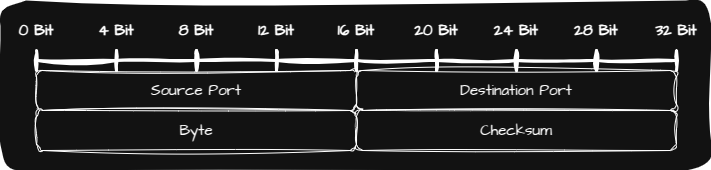

## 🌐 Transport Layer

Transport Layer는 Network Layer와 Application Layer 사이에 위치하며 IP의 한계를 극복하고 Application Process들을 식별하는 역할을 합니다.

IP의 한계는 다음과 같습니다.

|             IP의 한계             | 의미                                                                                                           |
| :-------------------------------: | :------------------------------------------------------------------------------------------------------------- |
|   비신뢰성(Unreliable Protocol)   | 최선형 전달(Best Effort Delivery): 최선을 다해 보겠지만, 전송 결과에 대해서는 어떠한 보장도 하지 않겠다는 의미 |
| 비연결성(Connectionless Protocol) | 송수신 Host 간에 사전 연결 수립 작업을 거치지 않고 그저 수신지를 향해 Packet을 보내기만 한다는 의미            |

### 🌐 Application Layer와 연결

포트(Port)란 Application Layer의 Appplication Process를 식별하는 정보입니다. 즉, Transport Layer에서는 Segment(Datagram) 내 수신지 포트와 송신지 포트를 통해 송수신지 Host의 Application을 식별합니다.

IP Address와 포트 번호에 대한 함께 주어지면 정 Host에서 실행 중인 특정 Application Process를 식별할 수 있습니다.

TCP와 UDP는 모두 송신지 포트와 수신지 포트 번호를 포함합니다.

Port 번호는 16 Bit로 표현 가능하며, 사용 가능한 Port는 0번 ~ 65535번까지 $2^{16}$개입니다.

표현 가능한 Port 번호들은 범위에 따라 $3$종류로 나누어집니다.

|                                                                                       | 포트 번호         | 사용                                                                                                                               |
| :-----------------------------------------------------------------------------------: | :---------------- | :--------------------------------------------------------------------------------------------------------------------------------- |
|            잘 알려진 포트(Well Known Port),  시스템 포트(System Port)             | 0번 ~ 1023번      | 범용적으로 사용되는 Application Protocol이 일반적으로 사용하는 포트 번호                                                           |
|                             등록된 포트(Registered Port)                              | 1024번 ~49151번   | 잘 알려진 포트에 비해서는 덜 범용적이지만 흔히 사용되는 Application Protocol에 할당하기 위해 사용                                  |
| 동적 포트(Dynamic Port),  사설 포트(Private Port),  임시 포트(Ephemeral Port) | 49152번 ~ 65535번 | 인터넷 할당 번호 관리 기관에 의해 할당된 Application Protocol이 없고 특별히 관리되지 않는 포트 번호인 만큼 자유롭게 사용할 수 있음 |

> 📢 Port Forwarding이란 네트워크 내 특정 Host에 IP Address와 포트 번호를 미리 할당하고 외부 네트워크에 있는 Host로부터 전달받은 Packet(Segment, Datagram)을 특정 Host로 전달하는 기능입니다.

## 🌐 Protocol

### 🌐 TCP(Transmission Control Protocol)

TCP는 IP의 한계를 극복하는 Protocol입니다.

#### 🌐 Segment

Segment Header 중 중요한 부분만 살펴보겠습니다.

_TCP Segment Header_

|            Segment Header             | 설명                                                                                                                              |
| :-----------------------------------: | :-------------------------------------------------------------------------------------------------------------------------------- |
|       송신지 포트(Source Port)        | 송신지 Application을 식별하는 포트                                                                                                |
|     수신지 포트(Destination Port)     | 수신지 Application을 식별하는 포트                                                                                                |
|      순서 번호(Sequence Number)       | 송수신되는 Segment의 올바른 순서를 보장하기 위해 Segment의 첫 Byte에 부여되는 번호                                                |
| 확인 응답 번호(Acknowledgment Number) | 상대 Host가 보낸 Segment에 대한 응답으로, 다음으로 수신하기를 기대하는 순서 번호가 명시                                           |
|  제어 비트(Control Bits, Flag Bits)   | • **ACK**: Segment의 승인을 나타내기 위한 Bit   • **SYN**: 연결을 수립하기 위한 Bit   • **FIN**: 연결을 종료하기 위한 Bit |
|            윈도우(Window)             | 송신 Host가 Pipelining 할 수 있는 최대량을 의미                                                                                   |

#### 🌐 TCP의 통신

TCP의 통신을 크게 나누면 다음과 같이 나눌 수 있습니다.

| 1️⃣ [연결 수립](#-연결-수립) |
| 2️⃣ 데이터 송수신 | • [오류 제어](#-오류-제어)   • [흐름 제어](#-흐름-제어)   • [혼잡 제어](#-혼잡-제어) |
| 3️⃣ [연결 종료](#-연결-종료) |

##### 🌐 연결 수립

TCP의 연결 수립은 Three-way Handshake를 통해 이루어집니다.

##### 🌐 오류 제어

Segment에 오류 검출을 위한 Checksum 필드가 있기는 하지만 Checksum은 Segment의 훼손 여부만 나타낼 뿐입니다. 그렇기 때문에 Checksum 값이 잘못되었다면 Host는 해당 Segment을 읽지 않고 폐기하기 때문에 신뢰성을 보장하기에는 부족합니다.

TCP가 신뢰성을 제대로 보장하기 위해서는 송신한 Segment에 문제가 발생했음을 인지할 수 있어야 합니다.

_중복된 ACK Segment / Timeout_

|             TCP가 문제가 생겼음을 감지하는 경우             | 설명(위의 사진 참고)                                                                                                                                                                                                                 |
| :---------------------------------------------------------: | :----------------------------------------------------------------------------------------------------------------------------------------------------------------------------------------------------------------------------------- |
| TCP는 중복된 ACK Segment를 수신했을 때 오류가 생겼음을 감지 | Host B가 요청한 Segment를 Host A가 송신했을 때 문제가 있어 폐기되고   Host B가 이전에 보냈던 ACK Segment를 한 번 더 Host A에 보낸 경우   Host A는 같은 ACK Segment를 두 번 수신하게 되므로 오류가 생겼음을 감지              |
|       TCP는 타임아웃이 발생하면 문제가 생겼음을 인지        | Segment를 송신하는 Host는 모두 재전송 타이머(Retransmission Timer)라는 값을 유지 하는데   Timeout이 발생할 때까지 ACK Segment를 받지 못하면   Segment가 상대 Host에게 정상적으로 도착하지 않았다고 간주하여 Segment를 재전송 |

문제를 인식하고 재전송하는 TCP의 대표적인 기법으로는 ARQ(Automatic Repeat Request)가 있습니다.

ARQ란 <u>수신 Host의 답변</u>과 <u>Timeout 발생</u>을 토대로 문제를 진단하고 문제가 생긴 메세지를 재전송함으로써 신뢰성을 확보하는 방식입니다.

ARQ의 대표적인 방식은 다음과 같습니다.

| Stop-and-Wait ARQ | 제대로 전달했음을 확인하기 전까지는 새로운 메세지를 보내지 않는 방식 |
| Go-Back-N ARQ | Pipelining 방식을 활용해 여러 Segment를 전송하고, 도중에 잘못된 Segment가 발생할 경우 해당 Segment부터 전부 재전송하는 방식 |
| Selective Repeat ARQ | 수신 Host 측에서 제대로 전송받은 각각의 Segment들에 대해 ACK Segment를 보내는 방식 |

##### 🌐 흐름 제어

Pipelining 기반의 Go-Back-N ARQ와 Selective Repeat ARQ가 정상적으로 작동하려면 Host가 한 번에 받아서 처리할 수 있는 Segment의 양에는 한계가 있기 때문에 반드시 흐름 제어를 고려해야 합니다.

흐름 제어란 송신 Host가 수신 Host의 처리 속도를 고려하며 송수신 속도를 균일하게 유지하는 것을 의미합니다.

TCP에서는 Sliding Window 방식을 사용해 흐름 제어를 고려합니다.

##### 🌐 혼잡 제어

혼잡이란 많은 트래픽으로 인해 Segment의 처리 속도가 늦어지거나 유실될 우려가 있는 네트워크 상황을 의미합니다. 그리고 이러한 혼잡을 제어하기 위한 기능을 혼잡 제어(Congestion Control)이라고 합니다.

혼잡 제어를 수행하는 송신 Host는 네트워크 혼잡도를 판단하고 혼잡한 정도에 맞춰 유동적으로 전송량을 조절합니다.

혼잡 없이 전송할 수 있을 만한 데이터의 양을 혼잡 윈도우(Congestion Window)라고 합니다. 흐름 제어에 사용되는 수신 Window의 크기는 Segment Header에 명시되어 있지만 혼잡 제어에 사용되는 Window의 크기는 송신 Host가 어느 정도의 Segment를 전송해야 혼잡을 방지할 수 있는지를 직접 계산합니다.

혼잡 윈도우의 크기를 조절하여 혼잡을 제어하는 혼잡 제어 알고리즘(Congestion Control Algorithm)은 다음과 같습니다.

|          Congestion Control Algorithm           | 설명                                                                                                                                            |
| :---------------------------------------------: | :---------------------------------------------------------------------------------------------------------------------------------------------- |
| AIMD(Additive Increase/Multiplicative Decrease) | • RTT마다 1씩 선형적으로 증가시키고, 혼잡이 감지되면 혼합 윈도우를 절반으로 떨어뜨리는 동작을 반복하는 알고리즘   • 합으로 증가 곱으로 감소 |
|              Slow Start(느린 시작)              | • 혼잡 윈도우를 1부터 시작해 문제없이 수신된 ACK Segment 하나당 1씩 증가시키는 방식   • 혼잡 윈도우는 RTT마다 2배씩 지수적으로 증가         |
|         Congestion Avoidance(혼잡 회피)         | RTT마다 혼잡 윈도우를 $1$ MSS씩 증가시키는 알고리즘                                                                                             |
|            Fast Recovery(빠른 회복)             | 세 번의 중복 ACK Segment를 수신했을 때 느린 시작은 건너뛰고 혼잡 회피를 수행하는 알고리즘으로, 빠르게 전송률을 회복하기 위한 알고리즘           |

> 💡 RTT(Round Trip Time)  
> 📢 메세지를 전송한 뒤 그에 대한 답변을 받는 데까지 걸리는 시간

> 💡 MSS(Maximum Segment Size)  
> 📢 TCP로 전송할 수 있는 최대 Payload의 크기(TCP Header 제외)

위의 알고리즘을 통해 혼잡 윈도우의 크기가 증가하다가 다음과 같은 상황을 만났을 때 혼잡 윈도우의 크기를 조절합니다.

| 상황 | |
| | |
| Timeout 발생 | • 혼잡 윈도우 크기를 1로 초기화   • 느린 시작 임계치를 혼잡이 감지되었던 시점의 혼잡 윈도우 크기의 절반으로 초기화   • 초기화 후 느린 시작 재개 |
| 혼잡 윈도우 >= 느린 시작 임계치 | 느린 시작 종료 후 혼잡 회피 수행 |
| 세 번의 중복 ACK Segment 발생 | 빠른 재전송 후 빠른 회복 수행 |

> 💡 빠른 재전송  
> 📢 재전송 타이머가 만료되기 전이라도 세 번의 동일한 ACK Segment가 수신되었다면 해당 Segment를 곧바로 재전송하는 기능

##### 🌐 연결 종료

TCP의 연결 종료는 Four-Way Handshake를 통해 이루어집니다.

#### 🌐 TCP의 상태

TCP는 연결형 통신과 신뢰할 수 있는 통신을 유지하기 위해 다양한 상태를 유지합니다.

TCP는 상태를 유지하고 활용한다는 점에서 Stateful Protocol이라고도 부릅니다.

|               TCP의 상태                |                                                                                        |
| :-------------------------------------: | :------------------------------------------------------------------------------------- |
|        연결이 수립되지 않은 상태        | `CLOSED`, `LISTEN`                                                                     |
| 연결 수립 과정에서 주로 볼 수 있는 상태 | `SYN-SENT`, `SYN-RECEIVED`, `ESTABLISHED`                                              |
| 연결 종료 과정에서 주로 볼 수 있는 상태 | `FIN-WAIT-1`, `CLOSE-WAIT`, `FIN-WAIT-2`, `LAST-ACK`, `TIME-WAIT`, `CLOSED`, `CLOSING` |

### 🌐 UDP(User Datagram Protocol)

UDP는 TCP와 달리 비연결형 통신을 수행하는 신뢰할 수 없는 Protocol입니다. 그렇기 때문에 TCP 처럼 연결 수립 및 해제, 재전송을 통한 오류 제어, 혼잡 제어, 흐름 제어, 상태 유지 및 활용을 하지 않습니다. 이러한 이유로 UDP를 Stateless Protocol의 일종이라고도 합니다.

UDP는 TCP에 비해 적은 Overhead로 Packet을 빠르게 처리할 수 있어서 주로 실시간 스트리밍 서비스, 인터넷 전화처럼 실시간성이 강조되는 상황에서 TCP보다 더 많이 쓰입니다.

또한 TCP의 전송 방식이 수신지에 하나씩 확실하게 전달하는 것과 같다면, UDP의 전송 방식은 수신지에 Packet들을 빠르게 마구 던지는 것과 같습니다.

#### 🌐 Datagram

Datagram Header는 다음과 같습니다.

_UDP Datagram Header_

|        Datagram Header        | 설명                                                                                                       |
| :---------------------------: | :--------------------------------------------------------------------------------------------------------- |
|   송신지 포트(Source Port)    |                                                                                                            |
| 수신지 포트(Destination Port) |                                                                                                            |
|            Length             | Header를 포함한 UDP Datagram의 Byte                                                                        |
|           Checksum            | • Datagram 전송 과정에서 오류가 발생했는지 검사하기 위한 필드   • 문제가 있다고 판단한 Datagram은 폐기 |
