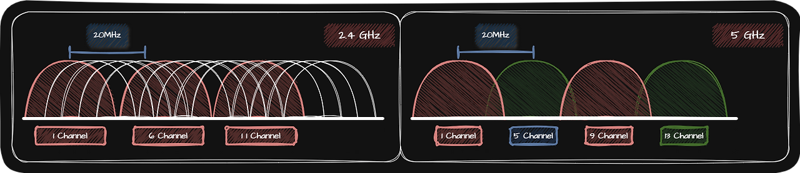

## 🌐 Wi-Fi

전파는 약 3kHz ~ 3THz 사이의 진동수를 가지는 전자기파입니다. 많은 기기들이 전파를 통해 통신한다면, 서로 다른 전파 신호가 같은 공간에 혼재할 수도 있습니다. 이런 상황에서 통신하기 위해 통신에 사용되는 전파에는 주파수 대역이 미리 정해져 있습니다.

무선 통신은 유선 통신과 마찬가지로 표준화되어 있고 표준화된 무선 통신은 2.4GHz, 5GHz 대역을 사용합니다. 표준 규격에 따라 주파수 뿐만 아니라 전송 속도, 대역폭, 전송 가능한 거리, 변조 방식 등 많은 것들이 달라집니다.

Wi-Fi는 IEEE 802.11 표준을 따르는 무선 LAN 기술을 의미하며 IEEE 802.11 표준의 버전에 따라 Wi-Fi의 버전도 달라집니다.

2.4GHz, 5GHz 주파수 대역은 Channel이라 불리는 하위 주파수 대역으로 한 번 더 세분화되고 해당 채널의 주파수 대역에서 통신이 이루어집니다. 즉, 같은 주파수 대역을 사용하는 Wi-Fi라 할지라도 별개의 무선 Network들이 존재할 수 있습니다.

Channel은 일반적으로 자동으로 설정되지만 수동으로 설정할 수도 있으며 같은 공간에서 같으 Wi-Fi를 사용하는 경우 간섭이 없는 Channel을 이용하는 것이 좋습니다.

## 🌐 2.4 GHz Wi-Fi VS 5 GHz Wi-Fi

|               | 송수신 속도 | 장애물의 영향 |
| :-----------: | :---------: | :-----------: |
| 2.4 GHz Wi-Fi |    느림     |    덜 받음    |
|  5 GHz Wi-Fi  |    빠름     |   크게 받음   |
