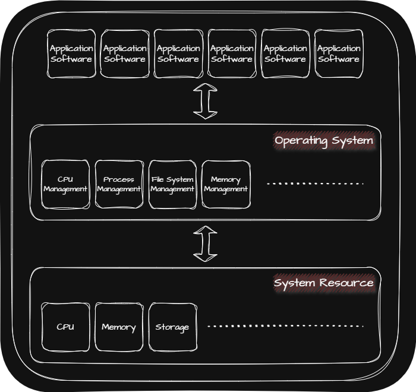
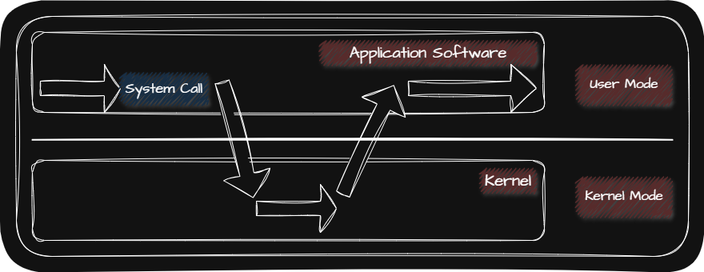

## 💾 OS(Operating System)

OS(Operating System)은 Kernel Space에 적재되어 Application Software에 필요한 시스템 자원을 할당하고 Application Software가 올바르게 실행 되도록 돕는 특별한 프로그램입니다.

대표적인 OS로는 Window, macOS, Linux, Android, iOS 등이 있습니다.

OS가 제공하는 기능은 다음과 같습니다.

| Kernel 영역에서 제공하는 기능 | Kernel 영역에서 제공하지 않는 기능 |
| :----------------------: | :---------------------------: |
| Process 관리 | UI(User Interface) |
| 시스템 자원 접근 및 할당 | Ex. GUI(Graphical User Interface) |
| File System 관리 | Ex. CLI(Command Line Interface) |

## 💾 Kernel

OS는 Application Software가 Kernel을 통해 시스템 자원에 접근하여 조작할 수 있도록하며 Application Software가 올바르고 안전하게 실행되게 하도록 합니다.

그렇기 때문에 OS가 어떤 Kernel을 사용하는지에 따라서 Application Software가 시스템 자원을 사용하는 방법이 달라지므로 컴퓨터 성능에 영향을 줄 수도 있습니다.

## 💾 Dual Mode

Dual Mode란 CPU가 명령어를 실행하는 모드를 크게 User Mode와 Kernel Mode로 구분하는 방식입니다. User Mode는 Kernel 영역의 코드를 실행할 수 없으며 Kernel Mode는 Kernel 영역의 코드를 실행할 수 있습니다.

> 가상화를 지원하는 CPU는 User Mode와 Kernel Mode 외에 Hypervisor Mode를 따로 두어 VM(Virtual Machine)에 설치된 Application Software가 Hypervisor Mode를 통해 OS 기능들을 사용할 수 있도록 합니다.
{: .prompt-info }

OS는 Application Software가 시스템 자원에 접근하려고 할 때 OS만을 통해서만 접근할 수 있도록 하여 시스템 자원을 보호합니다. 만약 Application Software가 User Mode로 실행 중에 System Call을 통해 시스템 자원에 접근하려고 할 때 Kernel Mode로 전환하여 시스템 자원에 접근할 수 있도록 합니다.

이처럼 System Call에 의해서 User Mode에서 Kernel Mode로 전환되는 것을 S/W Interrupt라 합니다.

대표적인 System Call에는 다음과 같은 것들이 있습니다.

| Process 관리 | File 관리 | Directory 관리 | File System 관리 |
| :---------: | :------: | :-----------: | :-------------: |
| `fork()` | `open()` | `chdir()` | `mount()` |
| `execve()` | `close()` | `mkdir()` | `umount()` |
| `exit()` | `read()` | `rmdir()` |  |
| `waitpid()` | `write()` |  |  |
|  | `stat()` |  |  |
