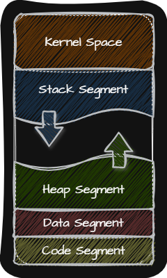

## 💾 Process

Process란 프로그램이 메모리에 적재되어 실행되는 것을 말합니다.

Process의 종류는 다음과 같습니다.
- **Foreground Process**: User가 볼 수 있는 공간에서 실행되는 Process
- **Background Process**: User가 보지 못하는 공간에서 실행되는 Process
    - **Demon(Service)**: User와 상호작용하지 않고 정해진 일만 수행하는 Process
        > 📢 Unix ➜ Demon  
        > 📢 Window ➜ Service

### 💾 PCB(Process Control Block)

PCB란 <u>Process를 식별하기 위해 꼭 필요한 정보</u>(Context)를 저장하는 자료구조이며 Process 생성시에 Kernel 영역에 만들어지고 실행이 종료되면 폐기됩니다.

Context에 포함되는 정보에는 OS마다 차이가 있지만 일반적으로 다음과 같은 정보들이 포함됩니다.

- **PID(Process ID)**: 특정 Process를 식별하기 위해 부여하는 고유한 번호
- **Register Value**: 해당 Process가 실행하며 사용했던 PC(Program Counter)와 같은 레지스터 값들을 저장
- **Process State**: 해당 Process의 현재 상태를 저장
- **CPU Scheduling**: 해당 Process가 CPU를 언제, 어떤 순서로 할당 받을지에 대한 정보를 저장
- **Memory Management**: 해당 Process가 저장된 메모리의 위치를 저장
- **Used File**: 어떤 File들을 열었는지에 대한 정보를 저장
- **Used I/O Device**: 어떤 I/O Device가 해당 Process에 할당되었는지에 대한 정보를 저장

Process들은 차례대로 돌아가며 한정된 시간만큼 CPU를 사용하는데 특정 Process가 정해진 시간만큼 모두 사용했거나 예기치 못한 상황이 발생하여 Interrupt가 발생할 수 있습니다. 이런 경우 OS는 PCB에 Context를 백업하고 이후 다시 해당 Process가 CPU를 사용할 때 PCB에 저장된 Context를 복구하여 실행합니다. 이처럼 PCB에 Context 백업하고 다시 복구하여 실행하는 과정을 Context Switching이라 합니다.

Context Switching이 자주 일어나면 Process들이 동시에 실행되는 것처럼 보이지만 Overhead가 발생할 수도 있습니다.

### 💾 Memory

Process는 User Space에서 다음과 같이 나뉘어 메모리에 저장됩니다.

> ⚠️ 동적으로 할당되는 Heap Segment와 Stack Segment의 주소가 겹치지 않도록 Heap Segment는 메모리의 낮은 주소에서 시작하고 Stack Segment는 높은 주소에서 시작합니다.

{: .left}

|  | Definition | 정적 or 동적 |
|:-:|:-:|:-:|
| Code Segment   (Text Segment) | CPU가 실행할 기계어로 이루어진 명령어가 저장   (Read-Only) | 정적 할당 영역
| Data Segment | Program이 실행되는 동안 유지할 데이터가 저장   (Ex. 전역 변수) | 정적 할당 영역
| Heap Segment | 프로그래머가 직접 할당할 수 있으며 언젠가는 반환해야 하는 공간   (⚠️ 반환하지 않으면 Memory Leak 문제 발생) | 동적 할당 영역
| Stack Segment | 데이터를 일시적으로 저장하는 공간   (Ex. 매개변수, 지역 변수) | 동적 할당 영역

  

### 💾 Process State

PCB에 저장되는 Process State는 OS마다 상이하지만 일반적으로 다음과 같은 상태를 거치며 실행됩니다.

- **생성 상태(New)**: 방금 메모리에 적재되어 PCB를 할당 받은 상태
- **준비 상태(Ready)**: 당장 CPU를 할당 받아서 실행할 수 있는 상태
- **실행 상태(Running)**: CPU를 할당 받아서 실행중인 상태
- **대기 상태(Blocked)**: I/O Device에 작업을 요청해서 그 결과를 기다리는 상태 
- **종료 상태(Terminated)**: Process가 종료된 상태로 PCB와 메모리를 모두 정리

### 💾 Process 계층 구조

많은 OS들은 Process를 계층적인 구조로 관리하며 Process는 실행 도중 System Call을 통해 다른 Process를 생성할 수 있습니다.

이때 기존의 Process를 Parent Process, 새로 생성한 Process를 Child Process라고 합니다.

Parent Process와 Child Process는 다른 Process이기 때문에 서로 다른 PID를 가지지만 일부 OS에서는 Child Process의 PCB에 Parent Prcoess의 PID를 Context에 포함시킵니다.

Child Process의 생성과정은 다음과 같습니다.

1. Parent Process는 `fork()`를 통해 자신의 복사본(Child Process)을 생성
2. Child Process는 `exec()`를 통해 Code Segment와 Data Segment의 내용이 실행할 프로그램의 내용으로 바뀌고 Heap Segment와 Stack Segment는 초기화

## 💾 Thread

Thread는 Process를 구성하는 실행의 흐름 단위이며 여러 Thread로 여러 명령어를 동시에 실행하는 것을 Multi-Thread라고 합니다.

Process들끼리는 기본적으로 자원을 공유하지 않지만 Thread끼리는 같은 Process 내의 자원을 공유합니다.

Multi-Thread의 장점과 단점은 다음과 같습니다.
- 장점
    - 여러 Process들을 함께 실행하는 것보다 메모리를 더 효율적으로 사용할 수 있음
    - Thread는 Process 내의 자원을 공유하기 때문에 서로 협력과 통신에 유리
- 단점
    - Multi-Thread를 사용하는 경우 하나의 Thread에 문제가 생기면 Process 전체에 문제가 생김
