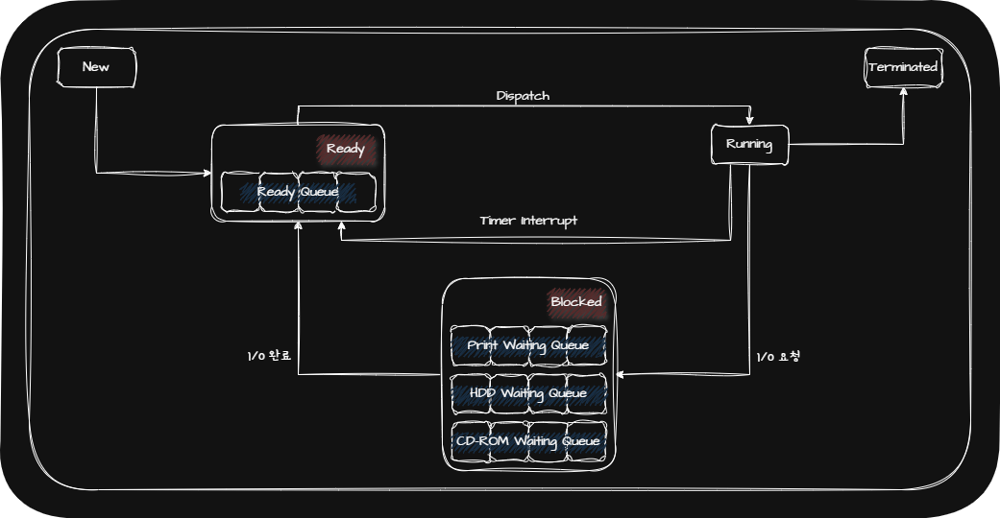
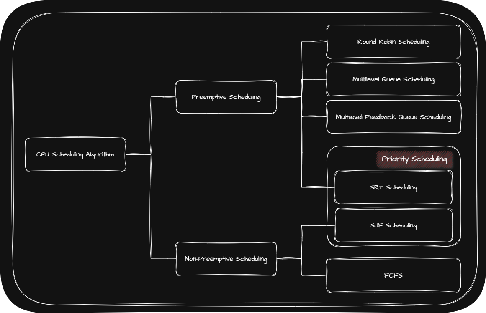

## 💾 CPU Scheduling

CPU Scheduling이란 OS(Operating System)가 Process들에게 CPU 자원을 공정하고 합리적으로 배분하는 것을 말합니다.

CPU가 먼저 처리하면 좋을 순서대로 번호를 부여한 것을 우선순위(Priority)라 하며 OS는 PCB(Process Control Block)에 우선순위를 명시합니다.

예를 들어 I/O Bound Process를 먼저 처리한 후 대기 상태로 만들고 CPU Bound Process에 집중적으로 CPU를 할당하는 것이 효율적이기 때문에 CPU Bound Process의 우선순위보다 I/O Bound Process의 우선순위가 더 높습니다.

> - **CPU Burst**: CPU를 이용하는 작업
> - **I/O Burst**: I/O Device를 기다리는 작업
> - **CPU Bound Process(CPU 집중 프로세스)**: CPU Burst가 많은 Process
> - **I/O Bound Process(I/O 집중 프로세스)**: I/O Burst가 많은 Process
{: .prompt-tip }

## 💾 Scheduling Queue

_Process State Diagram With Scheduling Queue_

매번 모든 Process들을 살펴본 후 우선순위를 정하는 것은 모든 Process들을 살펴봐야 하기 때문에 매우 비효율적입니다. 이러한 비효율을 해결하기 위해 Scheduling Queue를 사용합니다.

OS가 관리하는 Queue에는 대표적으로 다음과 같은 것들이 있습니다.

- Process State가 Ready(준비 상태)에 있는 <u>Ready Queue</u>
- Process State가 Blocked(대기 상태)에 있는 <u>Waiting Queue</u>

## 💾 CPU Scheduling Algorithm

OS는 Ready Queue에 있는 Process들의 우선순위를 CPU Scheduling Algorithm을 사용해 정합니다.

CPU Scheduling Algorithm은 크게 다음과 같이 나누어집니다.

|      |                               선점형 스케줄링(Preemptive Scheduling)                                |                                                                비선점형 스케줄링(Non-Preemptive Scheduling)                                                                |
| :--: | :-------------------------------------------------------------------------------------------------: | :------------------------------------------------------------------------------------------------------------------------------------------------------------------------: |
| 정의 | OS가 CPU를 사용하고 있는 Process로부터 CPU를 강제로 빼앗아   다른 Process에게 할당하는 스케줄링 | CPU를 사용하고 있는 Process가 있는 경우 해당 Process가 Terminated(종료 상태)가 되거나   Blocked(대기 상태)가 되기 전까지 다른 Process가 CPU를 사용하지 못하는 스케줄링 |
| 장점 |     어느 한 Process의 자원 독점을 막고   Process들에게 골고루 시스템 자원을 배분할 수 있음      |                                                Context Switching 횟수가 선점형 스케줄링보다 적기 때문에 Overhead가 덜 발생                                                 |
| 단점 |                                Context Switching에서 Overhead가 발생                                |                                                             모든 Process가 골고루 시스템 자원을 사용할 수 없음                                                             |
| 추가 |                       현재 대부분의 OS에서 사용하는 CPU Scheduling Algorithm                        |                                                                                                                                                                            |

CPU Scheduling Algorithm에는 다음과 같은 것들이 있습니다.

|                              CPU Scheduling Algorithm                              | Definition                                                                                                                                                                             |
| :--------------------------------------------------------------------------------: | :------------------------------------------------------------------------------------------------------------------------------------------------------------------------------------- |
|                 [FCFS(First Come First Served Scheduling)](#-fcfs)                 | Ready Queue에 삽입된 순서대로 Process들을 처리하는 비선점형 스케줄링                                                                                                                   |
|               [Rounding Robin Scheduling](#-round-robin-scheduling)                | 정해진 Time Slice만큼의 시간 동안 돌아가며 CPU를 이용하는 선점형 스케줄링                                                                                                              |
|                    [Priority Scheduling](#-priority-scheduling)                    | Process들에 우선순위를 부여하고 가장 높은 우선순위를 가진 Process부터 실행하는 스케줄링                                                                                                |
|      [SJF(Shortest Job First) Scheduling](#-sjfshortest-job-first-scheduling)      | Ready Queue에 삽입된 Process들 중 CPU 이용 시간의 길이가 가장 짧은 Process부터 실행하는 비선점형 스케줄링                                                                              |
| [SRT(Shortest Remaining Time) Scheduling](#-srtshortest-remaining-time-scheduling) | Ready Queue에 삽입된 Process들 중 CPU 이용 시간의 길이가 가장 짧은 Process들을 먼저 실행하되   Time Slice만큼 실행하는 선점형 스케줄링                                             |
|            [Multilevel Queue Scheduling](#-mulilevel-queue-scheduling)             | 우선순위가 가장 높은 Queue에 있는 Process들을 먼저 처리하고   우선순위가 가장 높은 Queue가 비어 있으면 그다음 우선순위 Queue에 있는 Process들을 처리하는 스케줄링                  |
|   [Multilevel Feedback Queue Scheduling](#-mulilevel-feedback-queue-scheduling)    | 어떤 Process의 CPU 이용 시간이 길면 낮은 우선순위 Queue로 이동시키고   어떤 Process가 낮은 우선순위 Queue에서 너무 오래 기다린다면 높은 우선순위 Queue로 이동시킬 수 있는 스케줄링 |

### 💾 FCFS

FCFS는 단순히 삽입된 순서대로 처리하기 때문에 Convoy Effect(호위 효과)가 발생할 수 있습니다.

> **Convoy Effect**: CPU를 적게 사용하는 Process를 수행하기 위해서는 먼저 실행되어야 하는 Process들이 있기 때문에 긴 시간을 기다려야 하는 현상
{: .prompt-tip }

### 💾 Round Robin Scheduling

Round Robin Scheduling은 FCFS에 Time Slice라는 개념이 더해진 스케줄링 방식입니다.

예를 들어 Ready Queue에 삽입된 Process들은 삽입된 순서대로 CPU를 정해진 시간만큼 이용하되 아직 완료되지 않았다면 다시 Ready Queue 맨 뒤에 다시 삽입됩니다.

Round Robin Scheduling에서는 Time Slice의 크기가 매우 중요합니다.

- **Time Slice의 크기가 큰 경우**: Convoy Effect가 발생할 수 있음
- **Time Slice의 크기가 작은 경우**: Context Switching에 발생하는 비용이 커지는 문제가 발생할 수 있음

> **Time Slice**: 각 Process가 얼마나 CPU를 사용할 수 있는지 정해진 시간
{: .prompt-tip }

### 💾 Priority Scheduling

Priority Scheduling에서 만약 우선순위가 같다면 FCFS로 스케줄링됩니다.

그러나 Priority Scheduling은 Starvation 현상이 일어날 수 있습니다. 이를 방지하기 위해 Aging 기법을 사용할 수도 있습니다.

> - **Starvation(기아) 현상**: 우선순위가 낮은 Process들이 우선순위가 높은 Process들 때문에 실행이 계속 연기되는 현상
> - **Aging**: 오랫동안 대기한 Process의 우선순위를 점차 높이는 방식
{: .prompt-tip }

### 💾 SJF(Shortest Job First) Scheduling

SJF Scheduling은 Priority Scheduling의 한 종류로 FCFS의 단점이었던 Convoy Effect를 방지할 수 있습니다.

### 💾 SRT(Shortest Remaining Time) Scheduling

SRT Scheduling은 Priority Scheduling의 한 종류로 SJF Scheduling과 Round Robin Scheduling을 합친 스케줄링 방식입니다.

즉 Ready Queue에 삽입된 Process들 중 CPU 이용 시간의 길이가 가장 짧은 Process들을 먼저 실행하되 Time Slice만큼 실행하는 스케줄링 방식입니다.

### 💾 Mulilevel Queue Scheduling

Multilevel Queue Scheduling은 Priority Scheduling의 발전된 형태로서 우선순위에 따른 Ready Queue를 여러 개 사용하는 스케줄링입니다.

|                         장점                         |               단점               |
| :--------------------------------------------------: | :------------------------------: |
|    Queue별로 Time Slice를 여러 개 지정할 수 있음     | Starvation 현상이 발생할 수 있음 |
| Queue마다 다른 Scheduling Algorithm을 사용할 수 있음 |                                  |

### 💾 Mulilevel Feedback Queue Scheduling

Multilevel Feedback Queue Scheduling은 Multilevel Queue Scheduling이 발전된 형태로서 Process들이 Ready Queue 사이를 이동할 수 있는 스케줄링입니다.

Multilevel Feedback Queue Scheduling의 순서는 다음과 같습니다.

1. 새롭게 들어오는 Process는 우선순위가 가장 높은 Ready Queue에 삽입
2. Time Slice동안 CPU를 사용했는데 실행이 끝나지 않았다면 다음 우선순위인 Ready Queue에 삽입되어 실행(우선순위가 한 단계 밀려남)
3. $2$번 반복

Multilevel Feedback Queue Scheduling은 구현이 복잡하지만 가장 일반적인 CPU Scheduling Algorithm입니다.
