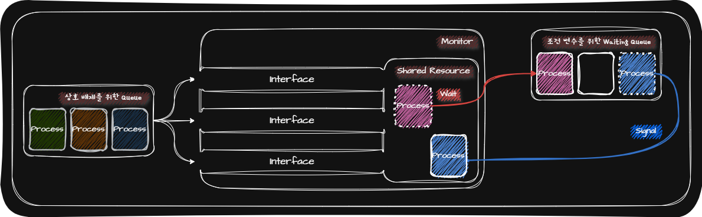
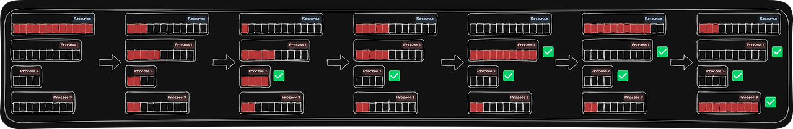
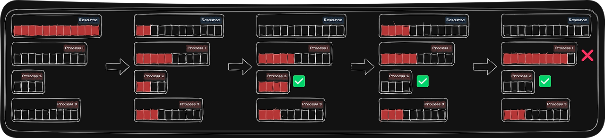

## 💾 Deadlock

Deadlock이란 일어나지 않을 사건을 기다리며 진행이 멈춰버리는 현상을 말합니다.

다음은 Deadlock이 발생하지 않은 경우와 Deadlock이 발생한 경우를 Resource-Allocation Graph로 표현한 것입니다.

_Resource-Allocation Graph_

- Deadlock이 발생하지 않은 경우
  - `Resource A` 하나를 `Process 1`에 할당
  - `Resource A` 하나와 `Resource B` 하나를 `Process 2`에 할당
  - `Process 3`은 `Process 1` 또는 `Process 2` 중 하나의 Process에서 `Resource A` 사용이 끝나면 할당 받기 위해 기다리는 상황
- Deadlock이 발생한 경우
  - `Process 1`은 `Resource A`를 할당 받고 `Process 2`의 `Resource B` 사용이 끝나면 할당 받기 위해 기다리는 상황
  - `Process 2`는 `Resource B`를 할당 받고 `Process 1`의 `Resource A` 사용이 끝나면 할당 받기 위해 기다리는 상황

## 💾 Deadlock 발생 조건

|     Deadlock 발생 조건      | Definition                                                         |
| :-------------------------: | :----------------------------------------------------------------- |
| Mutual Exclusion(상호 베재) | 하나의 자원을 한 번에 하나의 Process(Thread)만 사용가능한 상황     |
| Hold and Wait(점유와 대기)  | 자원을 할당 받은 상태에서 다른 자원을 할당 받기 위해 기다리는 상황 |
|    Nonpreemptive(비선점)    | Process(Thread)가 자원을 비선점하는 상황                           |
|  Circular Wait(원형 대기)   | Resource-Allocation Graph가 원의 형태로 그려지는 상황              |

## 💾 Deadlock 해결 방법

OS(Operating System)은 <u>예방</u>과 <u>회피</u>를 통해 Deadlock을 막고 <u>검출 후 회복</u>을 통해 이미 발생한 Deadlock을 해결하고자 합니다.

### 💾 Deadlock 예방

Deadlock을 예방하는 방법은 Deadlock 발생 조건 중 하나를 충족하지 못하게 하는 방법입니다.

| Deadlock 발생 조건 제외 |                  제외 방법                   | 단점                                                                                                   |
| :---------------------: | :------------------------------------------: | :----------------------------------------------------------------------------------------------------- |
|    Mutual Exclusion     |    Process(Thread)들이 하나의 자원을 공유    | 현실적으로 불가능                                                                                      |
|      Hold and Wait      | OS는 특정 Process(Thread)에 자원을 모두 할당 | • 자원 활용률이 낮아짐   • 기아 현상 발생                                                          |
|      Nonpreemptive      |    Process(Thread)가 자원을 선점하여 사용    | 범용성이 떨어짐(Ex. 프린터 자원을 선점하기 어려움)                                                     |
|      Circular Wait      | 자원에 번호를 붙여 오름차순으로 자원을 할당  | • 모든 자원에 번호를 붙이는 일은 간단하지 않음   • 번호에 따라 특정 자원의 활용률이 낮아질 수 있음 |

### 💾 Deadlock 회피

OS는 Deadlock을 한정된 자원의 무분별한 할당으로 인해 발생하는 것이라고 간주합니다. 그렇기 때문에 Deadlock이 발생하지 않을 정도의 자원 양을 Process(Thread)에 배분하여 Deadlock을 회피합니다.

Deadlock 없이 Process(Thread)에게 안전하게 자원을 할당할 수 있는 순서를 <u>안전 순서열(Safe Sequence)</u>라고 합니다.

이처럼 안전 순서열이 있는 상태를 <u>안전 상태(Safe State)</u>, 안전 순서열이 없는 상태를 <u>불안전 상태(Unsafe State)</u>라고 합니다.

_Safe State_

_Unsafe State_

### 💾 Deadlock 검출 후 회복

OS는 Process(Thread)들이 자원을 요구할 때마다 그때그때 할당하며 Deadlock 발생 여부를 주기적으로 검사합니다. 그리고 Deadlock이 검출되면 <u>선점을 통한 회복</u>이나 <u>Process(Thread) 강제 종료</u>를 통한 회복을 합니다.

- **선점을 통한 회복**: Deadlock이 해결될 때까지 다른 Process(Thread)로부터 자원을 강제로 빼앗고 한 Process(Thread)에게 자원을 몰아주는 방식
- **Deadlock에 놓인 모든 Process(Thread)를 강제 종료를 통한 회복**: 많은 Process(Thread)들이 작업 내역을 잃게 됨
- **Deadlock이 없어질 때까지 하나의 Process(Thread)씩 강제 종료를 통한 회복**: Deadlock이 없어졌는지 여부를 확인하는 과정에서 Overhead가 야기됨
