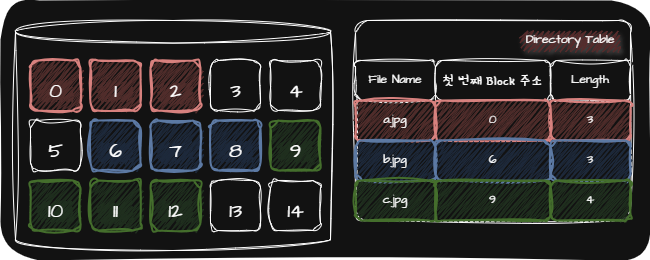

## 💾 File

File이란 HDD나 SSD와 같은 보조기억장치에 저장된 관련 정보의 집합을 말합니다. 또한 File은 의미있고 관련있는 정보를 모은 논리적 단위를 의미하기도 합니다.

또한 File을 다루는 모든 작업은 OS(System Call)에 의해서 이루어집니다.

File의 Attribute는 다음과 같습니다.

| File Attribute | Definition Or Example |
|:-:|:-|
| 유형(Type) | Excution File(`.exe`, `.com`, `.bin`)   Object File(`.obj`, `.o`)   Source Code File(`.c`, `.cpp`, `.java`, `.py`)   Word Processor File(`.xml`, `.doc`)   Library File(`.lib`, `.dll`)   MulitiMedia File(`.mpeg`, `.mov`, `.mp3`)   Backup File(`.rar`, `.zip`, `.tar`)
| 크기(Size) | File의 현재 크기와 허용 가능한 최대 크기를 나타냄
| 보호(Protection) | 어떤 사용자가 해당 File을 읽고, 쓰고, 실행할 수 있는지를 나타냄
| 생성 날짜(Created Time) | File이 생성된 날짜
| 마지막 접근 날짜(Las Accessed Time) | File에 마지막으로 접근한 날짜
| 마지막 수정 날짜(Last Modified Time) | File이 마지막으로 수정된 날짜
| 생성자(Author) | File을 생성한 사용자
| 소유자(Owner) | File을 소유한 사용자
| 위치(Location) | File의 보조기억장치상의 현재 위치

## 💾 Directory

OS는 많은 File들을 관리하기 위해서 Tree-Structured Directory를 사용하며 Directory와 관련된 작업들은 File과 마찬가지로 OS(System Call)에 의해서 이루어집니다.

File의 위치를 특정 짓기 위한 정보로 Absolute Path와 Relative Path를 사용합니다.

| Absolute Path | Relative Path |
| :-: | :-: |
| Root Directory부터 시작하는 경로 | 현재 Directory부터 시작하는 경로 |
| `/home/juny/image.jpg` | `./juny.image.jpg` |

### 💾 Directory Table

Directory는 보조기억장치에 Directory Table을 담아 저장합니다.

Directory Table에 저장된 하나의 행을 Directory Entry라 하며 저장되는 정보는 File System마다 차이가 있습니다.

## 💾 File Allocation

하나의 File이 보조기억장치에 저장될 때는 OS가 하나 이상의 Sector를 Block이라는 단위로 묶은 뒤 저장합니다.

File을 보조기억장치에 저장하는 방법에는 다음과 같은 것들이 있습니다.

| File Allocation | 정의 | 장점 | 단점 |
| [Contiguous Allocation(연속 할당)](#-contiguous-allocation연속-할당) | 보조기억장치 내 연속적인 Block에 File을 저장하는 방식 | 구현이 단순 | 외부 단편화 |
| [Linked Allocation(연결 할당)](#-linked-allocation연결-할당) | 각 Block 의 일부에 다음 Block의 주소를 저장하여 각 Block이 다음 Block을 가리키는 형태로 할당하는 방식 | 외부 단편화 해결 | • 반드시 첫 번째 Block부터 하나씩 차례대로 읽어야 함   • H/W 고장이나 오류 발생시 문제가 있는 Block 이후에 있는 Block에는 접근할 수 없음 |
| [Indexed Allocation(색인 할당)](#-indexed-allocation색인-할당) | File의 모든 Block 주소를 Index Block이라는 하나의 Block에 모아 관리하는 방식 |  |  |

### 💾 Contiguous Allocation(연속 할당)

### 💾 Linked Allocation(연결 할당)

### 💾 Indexed Allocation(색인 할당)

## 💾 File System

File System이란 File과 Directory를 보조기억장치에 일목요연하게 저장하고 접근할 수 있게 하는 OS 내부 프로그램입니다.

File System에서 보조기억장치를 사용하기 위해서는 Partitioning과 Formatting이 먼저 진행되어야 합니다.

> 💡 Partitioning  
> 📢 저장 장치의 논리적인 영역을 구획하는 작업

> 💡 Low-Level Formatting  
> 📢 저장 장치를 생성할 당시 공장에서 수행되는 물리적인 Formatting

> 💡 High-Level Formatting  
> 📢 File System을 생성하는 Formatting

File System의 종류로는 다음과 같은 것들이 있습니다.

| File System | OS | Journaling 지원 유무 |
| :-: | :-: | :-: |
| [FAT File System](#-fat-file-system) | USB, SD 카드 등 저용량 저장 장치 | ⭕ |
| [Unix File System](#-unix-file-system) | Unix 계열 OS | ⭕ |
| NTFS(NT File System) | Window OS | ⭕ |
| ext File System | Linux OS | ⭕ |

> 💡 Journaling  
> 📢 작업 Log를 통해 System Crash가 발생했을 때 빠르게 복구하기 위한 방법

> 💡 System Crash  
> 📢 File System을 변경하는 도중에 전원이 나가거나 치명적인 오류로 인해 컴퓨터가 강제로 종료되어 버리는 상황

### 💾 FAT File System

FAT File System은 Linked Allocation의 단점을 보완한 File System으로 각 Block에 포함되어 있던 다음 Block의 주소들을 FAT(File Allocation Table)에 모아 한 번에 관리하는 File System입니다.

FAT File System은 버전에 따라 FAT$12$, FAT$16$, FAT$32$로 나누어지며 $12$, $16$, $32$는 Block을 표현하는 Bit 수입니다.

HDD의 한 Partition을 FAT$12$으로 Formatting하면 해당 Partition은 다음과 같이 구성됩니다.

### 💾 Unix File System

Unix File System은 Indexed Allocation 기반의 File System입니다.

i-node(Index Block)에는 File Attribute 정보와 15개의 Block 주소가 저장될 수 있습니다. Unix File System에는 File마다 i-node가 있고 i-node마다 번호가 부여되어 있습니다. 

그리고 HDD의 한 Partition을 Unix File System으로 Formatting하면 해당 Partition은 다음과 같이 구성됩니다.

Unix File System에서 i-node에 저장할 수 있는 Block은 15개로 제한되어 있습니다. 그렇기 때문에 Blcok을 더 많이 포함하도록 하기 위해 다음과 같은 방법을 사용합니다.

| Block 주소 | 저장 |
| :-: | :-: |
| $0$번 ~ $11$번 | Direct Block(직접 블로) 주소를 저장 |
| $12$번 | Single Indirect Block(단일 간접 블록)을 저장 |
| $13$번 | Double Indirect Block(이중 간접 블록)을 저장 |
| $14$번 | Triple Indirect Block(삼중 간접 블록)을 저장 |

> 💡 Single Indirect Block(단일 간접 블록)    
> 📢 File이 저장된 Block이 아닌 File을 저장한 Block의 주소가 저장된 Block

> 💡 Double Indirect Block(이중 간접 블록)    
> 📢 Single Indirect Block을 저장하는 Block

> 💡 Triple Indirect Block(삼중 간접 블록)    
> 📢 Double Indirect Block을 저장하는 Block