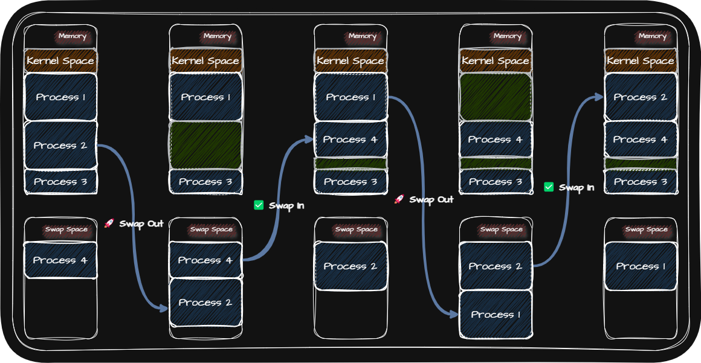
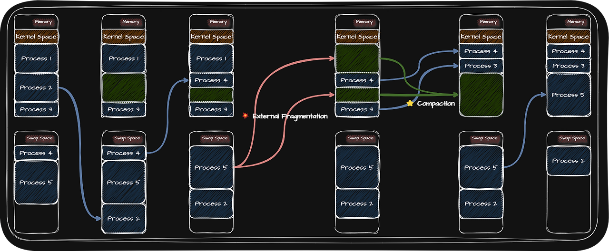
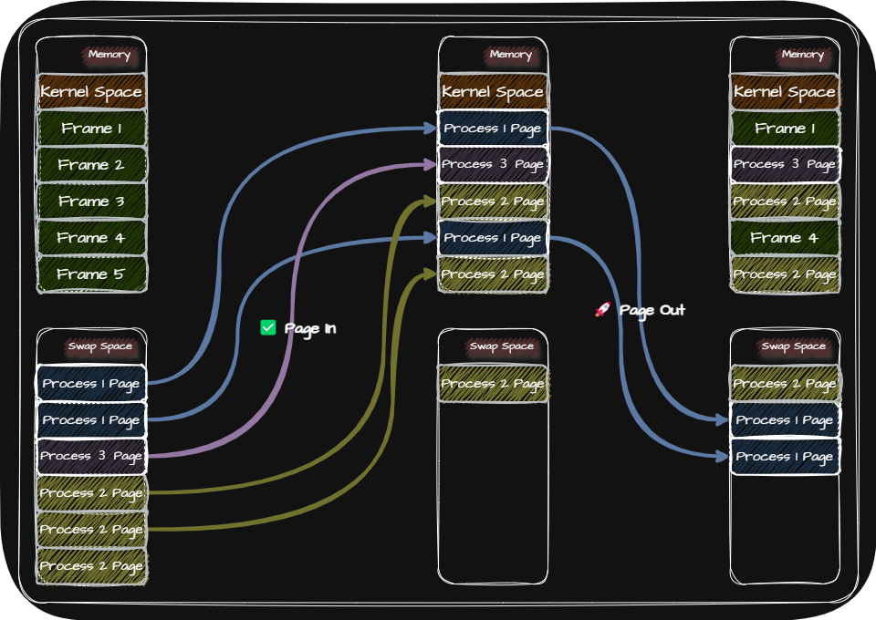
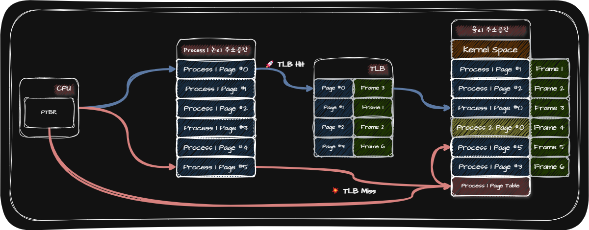
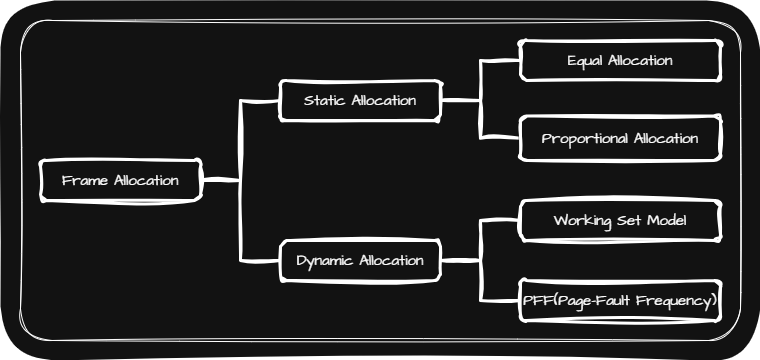
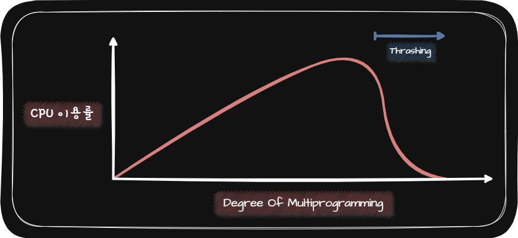

## 💾 Swapping

Swapping이란 현재 실행되지 않는 Process들을 임시로 Swap Space로 쫓아내고, 쫓아내고 생긴 빈 공간에 또 다른 Process를 적재하여 실행하는 방식을 말합니다.

이러한 Swapping을 사용하면 제한된 메모리 공간에서 많은 Process들을 적재하여 실행할 수 있습니다.

> - **Swap Sapce**: 보조기억장치 일부 영역
> - **Swap-Out**: 메모리에 있는 Process를 Swap Space로 쫓아내는 과정
> - **Swap-In**: Swap Space에 있는 Process를 메모리에 적재하는 과정
{: .prompt-tip }

## 💾 연속 메모리 할당

연속 메모리 할당은 하나의 Process를 연속적인 메모리 공간에 할당하는 것을 말합니다.

연속 메모리 할당에는 다음의 $3$가지 방법이 있습니다.

- 최초 적합(First Fit): 최초로 발견한 적재 가능한 빈 공간에 Process를 배치하는 방식
- 최적 적합(Best Fit): OS가 빈 공간을 검색해 본 후, Process가 적재될 수 있는 공간 중 가장 작은 공간에 Process를 배치하는 방식
- 최악 적합(Worst Fit): OS가 빈 공간을 검색해 본 후, Process가 적재될 수 있는 공간 중 가장 큰 공간에 Process를 배치하는 방식

### 💾 External Fragmentation

외부 단편화(External Fragmentation)이란 Process를 할당하기 여러울만큼 작은 크기의 메모리 공간들로 인해 메모리가 낭비되는 현상을 말합니다.

연속 메모리 할당 방식은 외부 단편화 현상이 일어날 수 있기 때문에 메모리를 효율적으로 사용하는 방법은 아닙니다.

이러한 외부 단편화를 해결할 수 있는 대표적인 방안으로 압축(Compaction)하는 방법이 있습니다. 그러나 압축하는 방법조차도 압축하는 동안 시스템이 하던 일을 중지해야 하고 Process들을 재배치함으로써 Overhead가 발생할 수 있습니다.

추가적으로 연속 메모리 할당 방식은 물리 메모리보다 큰 Process를 실행할 수 없다는 단점도 있습니다.

## 💾 Virtual Memory

Virtual Memory란 실행하고자 하는 Program의 일부만 메모리에 적재하여 실제 물리 메모리보다 더 큰 Process를 실행할 수 있게 하는 기술입니다.

Virtual Memory 기법에는 크게 Paging과 Segmentation이 있고 현대 대부분의 OS에서는 Paging 기법을 사용합니다.

## 💾 Paging

Paging이란 메모리의 물리 주소 공간을 Frame 단위로 자르고 Process의 논리 주소 공간을 Page 단위로 자른 뒤 각 Page를 Frame에 할당하는 가상 메모리 관리 기법입니다.

이러한 Paging 기법을 사용하면 연속 메모리 할당 기법의 단점인 외부 단편화를 해결하고 물리 메모리보다 큰 Process를 실행할 수 있습니다.

|                   장점                    |                                                                       단점                                                                        |
| :---------------------------------------: | :-----------------------------------------------------------------------------------------------------------------------------------------------: |
|           외부 단편화 문제 해결           |                                                                    내부 단편화                                                                    |
|     물리 메모리보다 큰 Process를 실행     | Process의 크기가 커지면서 Page Table의 크기도 커지기 때문에 메모리에 Page Table을 모두 올려두는 것은 낭비   (Hierarchical Paging을 통해 해결) |
| Process 간 Page를 공유(Ex. Copy on Write) |

> **내부 단편화**: Process의 크기가 Page의 크기로 정확히 나눠지지 않을 때 발생하는 메모리 낭비 현상
{: .prompt-tip }

## 💾 Page Table

Process가 메모리에 불연속적으로 배치되어 있는 경우 CPU가 해당 Process를 순차적으로 수행하기 위해서는 순서를 알아야 합니다. 이러한 문제를 해결하기 위해 CPU가 바라보는 주소인 논리 주소에는 연속적으로 배치되도록 하기 위해 Paging 기법에서는 Page Table을 사용합니다.

즉, CPU는 Page Table의 Page Number만 보고 해당 Page가 적재된 Frame을 찾을 수 있게 합니다.

Process마다 Page Table을 가지고 있고 각 Process의 Page Table은 메모리에 적재되어 있습니다. 그리고 적재된 메모리의 주소는 PTBR(Page Table Base Register)에 저장되어 있습니다.

그리고 메모리에 접근하는 횟수를 줄이기 위해 Page Table의 일부를 TLB(Translation Lookaside Buffer)에 저장하고 CPU 곁에 두어 Page Table의 Cache 역할을 합니다.

### 💾 Page Table Entry

Page Table Enetry에는 Page Number와 Frame Number 뿐 아니라 많은 것들이 담길 수 있습니다.

대표적으로 다음과 같은 것들이 포함됩니다.

|                Bit                 | Definition                                               |           Bit가 1인 경우           |             Bit가 0인 경우              |
| :--------------------------------: | :------------------------------------------------------- | :--------------------------------: | :-------------------------------------: |
|        유효 비트(Valid Bit)        | 해당 Page가 메모리에 적재되어 있는지 여부를 알려주는 Bit | Page가 메모리에 적재되어 있는 경우 | Page가 메모리에 적재되어 있지 않은 경우 |
|     보호 비트(Protection Bit)      | Page에 접근할 권한을 제한하여 Page를 보호하는 Bit        |         읽기만 가능한 Page         |     읽기와 쓰기가 모두 가능한 Page      |
|      참조 비트(Reference Bit)      | CPU가 Page에 접근한 적이 있는지를 나타내는 Bit           | CPU가 Page에 접근한 적이 있는 경우 |   CPU가 Page에 접근한 적이 없는 경우    |
| 수정 비트(Modified Bit, Dirty Bit) | 해당 Page가 수정된 적이 있는지를 나타내는 Bit            | Page에 데이터를 쓴 적이 있는 경우  |    Page에 데이터를 쓴 적이 없는 경우    |

## 💾 Demand Paging

Demand Paging(요구 페이징)이란 Process를 메모리에 적재할 때 처음부터 모든 Page를 적재하지 않고 필요한 Page만을 메모리에 적재하는 기법입니다.

Demand Paging의 과정은 다음과 같습니다.

1. CPU가 특정 Page에 접근하는 명령어를 실행
2. 해당 Page가 현재 메모리에 있는지 없는지 확인
   - 해당 Page가 현재 메모리에 있는 경우 CPU는 Page가 적재된 Frame에 접근
   - 해당 Page가 현재 메모리에 없는 경우 Page Fault 발생
3. Page Fault 처리: 해당 Page를 메모리로 적재하고 Valid Bit를 1로 설정
4. 다시 1번 수행

Demand Paging 기법을 안정적으로 작동하게 하려면 <u>Page Replacement Algorithm</u>을 결정하고 <u>Frame Allocation</u>을 잘 수행해야 합니다.

### 💾 Page Replacement Algorithm

Page Replacement Algorithm이란 가득찬 메모리에서 Page Out을 할 Page를 결정하는 방법을 말합니다.

일반적으로 Page Fault를 가장 적게 일으키는 Page Replacement Algorithm을 좋은 Algorithm으로 평가합니다. Page Fault 횟수는 Page Reference String을 통해 알 수 있습니다.

즉 Page Reference String을 통해 Page Replacement Algorithm의 성능을 평가합니다.

> **Page Reference String(페이지 참조열)**: CPU가 참조하는 Page들 중 연속된 Page를 생략한 Page String
{: .prompt-tip }

> 연속된 Page를 생략하는 이유는 무엇인가요?  
> - 연속된 Page는 Page Fault를 발생시키지 않기 때문입니다.
{: .prompt-info }

Page Replacement Algorithm의 종류는 다음과 같습니다.

| Page Replacement Algorithm | Definition                                                                                                                                                               |
| :------------------------: | :----------------------------------------------------------------------------------------------------------------------------------------------------------------------- |
|  FIFO(First-In First-Out)  | 적재된 Page 순서대로 교체하는 알고리즘                                                                                                                                   |
|       Second Chance        | 참조 비트가 $1$인 경우 참조 비트를 $0$으로 바꾸고 적재 시간을 현재 시간으로 변경하여 한 번 더 기회를 주는 알고리즘즘                                                     |
|  LRU(Least Recently Used)  | 가장 오랫동안 사용되지 않은 Page를 교체하는 알고리즘                                                                                                                     |
|          Optimal           | CPU에 의해 참조되는 횟수를 고려하여 교체하는 알고리즘   (구현이 어렵기 때문에 OS에서 사용하기보다는 다른 Page Algorithm의 이론상 성능을 평가하기 위한 기준으로 사용) |

### 💾 Frame Allocation

만약 Frame의 수가 적어서 Page Fault가 자주 발생하여 Process가 실제 실행되는 시간보다 Paging에 더 많은 시간을 소요하여 성능이 저해되는 Thrashing이 발생할 수 있습니다.

> **Thrashing**: 지나치게 빈번한 Page Replacement로 인해 CPU 이용률이 낮아지는 문제
{: .prompt-tip }

Frame Allocation 방식에는 다음과 같은 것들이 있습니다.

|      Frame Allocatio      | Definition                                                                                                                             |
| :-----------------------: | :------------------------------------------------------------------------------------------------------------------------------------- |
|     Static Allocation     | Process의 실행 과정은 고려하지 않고 단순히 Process의 크기와 물리 메모리 크기만 고려하는 방식                                           |
|     Equal Allocation      | 모든 Process들에게 균등하게 Frame을 할당해주는 방식                                                                                    |
|  Proportional Allocation  | Process의 크기에 따라 Frame을 할당해주는 방식                                                                                          |
|    Dynamic Allocation     | Process를 실행하는 과정에서 할당할 Frame을 결정하는 방식                                                                               |
|     Working Set Model     | 해당 Process에 Working Set만큼의 Frame을 동적으로 할당해주는 방식                                                                      |
| PFF(Page-Fault Frequency) | 페이지 폴트율에 상한선과 하한선을 정하고 페이지 폴트율이 상한선보다 높으면 Frame을 더 할당하고 하한선보다 낮으면 Frame을 회수하는 방식 |

> **Working Set(작업 집합)**: 실행 중인 Process가 일정 시간 동안 참조한 Page의 집합
{: .prompt-tip }

### 💾 Degree Of Multiprogramming과 Thrashing

Degree Of Multiprogramming이란 메모리에서 동시에 실행되는 Process의 수를 말합니다.

Degree Of Multiprogramming을 증가시키면 CPU 이용률을 높일 수 있을 것 같지만 그렇지 않습니다. 동시에 실행되는 Prcoess의 수가 어느 정도 증가하면 CPU 이용률이 높아지지만, 필요 이상으로 늘리면 각 Process들이 사용할 수 있는 Frame의 수가 적어지기 때문에 Page Fault가 빈번하게 발생하기 때문에 Thrashing이 발생하게 됩니다.

이러한 Thrashing이 발생하는 근본적인 이유는 각 Process가 필요로 하는 최소한의 Frame의 수가 보장되지 않았기 때문입니다.

이러한 이유로 Thrashing이 발생하지 않도록 OS는 각 Process가 필요로 하는 최소한의 Frame의 수를 파악하고 각 Process들에게 적절한 수 만큼 Frame을 할당해 주어야 합니다.
