해당 포스트에서는 [Pix2Pix : Image-to-Image Translation with Conditional Adversarial Networks](https://arxiv.org/abs/1611.07004) 논문을 함께 읽어가도록 하겠습니다. 문장마다 해석을 하기 보다는 각 문단에서 중요한 부분을 요약하는 식으로 진행하겠습니다.

## Abstract

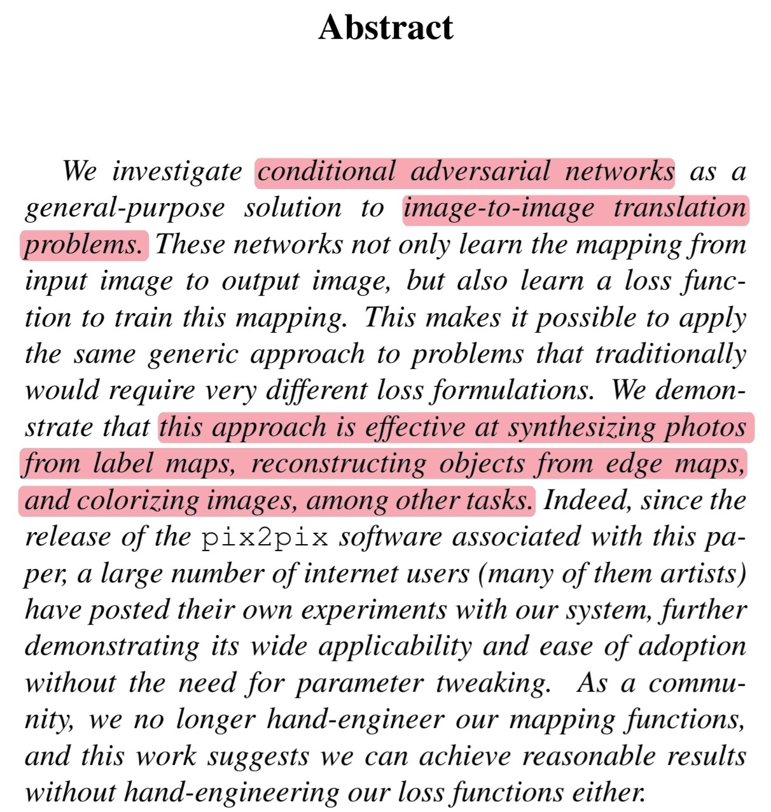{: width="400" .left}

🔎 해당 논문은 image-to-image translation problems의 general-purpose solution에 대한 conditional adversarial networks을 조사합니다.

🔎 Conditional adversarial networks는 image-to-image mapping을 하나의 loss function을 통해 학습됩니다.

🔎 하나의 loss function으로 mapping을 학습하는 것이 이전 연구와는 다른 점입니다.

🔎 특히 해당 networks는 synthesizing photos from label maps, reconstructing objects from edge maps, colorizing images에 효과적인 접근법입니다.

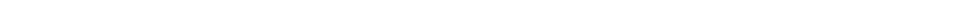{: .normal}

## 1. Introduction

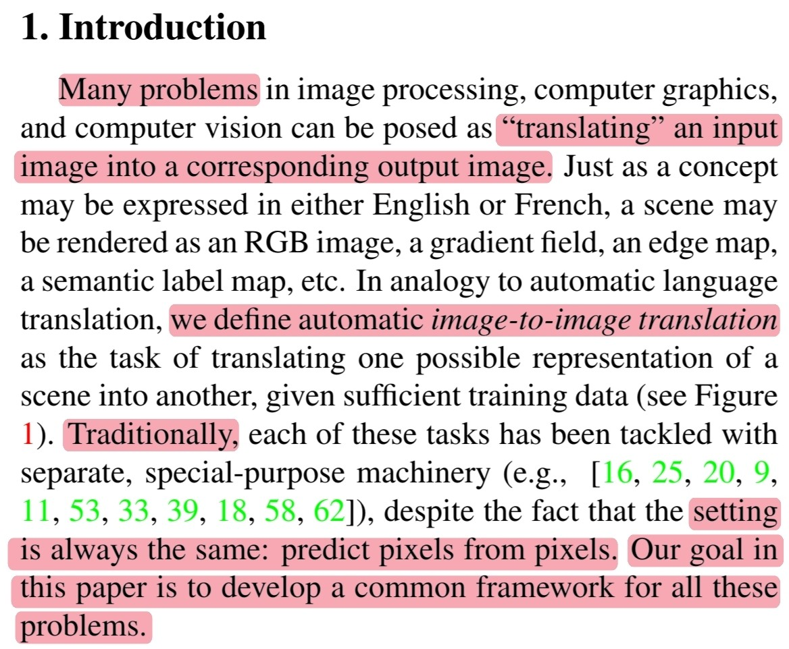{: width="400" .left}

🔎 Image processing, computer graphics, computer vision에서의 많은 문제는 image-to-image에 해당할 것입니다.

🔎 이전 연구에서는 pixel-to-pixel이라는 공통적인 부분이 있음에도 별개의 문제로 다뤘습니다.

🔎 그래서 해당 연구에서는 automatic image-to-image translation을 정의하고자 합니다.

🔎 해당 연구의 간단한 결과는 [Figure 1](#figure-1)에서 확인할 수 있습니다.

{: .normal}

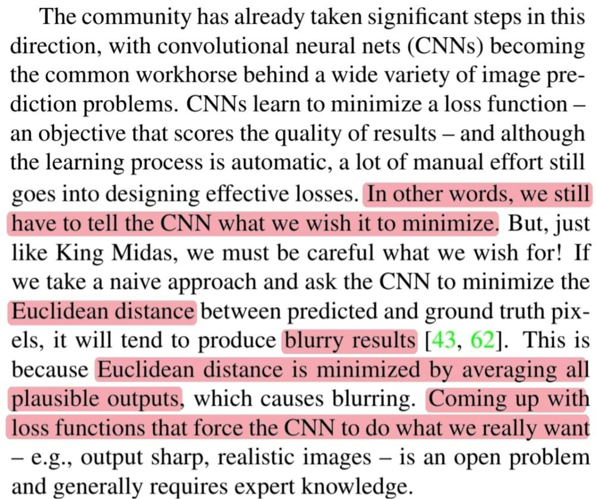{: width="400" .left}

🔎 CNN의 learning process는 자동이지만 효과적인 loss function을 만들기 위해서는 수동적인 노력이 필요합니다.

🔎 Loss function으로 naive한 접근법인 Euclidean distance로 사용할 경우 blurry한 결과를 얻게 될 것입니다.

🔎 왜냐하면 Euclidean distance는 평균을 최소화 하기 때문에 전체적으로 그럴듯한 결과를 만들기 때문입니다.

{: .normal}

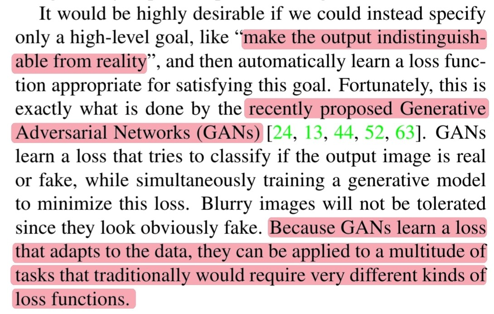{: width="400" .left}

🔎 해당 task에 가장 바람직한 loss function은 GAN의 loss function이라고 할 수 있습니다.

🔎 GAN의 loss function은 data의 분포를 학습하기 때문에 blurry한 결과를 피할 수 있습니다.

🔎 또한 GAN의 loss function은 전통적으로 매우 다른 종류의 loss function을 필요로 하는 다양한 작업에 적용할 수 있습니다.

{: .normal}

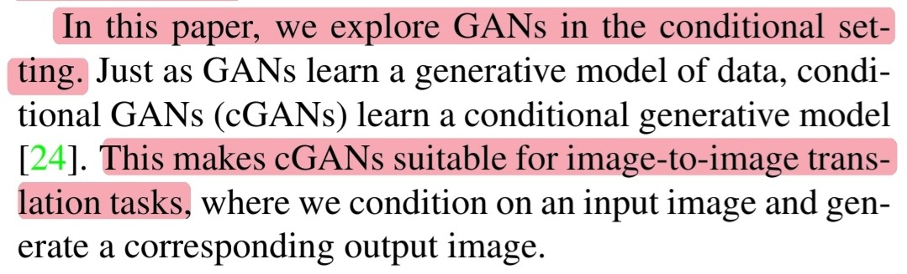{: width="400" .left}

🔎 해당 논문에서는 conditional GANs을 연구합니다.

🔎 왜냐하면 조건화된 이미지를 입력으로 주고 그에 대응하는 결과 이미지를 생성하는 것이 image-to-image translation에 적합하기 때문입니다.

{: .normal}

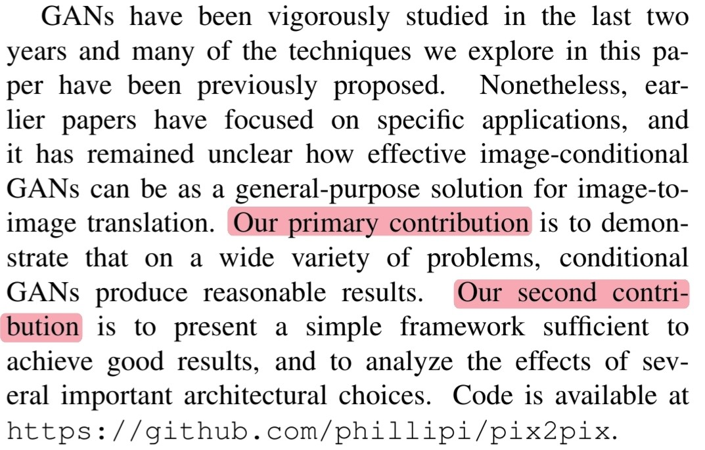{: width="400" .left}

🔎 해당 논문의 contribution을 두 개로 정리할 수 있습니다.

🔎 첫 번째, 다양한 문제에서 cGANs가 합리적인 결과를 도출할 수 있음을 입증합니다.

🔎 두 번째, 좋은 결과를 얻기 위해 간단한 framework를 제시하고 몇 가지 중요한 architecture 선택의 효과를 분석합니다.

{: .normal}

## 2. Related work

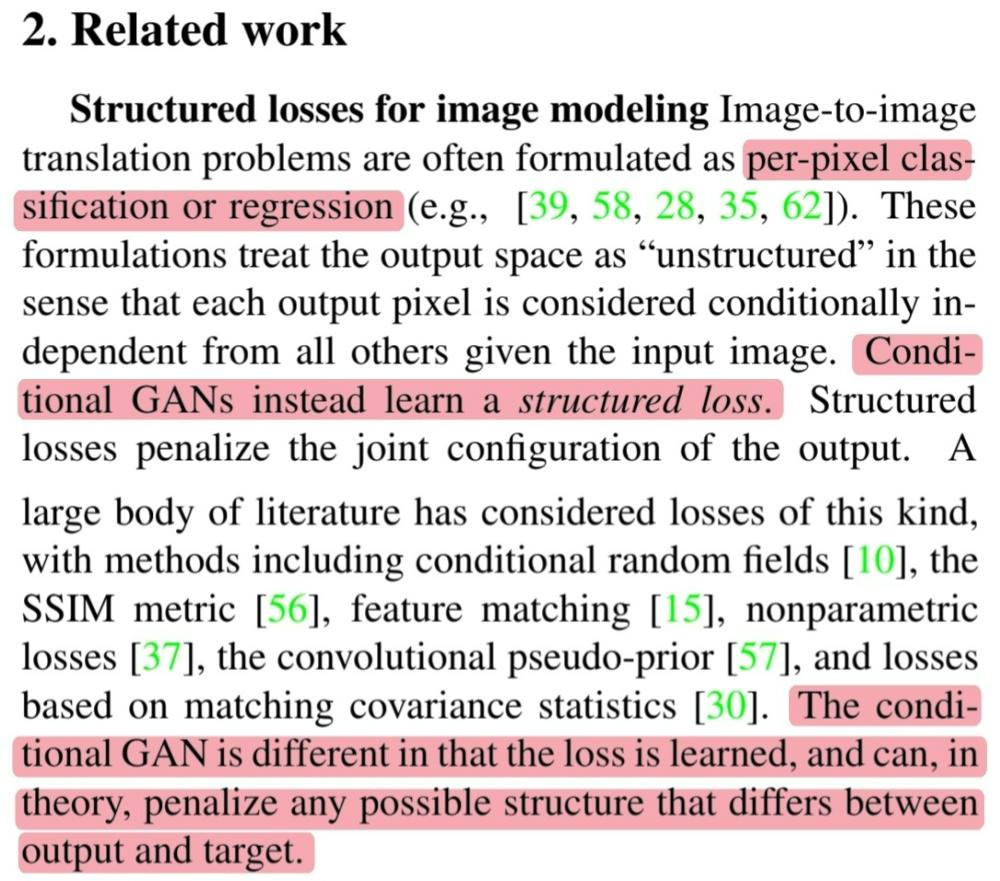{: width="400" .left}

🔎 Image-to-image translation problem은 per pixel classification 또는 regression으로 공식화됩니다.

🔎 이러한 방식은 unstructured라고 output space를 만들어냅니다.

🔎 그러나 cGANs는 structured loss를 학습하기 때문에 output과 target 사이의 차이에 불이익을 주며 output space를 구조화 할 수 있습니다.

{: .normal}

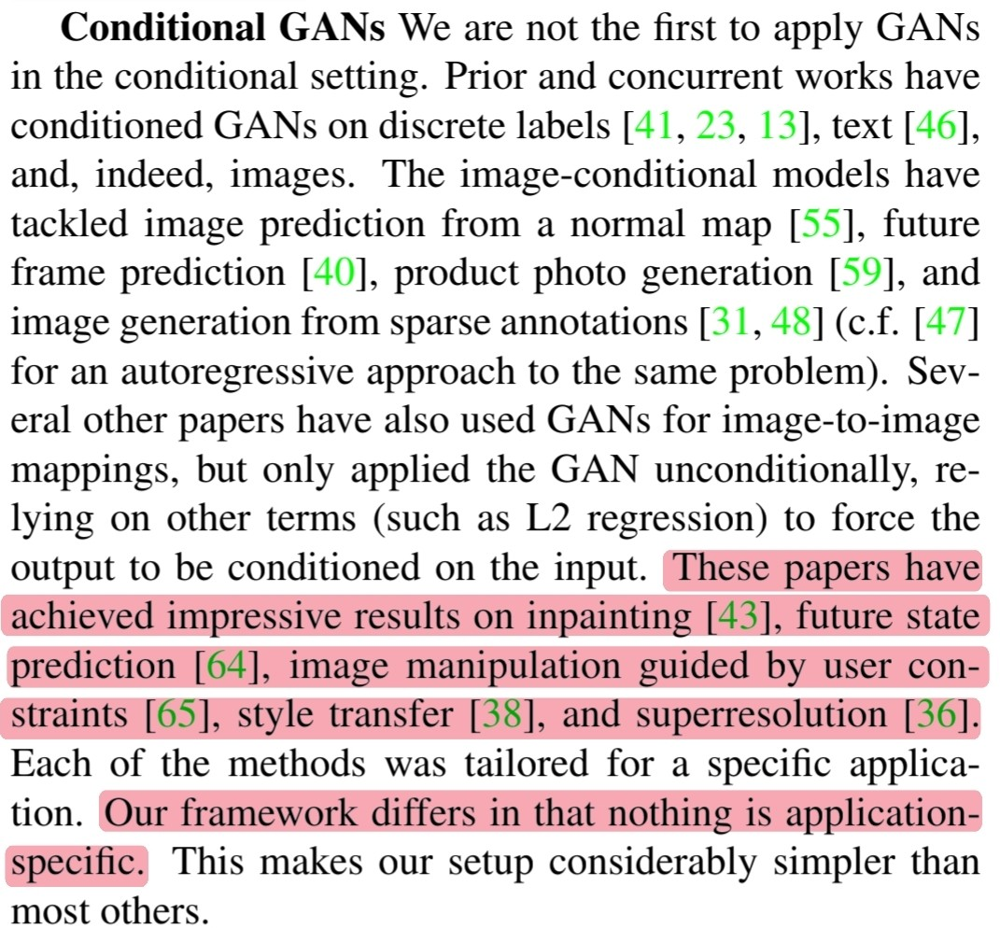{: width="400" .left}

🔎 이전 연구들에서는 unconditional GANs과 L2 regression과 같은 다른 term을 추가해 image-to-image task를 수행하여 특정 분야에서 좋은 결과를 얻었습니다.

🔎 그러나 해당 논문의 framework는 conditional GANs 외에 다른 term이 추가되지 않습니다.

🔎 그렇기 때문에 다른 framework보다 간단하다고 할 수 있습니다.

{: .normal}

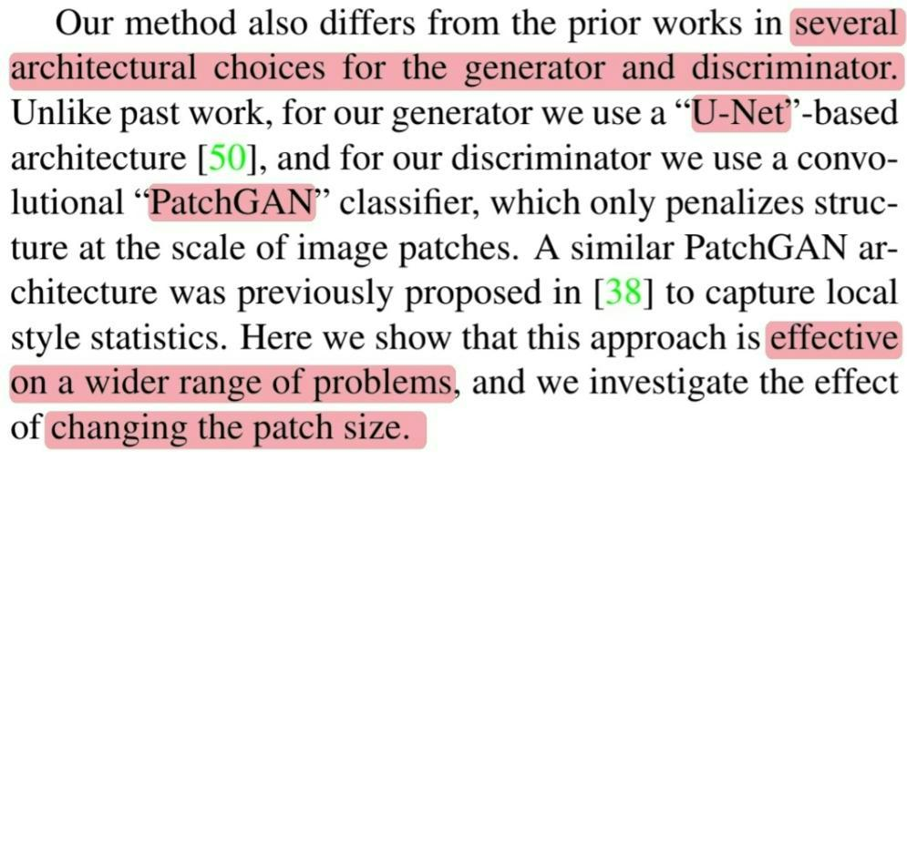{: width="400" .left}

🔎 이전 연구와 다르게 몇몇 다른 acrhitecture를 generator와 discriminator에서 사용했습니다.

🔎 Generator에서는 `U-Net`구조의 architecture를 선택했습니다.

🔎 Discriminator에서는 `PatchGAN`의 clssifier를 사용했습니다.

🔎 PatchGAN 구조가 더 다양한 범위의 문제를 해결하는데 효과적임을 해당 논문에서 보여줍니다.

💭 Local style statistics를 확인하는 것이 왜 다양한 범위의 문제를 해결하는데 더 효과적일까?

💭 Patch 크기에 따른 결과?

{: .normal}

## 3. Method

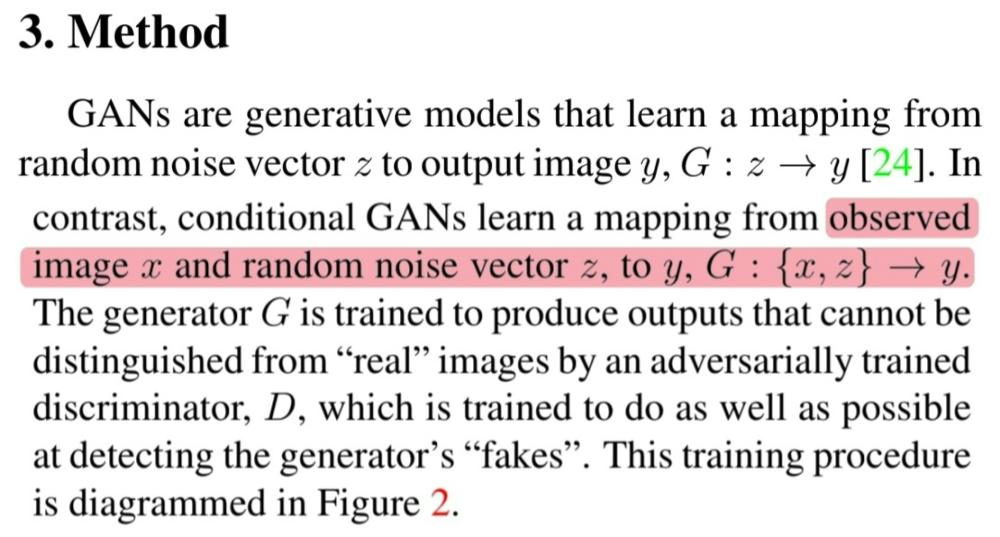{: width="400" .left}

🔎 GANs과 cGANs의 차이는 training images $x$가 generator의 입력으로 random noise vector $z$와 함께 들어가는지 여부입니다.

🔎 GANs : $G : z \rightarrow y$

🔎 cGANs : $G : \\{x, z\\} \rightarrow y$

{: .normal}

### 3.1 Objective

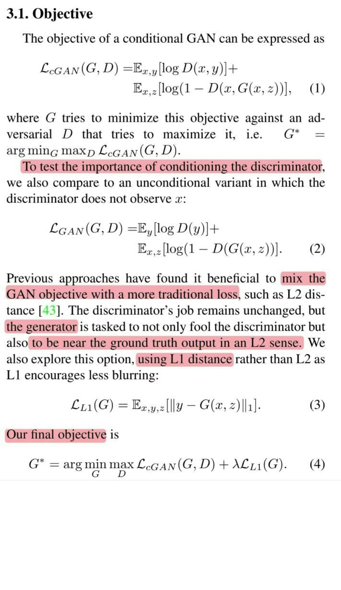{: width="400" .left}

🔎 cGANs의 objective function은 아래와 같이 나타낼 수 있습니다.

$$\begin{align} \mathcal{L}_{cGAN}(G, D) = &\mathbb{E}_{x,y}[\log{D(x,y)}] + \\ &\mathbb{E}_{x,z}[\log{1-D(x,G(x,z))}] \end{align}$$

🔎 여기서 $G$는 objective function을 최대화하려는 $D$에 대해서 objective function을 최소화하려합니다. 따라서 아래와 같이 $G$의 objective function을 나타낼 수 있습니다.

$$G^{*} = \text{arg}\ \text{min}_G\ \text{max}_D\ \mathcal{L}_{cGAN}(G, D)$$

🔎 Conditioning discriminator의 중요성을 확인하기위해 unconditional GANs도 비교합니다.

$$\begin{align} \mathcal{L}_{GAN}(G, D) = &\mathbb{E}_{y}[\log{D(y)}] + \\ &\mathbb{E}_{x, z}[\log{1-D(x,G(z))}] \end{align}$$

🔎 이전 연구들처럼 L2 regression과 같은 term을 사용하는 것이 더 효과적인지 해당 논문에서 확인합니다. 그 중에서 blurring이 덜 한 L1 distance를 사용했습니다.

$$\mathcal{L}_{L1}(G) = \mathbb{E}_{x,y,z}[||y - G(x,z)||_1]$$

🔎 최종 objective function은 아래와 같습니다.

$$G^{*} = \text{arg}\ \underset{G}{\text{min}}\ \underset{D}{\text{max}}\ \mathcal{L}_{cGAN}(G, D) + \lambda\mathcal{L}_{L1}(G)$$

{: .normal}

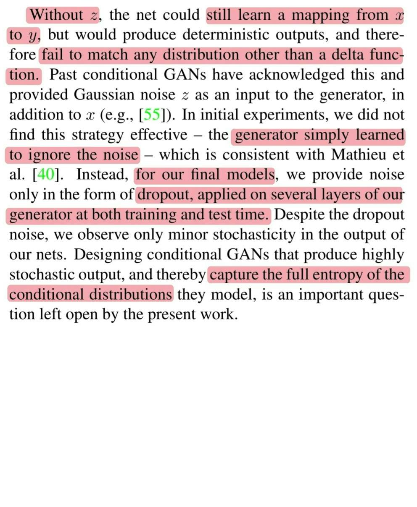{: width="400" .left}

🔎 Random noise vector $z$가 없을 때 여전히 $x \rightarrow y$를 학습하지만 deterministic outputs을 만들어냅니다.

🔎 Deterministic outputs이란, 동일한 x가 주어졌을 때 동일한 output이 나온다는 뜻입니다. 이것을 확률분포 관점에서 본다면 delta function 외에 어떠한 분포와도 매칭이되지 않는 것을 말합니다.

🔎 초기 실험에서는 random noise vector $z$의 역할이 보이지 않았습니다.

🔎 그러나 해당 논문의 최종 모델에서는 random noise vector $z$가 dropout 형태로 generator에게 영향을 주고 있는 것을 알 수 있었습니다.

🔎 이런 random noise vector $z$가 작은 확률적 변화를 만들어낸 것을 알 수 있었습니다.

🔎 많은 확률적 변화를 만들어 내도록 cGANs를 설계하는 것이 추후 연구가 될 수 있습니다.

{: .normal}

### 3.2 Network architecture

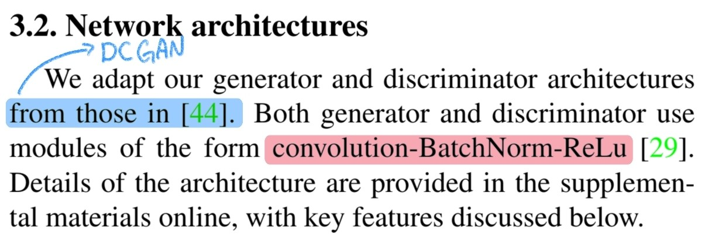{: width="400" .left}

🔎 Generator와 Discriminator의 구조는 DCGAN의 구조를 가지고 있습니다.

🔎 Convolution / BatchNorm / ReLU 로 이루어진 모듈들로 구성되었습니다.

{: .normal}

#### 3.2.1 Generator with skips

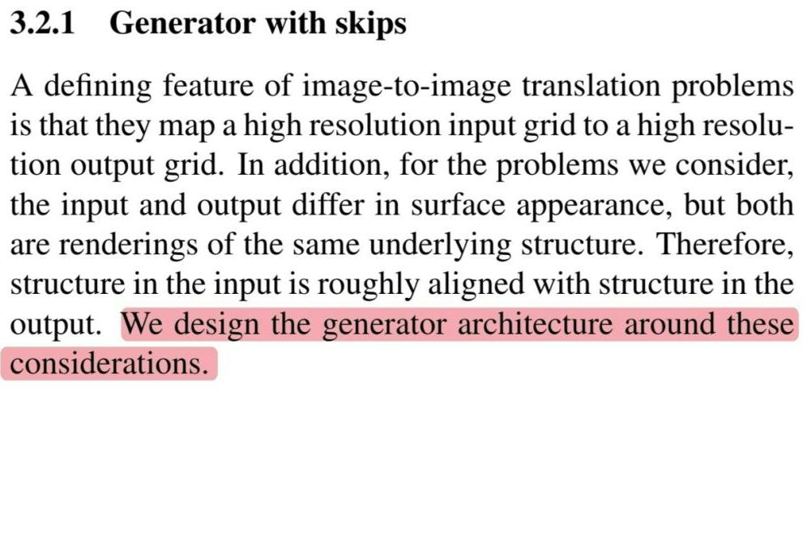{: width="400" .left}

🔎 해당 논문의 저자들이 어떤 점을 염두하면서 generator를 구성했는지 알 수 있습니다.

🔎 Image-to-image translation problems는 high resolution에서 high resolution으로 mapping하는 것으로 정의할 수 있습니다.

🔎 또한 input과 output을 서로 다른 surface를 보이지만 둘 다 비슷한 구조를 가지고 있습니다.

🔎 이러한 점을 고려해 generator를 구성했다고 합니다.

{: .normal}

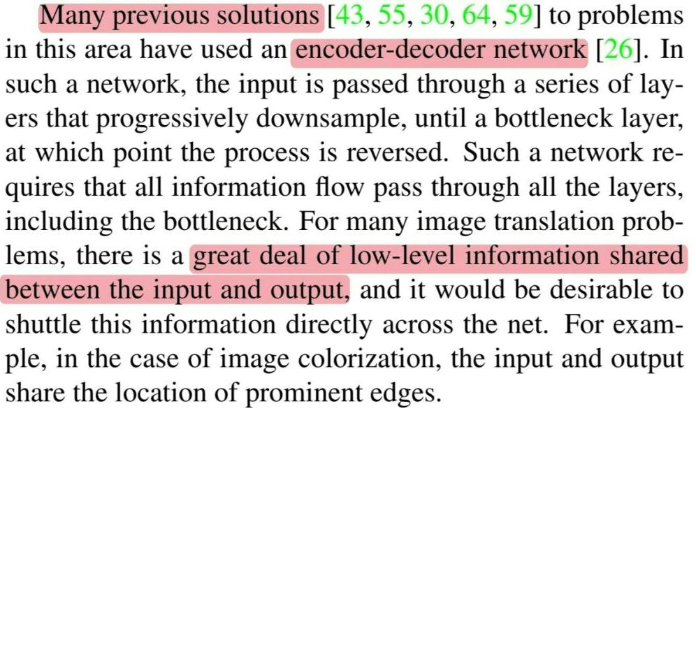{: width="400" .left}

🔎 많은 이전의 연구들은 encoder-decoder 구조를 사용했으며 모든 정보가 모든 layer를 지나가며 전달되도록 합니다.

🔎 Image translation problem에서 input과 output 사이에 공유되는 low-level information이 많이 있습니다.

🔎 그렇기 때문에 network에 low-level information을 직접 전달하는 것이 바람직합니다.

🤔 위에서 본 것처럼 input과 output의 구조는 비슷하므로 input과 output 사이에 많이 공유되는 low-level information을 더욱 잘 활용할 수 있다면 더 좋은 결과를 얻을 수 있을 것이다라는 생각에서 low-level information을 직접 network에 전달한 것이 아닐까 생각합니다.

{: .normal}

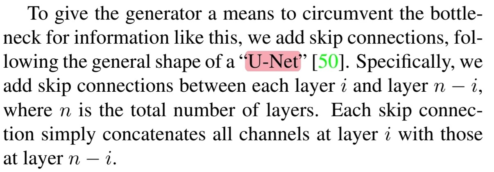{: width="400" .left}

🔎 이 모든 것을 종합했을 때 generator는 U-Net 구조를 가집니다.

{: .normal}

#### 3.2.2 Markovian discriminator (PatchGAN)

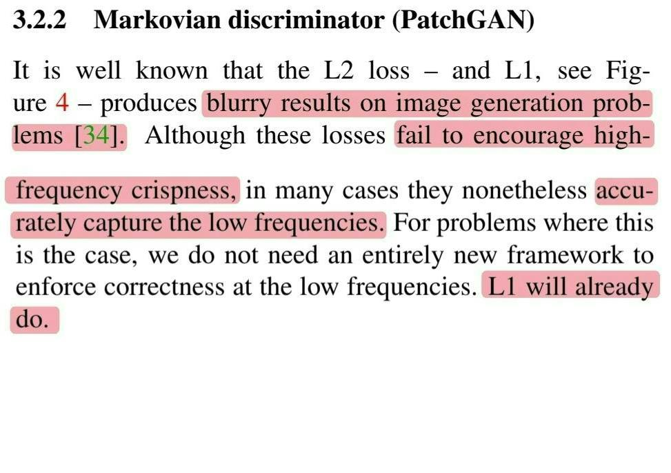{: width="400" .left}

🔎 이전 연구들에서 사용되어 온 L2 loss 또는 L1 loss를 사용했을 때 blurry한 결과를 만들어 내는 것을 확인했습니다.([Figure 4](#figure-4))

🔎 이러한 loss는 high frequency를 잘 나타내지 못하기 때문에 blurry한 결과를 만들어내지만 low frequency는 잘 파악합니다.

🔎 그렇기 때문에 low frequency를 나타내기 위해 추가적인 framework이 필요하지 않습니다.

{: .normal}

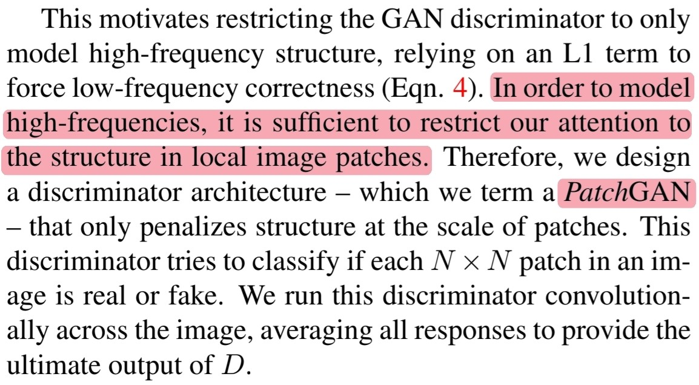{: width="400" .left}

🔎 Low frequency는 L1 loss로 충분히 파악하기 때문에 discriminator는 high frequency만 잘 파악하도록 설계하면 됩니다.

🔎 해당 논문에서는 high frequency를 잘 파악하기 위한 방법으로 `PatchGAN`을 사용했습니다.

🔎 Patch들의 real or fake를 구분하고 모든 patch들의 평균을 discriminator의 output으로 사용합니다.

{: .normal}

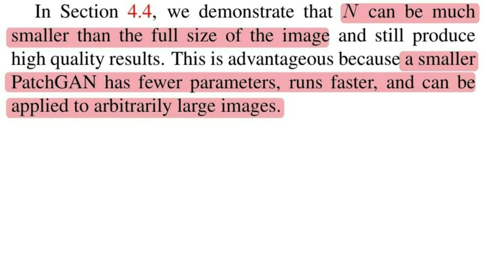{: width="400" .left}

🔎 Patch size $N$이 image size보다 작은 경우 좋은 품질의 결과를 얻을 수 있음을 해당 논문에서 입증합니다.

💭 Patch size에 따른 결과?

🔎 Patch size $N$이 작을수록 더 적은 파라미터, 더 빠른 속도, 큰 이미지에 적용할 수 있다는 장점이 있습니다.

{: .normal}

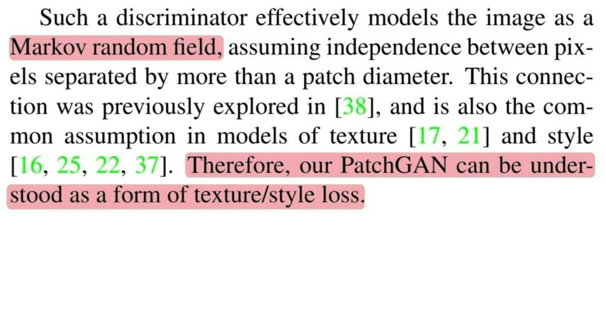{: width="400" .left}

🔎 PatchGAN의 discriminator는 이미지를 Markov random field로 생각할 수 있게 합니다.

🔎 Markov random field는 texture, style model에서 흔한 가정입니다.

🔎 따라서 PatchGAN은 texture/style loss의 한 형태로 볼 수 있습니다.

{: .normal}

### 3.3 Optimization and inference

{: width="400" .left}

🔎 학습 방법을 소개합니다.

🔎 $D$를 한 번 update하고 $G$를 update 합니다.

🔎 $\log(1-D(x,G(x,z)))$를 최소화하는 대신 $\log D(x,G(x,z))$를 최대화합니다.

🔎 $D$를 update 할 때 2로 나눠 학습 속도를 늦춥니다.

🔎 Minibatch SGD를 사용했습니다.

🔎 Adam($lr = 0.0002,\ \beta_1=0.5,\ \beta_2=0.999$)

{: .normal}

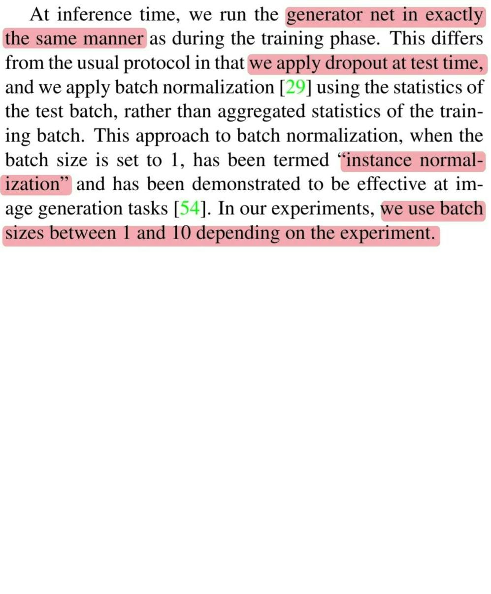{: width="400" .left}

🔎 Inference time에는 training때 사용한 generator를 그대로 사용합니다.

🔎 그러나 특이한 점으로는 test time에서도 dropout을 적용한다는 점입니다.

🔎 그리고 batch normalization을 사용했는데 training data의 statistics가 아닌 test data의 statistics를 사용한 것 또한 특이한 점입니다.

🔎 위에서 말한 batch normalization의 batch size가 $1$인 경우를 instance normalization이라고 볼 수 있으며 generation task에서 가장 효과적인 normalization이라고 합니다.

🔎 해당 논문에서는 inference time에 batch size를 $1 \sim 10$으로 설정했습니다.

{: .normal}

## 4. Experiments

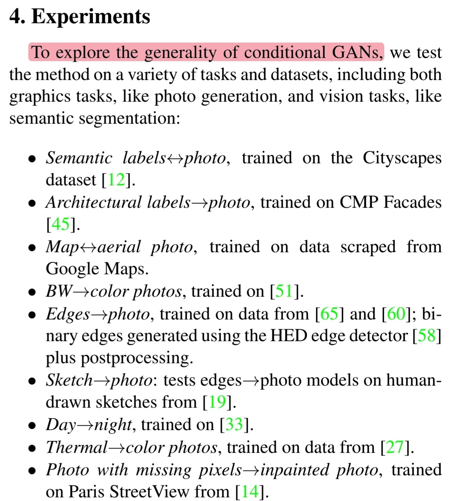{: width="400" .left}

🔎 실험에 사용된 pair-dataset을 확인할 수 있습니다.

{: .normal}

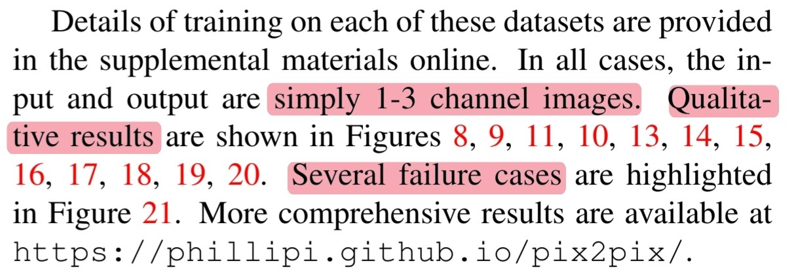{: width="400" .left}

🔎 좋은 퀄리티의 결과물과 실패한 결과물을 확인할 수 있습니다.

{: .normal}

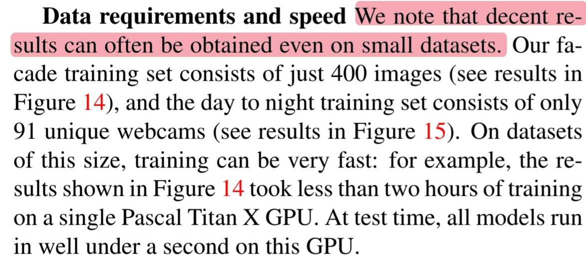{: width="400" .left}

🔎 작은 dataset에서도 종종 괜찮은 결과를 얻을 수 있었습니다.

🔎 Training dataset이 400개

🔎 Training dataset이 91개

{: .normal}

### 4.1 Evaluation metrics

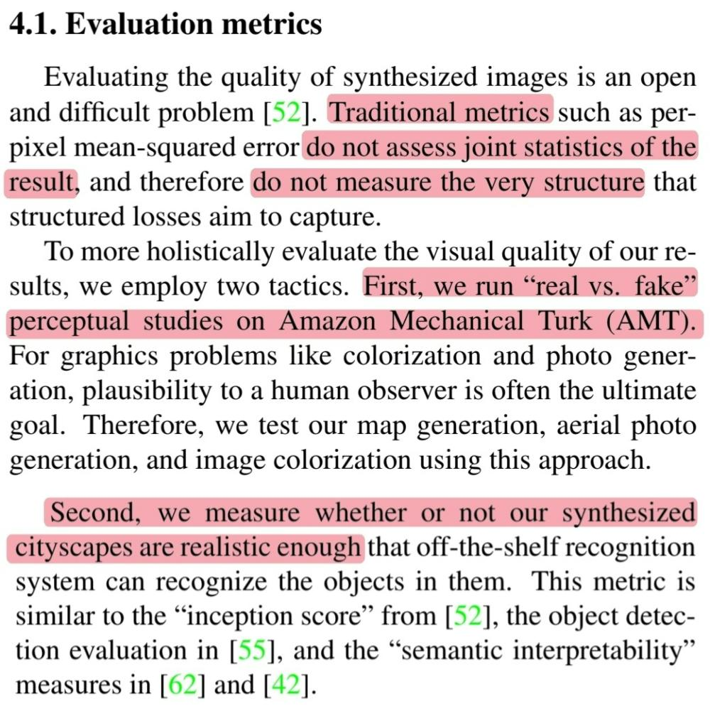{: width="400" .left}

🔎 Per-pixel MSE와 같은 전통적인 metrics의 경우 결과물의 공통적인 통계치에 접근할 수 없어서 구조적인 측정을 할 수 없었습니다.

🔎 그래서 전체적으로 파악하고자 두 가지 metric을 도입했습니다.

🔎 첫 번째, real인지 fake인지 사람이 구분

🔎 두 번째, 만들어진 결과물이 충분히 현실적인지 측정

{: .normal}

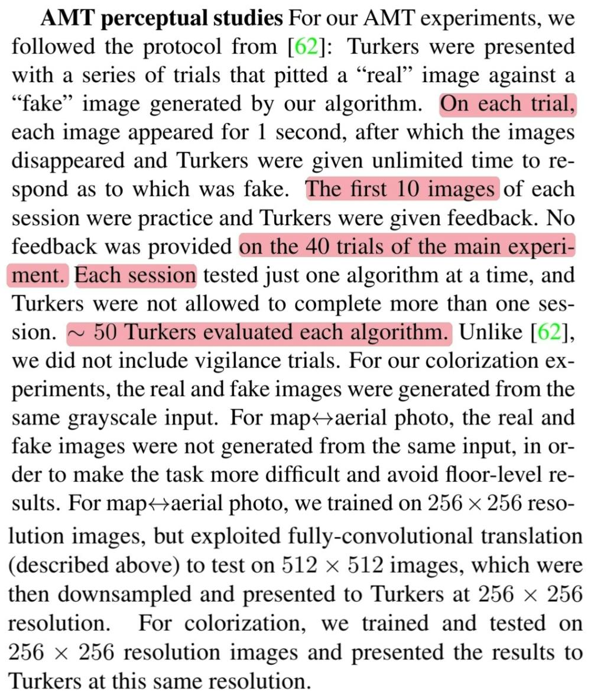{: width="400" .left}

🔎 첫 번째, real인지 fake인지 사람이 구분하기위해 AMT 실험 진행

🔎 Fake인지 real인지 구분하기 위해 하나의 fake 이미지와 하나의 real 이미지를 함께 1초동안만 보여주고 어떤 것이 fake인지 응답할 수 있는 시간이 무제한으로 주어졌습니다.

🔎 평가자들은 하나의 세션만 평가할 수 있었으며 각 세션은 서로 다른 알고리즘으로 만들어진 결과물을 비교합니다.

🔎 또한 각 세션에서 첫 10장의 이미지에 대해서는 피드백을 주는 연습 이미지이고 나머지 40장의 이미지에 대해서 평가를 진행했습니다.

{: .normal}

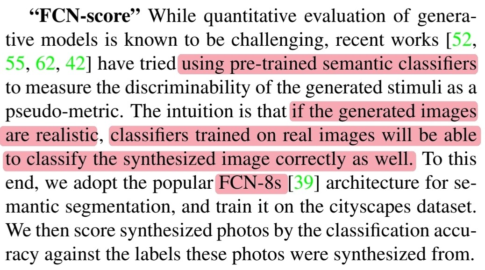{: width="400" .left}

🔎 두 번째, 만들어진 결과물이 충분히 현실적인지 측정하기위해 FCN-score 측정

🔎 만들어진 이미지가 현실적이라면 real images로 학습된 semantic classifier가 잘 분류할 수 있을 것입니다.

🔎 이러한 관점에서 semantic semgentation에서 가장 유명한 `FCN-8s`를 사용했습니다.

{: .normal}

### 4.2 Analysis of the objective function

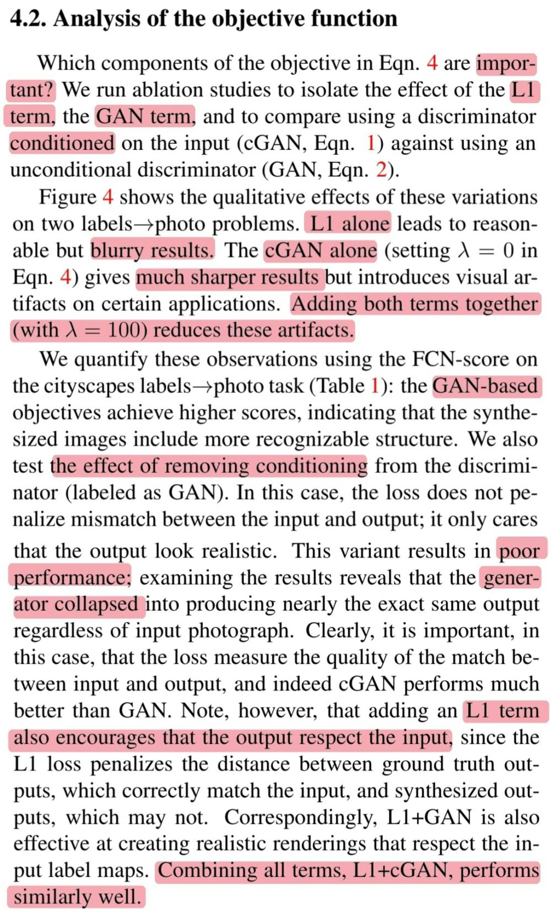{: width="400" .left}

🔎 [Figure 4](#figure-4) 결과 분석

🔎 L1 loss만 사용했을 때 : Blurry한 결과

🔎 cGANs만 사용했을 때 : L1 loss만 사용했을 때보다는 sharp한 결과이지만 몇몇 결과에서 artifacts 발견

🔎 L1 + cGANs : Artifacts를 줄임

🔎 [Table 1](#table-1) 결과 분석

🔎 L1 VS cGAN : cGAN의 성능이 더 좋음

🔎 Unconditional GANs를 사용했을 때 input 이미지와 관계없이 현실적인 이미지만을 생성하려는 경향을 보이며 input 이미지와 관련없이 같은 이미지를 생성하는 collapse 현상이 발생하는 것을 확인했습니다.

🔎 이러한 현상을 cGANs를 통해 해결할 수 있습니다.

🔎 또한 L1 loss는 예측값과 실제값의 거리에 penalty를 주기 때문에 collapse 현상을 해결할 수 있습니다.

🔎 최종적으로 cGANs + L1 loss를 통해 collapse 현상을 효과적으로 해결했습니다.

{: .normal}

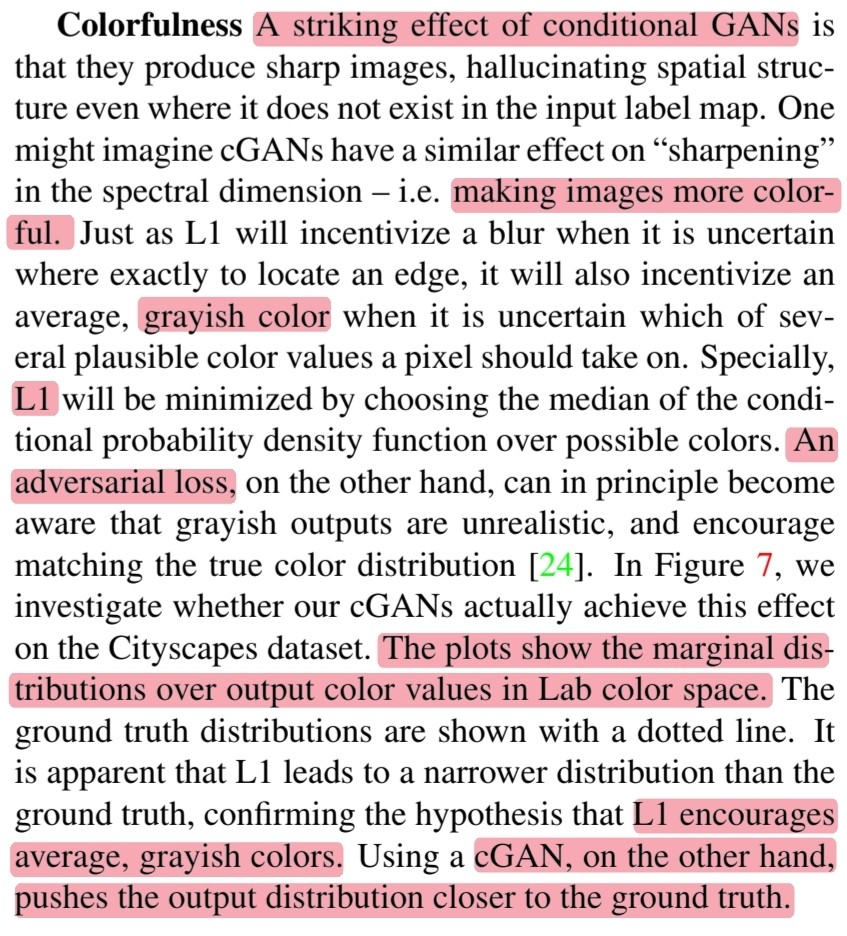{: width="400" .left}

🔎 [Figure 7](#figure-1) : 색 측면에서 L1 loss와 cGANs의 차이를 비교합니다.

🔎 L1 : Pixel이 그럴듯한 색상 중 어느 것을 선택해야할지 불확실할 때 L1 loss를 최소화하기 위해 조건부 확률밀도함수의 중앙값을 선택하게 되는데 이 때 중앙값은 회색입니다.

🔎 cGANs : 회색의 pixel은 비현실적인 것을 인식하고 실제 색상 분포와 일치하도록 하기 때문에 이미지를 더욱 colorful하게 만드는 효과를 보여줍니다.

{: .normal}

### 4.3 Analysis of the generator architecture

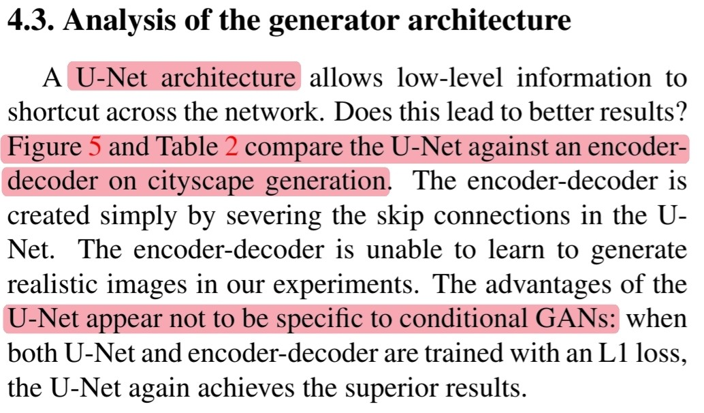{: width="400" .left}

🔎 U-Net architecture가 정말 효과적인지 실험합니다.

🔎 [Figure 5](#figure-5)에서 L1만 사용했을 때에도 U-Net architecture가 더 좋은 결과를 보여주는 것을 알 수 있습니다.

🔎 따라서 U-Net architecture가 cGANs에만 국한되는 이점은 아닌 것을 알 수 있습니다.

{: .normal}

### 4.4 From PixelGANs to Patch GANs to ImageGANs

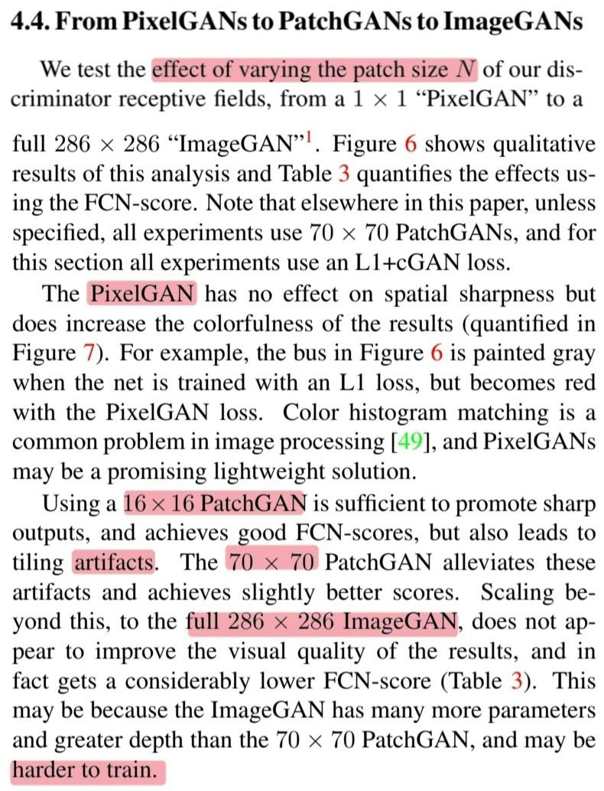{: width="400" .left}

🔎 Patch size($N$)에 따른 결과를 비교합니다.

🔎 PixelGAN($N = 1$) : No sharpness / colorful

🔎 PatchGAN($N = 16$) : Artifacts / Sharpness & Good FCN-scores

🔎 PatchGAN($N = 70$) : Artifacts 완화 / Sharpness & Good FCN-scores

🔎 ImageGAN($N = 286$) : 결과물을 직접 봐도 좋지 않음 & Bad FCN-scores / ❌

🔎 ImageGAN이 좋은 결과를 얻지 못한 이유로 증가한 parameter로 인한 어려운 학습을 이야기 했습니다.

{: .normal}

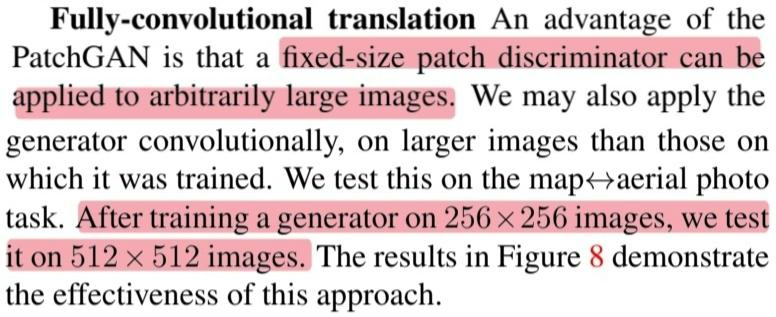{: width="400" .left}

🔎 PatchGAN의 장점은 고정된 patch size로 더 큰 이미지에 적용할 수 있는 것입니다.

🔎 $256 \times 256$인 이미지로 generator를 학습한 이후 $512 \times 512$인 이미지로 테스트를 진행한 결과를 [Figure 8](#figure-8)에서 확인할 수 있습니다.

{: .normal}

### 4.5 Perceptual validation

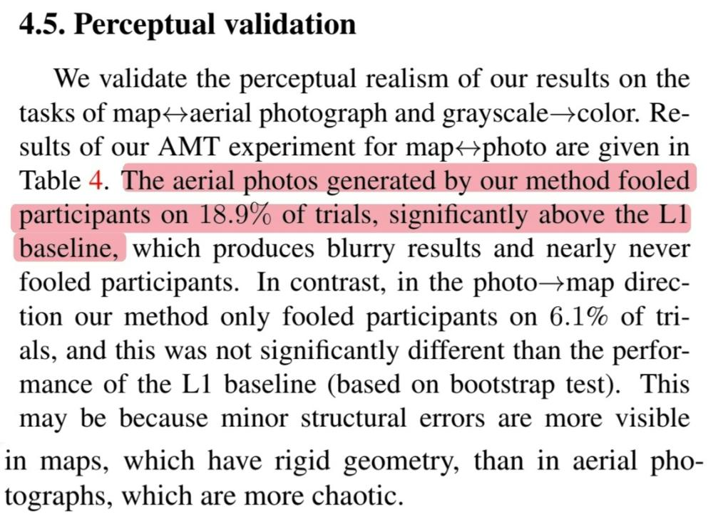{: width="400" .left}

🔎 Map $\rightarrow$ Photo에서 많은 향상을 보였지만 여전히 부족한 수치입니다.

{: .normal}

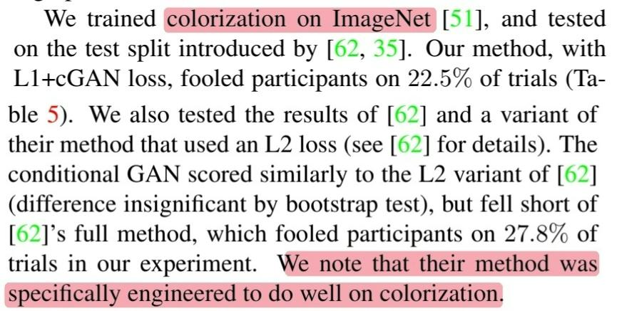{: width="400" .left}

🔎 Colorization에 대해 AMT 실험을 진행했지만 coloriation에 특화된 연구보다는 낮은 결과를 얻었습니다.

{: .normal}

### 4.6 Semantic segmentation

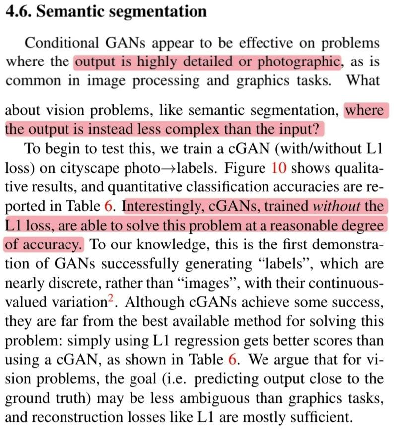{: width="400" .left}

🔎 cGANs는 output이 상세한 경우에 효과적인 것으로 나타나는데 그렇다면 output이 input보다 덜 복잡한 semantic segmentation과 같은 문제는 어떨까요?에 대해 말하고 있습니다.

🔎 L1 loss만 사용한 경우가 가장 좋은 결과를 보여주는 것을 확인했습니다. 반대로 cGANs를 같이 사용한 경우 결과값은 감소합니다.([Figure 10](#figure-10), [Table 6](#table-6))

🔎 이산적인 label를 생성한 첫 사례

{: .normal}

## Figure

### Figure 1

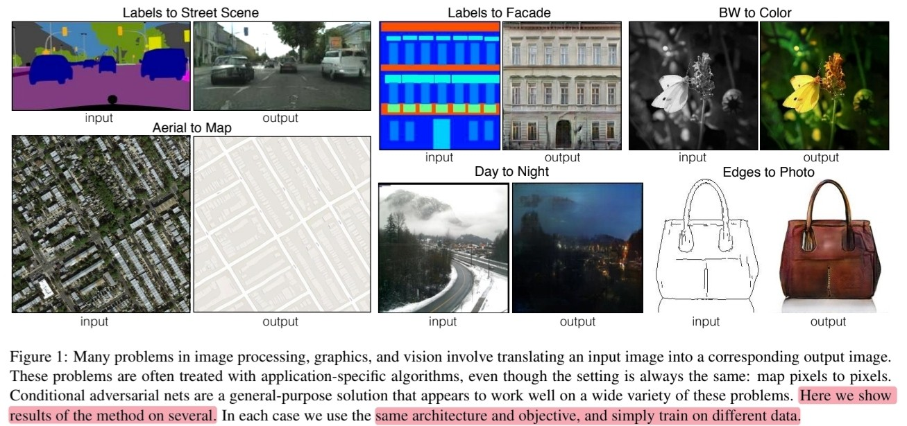{: width="400" .left}

🔎 같은 architecture, objective와 서로 다른 training data를 사용해 학습한 결과를 보여줍니다.

{: .normal}

### Figure 2

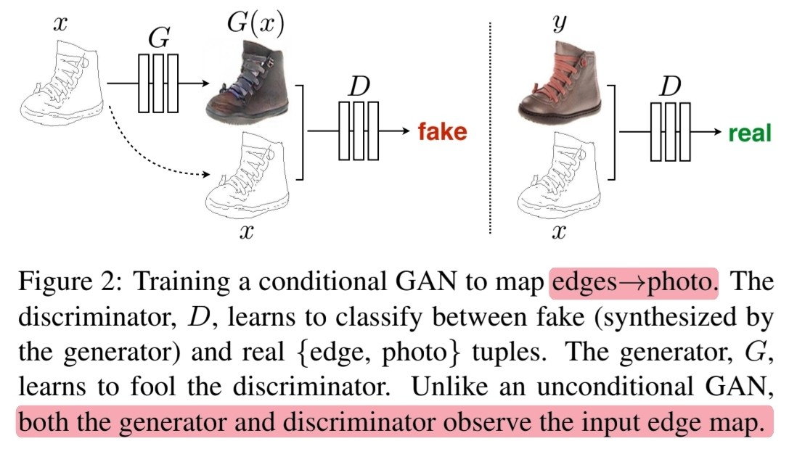{: width="400" .left}

🔎 GANs과 달리 cGANs에서는 generator와 discriminator 모두에 input image $x$가 들어가는 것을 그림으로 보여줍니다.

{: .normal}

### Figure 3

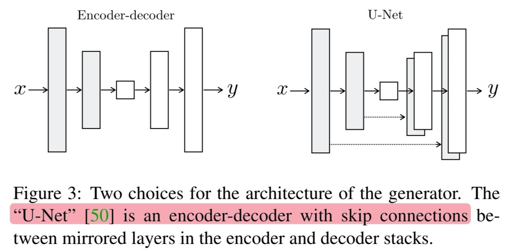{: width="400" .left}

🔎 Encoder-Decoder 구조와 U-Net 구조를 그림으로 보여줍니다.

🔎 U-Net 구조가 skip connections이 포함된 encoder-decoder 구조임을 말하고 있습니다.

{: .normal}

### Figure 4

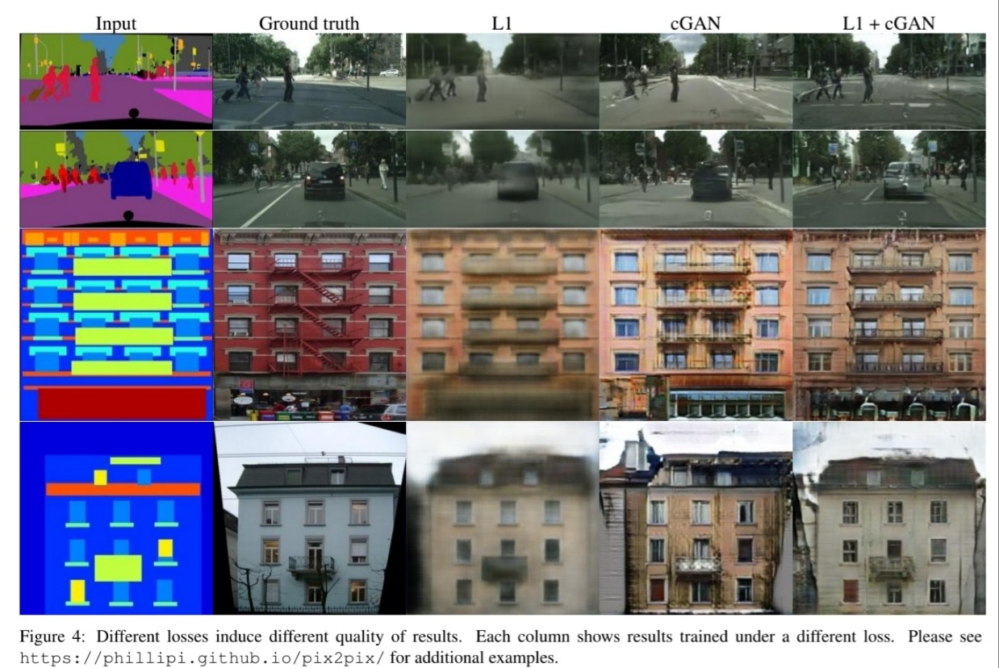{: width="400" .left}

🔎 L1 loss가 blurry한 결과를 만들어내는 것을 그림으로 보여줍니다.

{: .normal}

### Figure 5

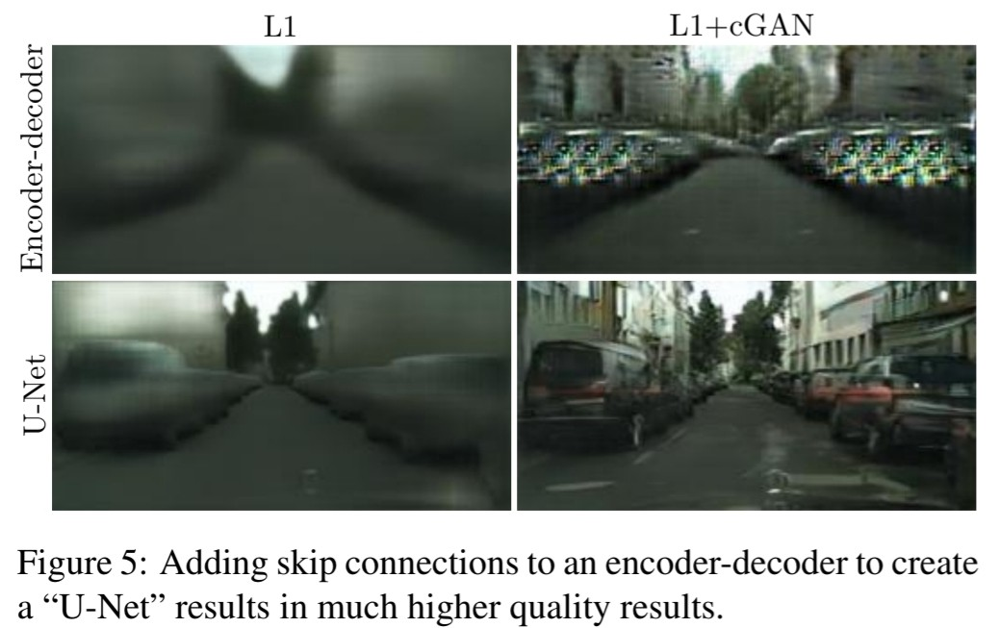{: width="400" .left}

🔎 Encoder-decoder VS U-Net architecture의 결과물을 비교합니다.

{: .normal}

### Figure 6

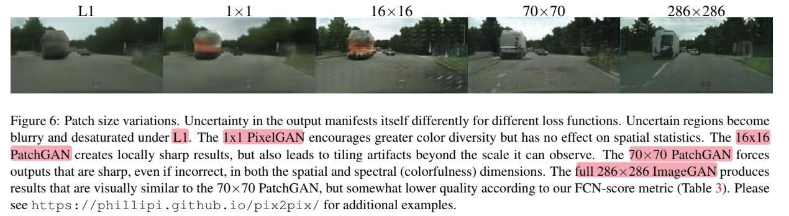{: width="400" .left}

🔎 Patch size($N$)에 따른 결과를 보여줍니다.

{: .normal}

### Figure 7

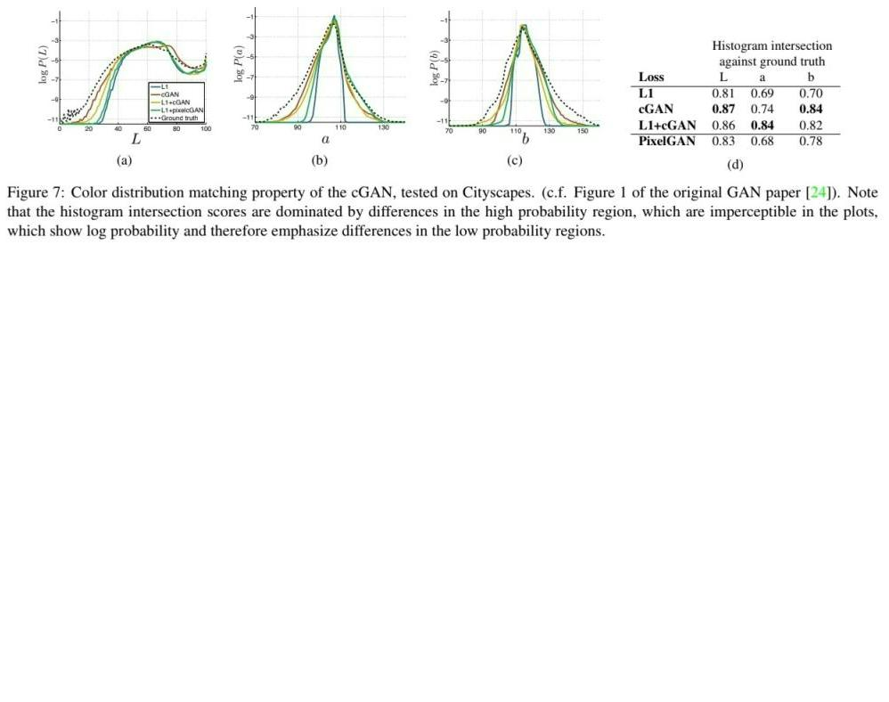{: width="400" .left}

🔎 L, a, b를 통해 색을 표현하는 것을 CIELAB라고 합니다.

🔎 L은 밝기를 나타내며 0 ~ 100의 범위를 가지고 0은 완전히 어두운 검은색, 100은 완전히 밝은 흰색을 나타냅니다.

🔎 a는 녹색에서 빨간색으로의 색상 차이를 나타내며 음수는 녹색, 양수는 빨간색, 0은 회색입니다.

🔎 b는 파란색에서 노란색으로의 색상 차이를 나타내며 음수는 파란색, 양수는 노란색, 0은 회색입니다.

{: .normal}

### Figure 8

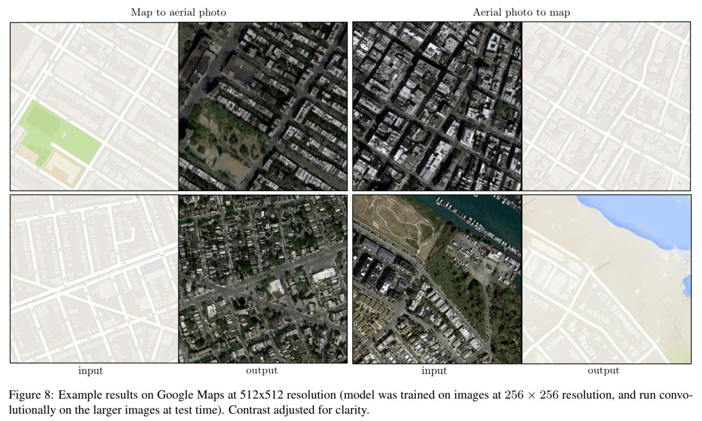{: width="400" .left}

{: .normal}

### Figure 9

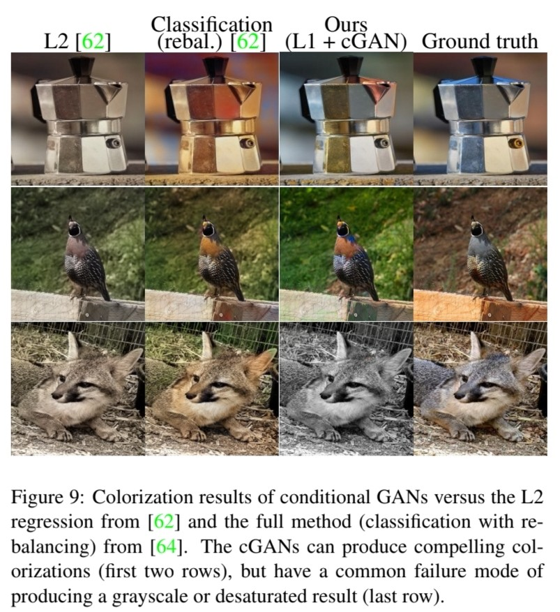{: width="400" .left}

{: .normal}

### Figure 10

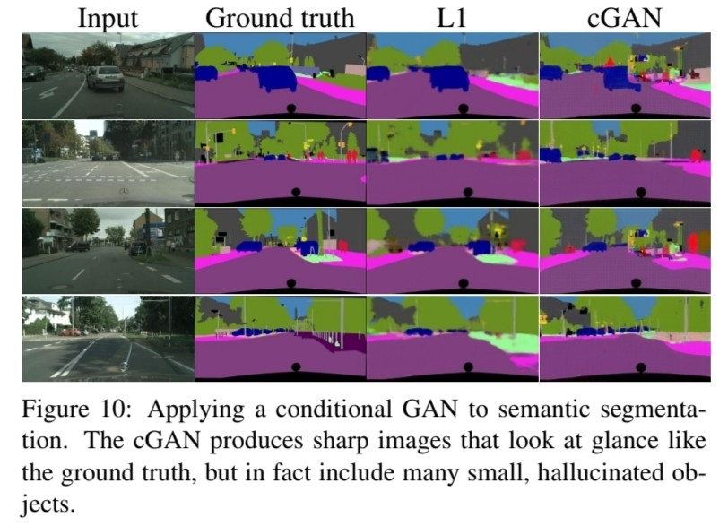{: width="400" .left}

{: .normal}

## Table

### Table 1

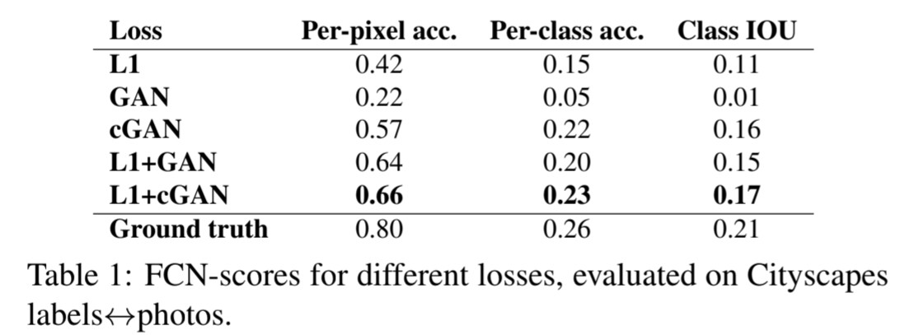{: width="400" .left}

🔎 L1 loss와 GANs, cGANs의 ablation studies의 결과를 보여줍니다.

{: .normal}

### Table 2

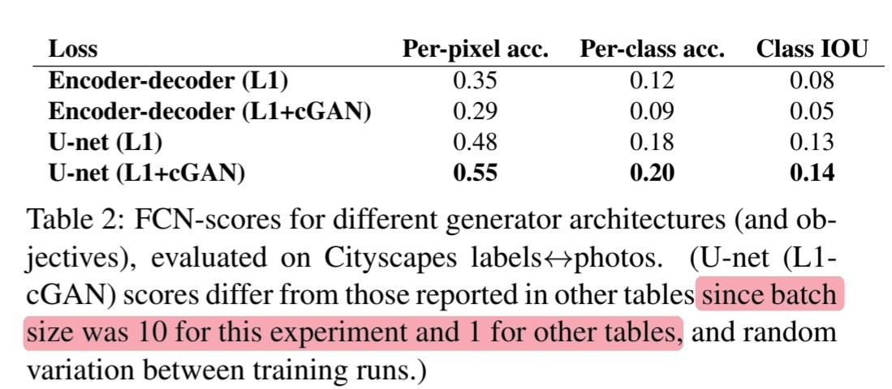{: width="400" .left}

🔎 Encoder-decoder VS U-Net architecture의 FCN-score를 비교합니다.

{: .normal}

### Table 3

{: width="400" .left}

🔎 Patch size($N$)에 따른 FCN-scores를 비교합니다.

{: .normal}

### Table 4

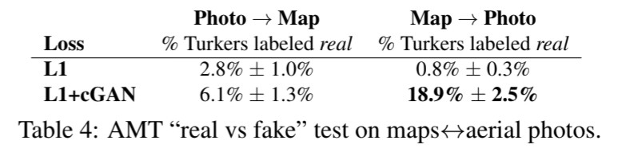{: width="400" .left}

{: .normal}

### Table 5

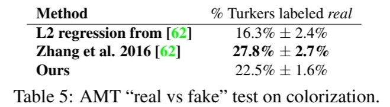{: width="400" .left}

{: .normal}

### Table 6

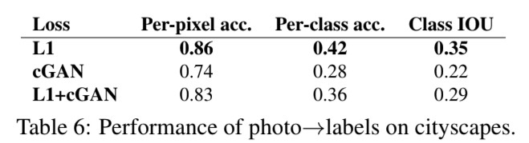{: width="400" .left}

{: .normal}
