해당 포스트에서는 [CycleGAN : Unpaired Image-to-Image Translation using Cycle-Consistent Adversarial Networks](https://arxiv.org/abs/1703.10593) 논문을 함께 읽어가도록 하겠습니다. 문장마다 해석을 하기 보다는 각 문단에서 중요한 부분을 요약하는 식으로 진행하겠습니다.

## Abstract

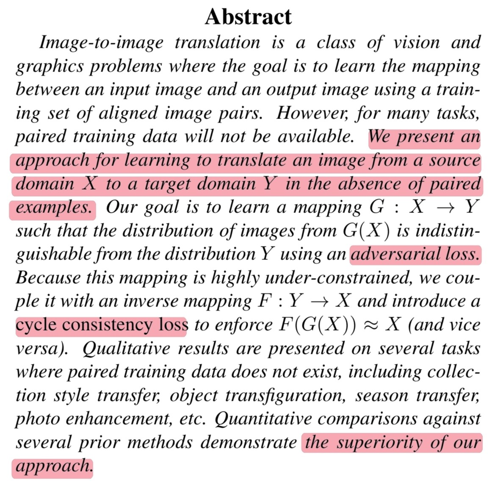{: width="400" .left}

🔎 해당 논문의 저자들은 paired examples이 없을 때 image-to-image 학습 방법을 소개합니다.

🔎 해당 논문에서의 목표는 mapping $G : X \rightarrow Y$를 adversarial loss로 학습하는 것이지만 매우 제약이 부족하기 때문에 cycle consistency loss를 추가해 $F(G(X)) \approx X$를 학습함으로써 목표를 이룹니다.

🔎 이러한 접근법은 이전 방법들과 비교했을 때 우수한 것으로 나타납니다.

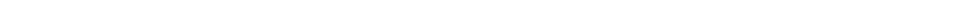{: .normal}

## 1. Introduction

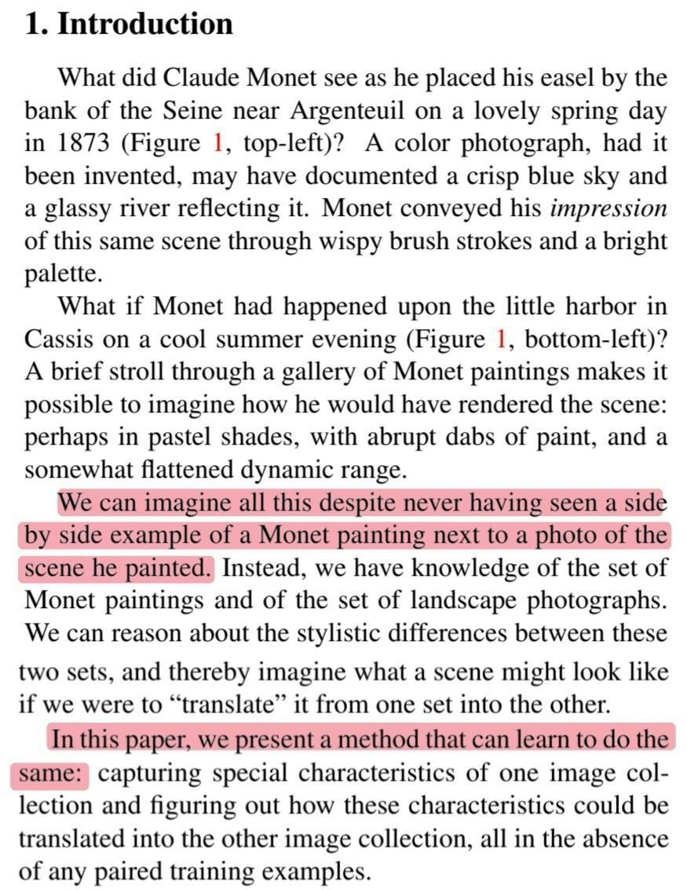{: width="400" .left}

🔎 우리는 스타일이 다른 두 그림 또는 사진의 스타일이 바뀐 결과를 본 적은 없지만 상상할 수 있습니다.

🔎 해당 논문에서는 이러한 결과를 만드는 방법에 대해 제시합니다.

{: .normal}

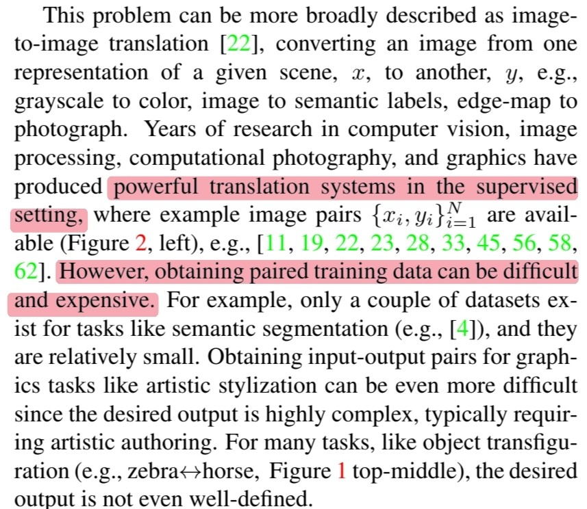{: width="400" .left}

🔎 이전의 연구들은 powerful translation system in supervised setting 입니다.

🔎 그러나 paired training data를 얻기는 쉽지 않습니다. 특히 style translation에서는 더욱 어렵습니다.

{: .normal}

{: width="400" .left}

🔎 그래서 해당 논문에서는 paired training data 없이 translation 하는 알고리즘을 소개합니다.

🔎 여기서 중요한 것은 domain 사이의 근본적인 관계가 있고 알고리즘은 그 관계를 학습하는 것입니다.

🔎 그러나 기존의 adversarial loss만 사용할 경우 unpaired training data를 학습하기 때문에 같은 output $\hat{y}$을 mapping 하는 $G$는 무한할 수 있습니다.

🔎 또한 mode collapse 현상이 더욱 잘 발생하는 것을 발견했습니다.

{: .normal}

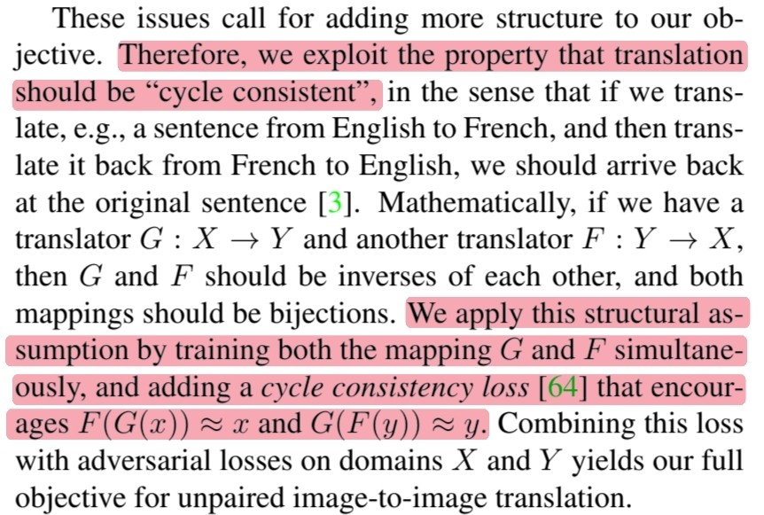{: width="400" .left}

🔎 그래서 저자들은 objective function에 무엇인가 추가를 해야만 했었고 translation의 cycle consistent 속성을 이용했습니다.

🔎 저자들은 이러한 속성을 $F(G(x)) \approx x$와 $G(F(y)) \approx y$를 강요하는 cycle consisitency loss를 objective function에 추가하여 $G$와 $F$를 동시에 학습시킴으로써 이용하고자 했습니다.

{: .normal}

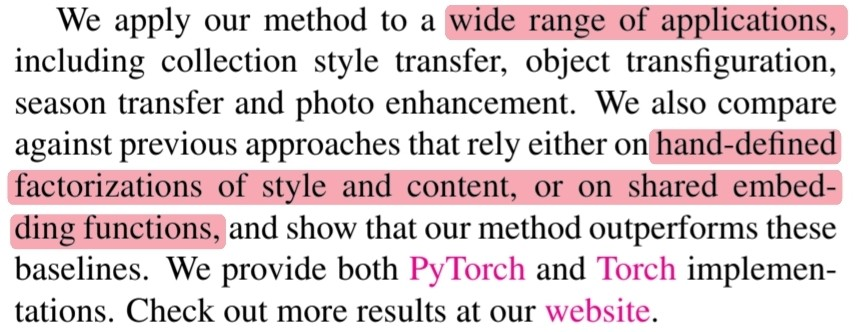{: width="400" .left}

🔎 이러한 방법은 많은 분야에 폭넓게 사용이 가능합니다.

🔎 또한 hand-defined factorizations of style and content과 shared embedding functions에 기반한 이전 연구들보다 월등히 뛰어남을 확인했습니다.

{: .normal}

## 2. Related work

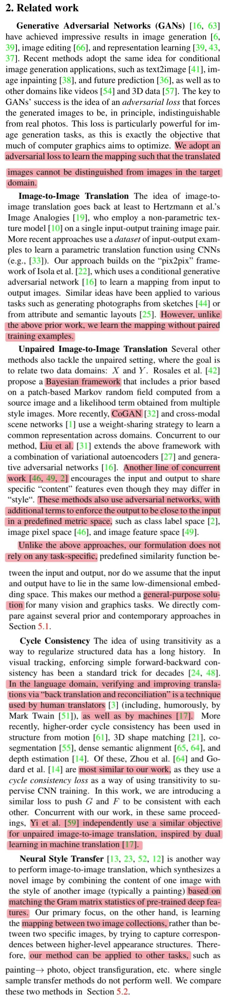{: width="400" .left}

🔎 `GANs` : 저자들은 GANs를 만들어진 이미지를 구별 못하도록 translation하는 mapping을 학습하기위해 adversarial loss를 사용합니다.

🔎 `Image-to-image translation` : 이전 연구들과 달리 paired-training data 없이 mapping을 학습합니다.

🔎 `Unpaired image-to-image translation` : Bayesian framework, CoGAN, VAE + GANs, content를 공유하도록 하는 모델이 있지만 CycleGAN은 general-purpose solution을 모델입니다.

🔎 `Cycle Consistency` : 언어 도메인에서도 자주 사용하는 방법, supervise CNN training에 cycle consistency loss를 사용한 이전 연구, 비슷한 연구인 DualGAN이 있습니다.

🔎 `Neural Style Transfer` : Gram matrix에 기반한 모델이 존재하지만 이러한 모델은 feature를 뽑아 content와 결합하는 방식이므로 다른 task에 적용하기 힘듭니다. 그러나 CycleGAN은 mapping을 학습하기 때문에 다른 task에 적용이 가능합니다.

{: .normal}

## 3. Formulation

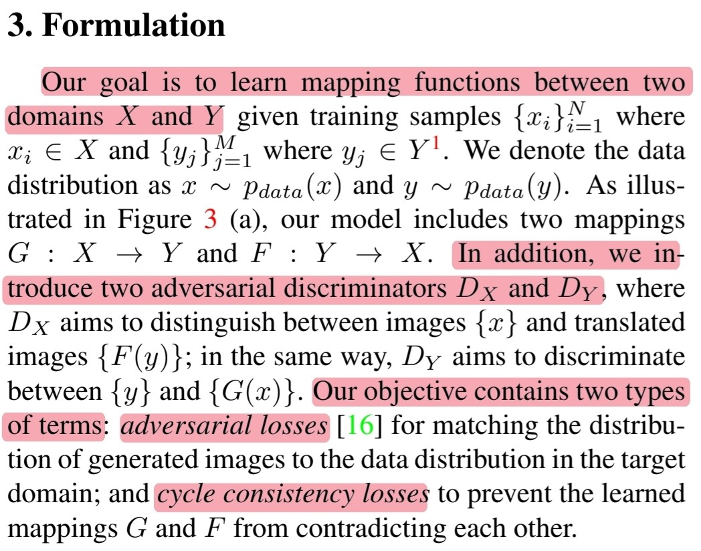{: width="400" .left}

🔎 해당 연구의 목표는 두 개의 domain $X$와 $Y$ 사이의 mapping function($G$, $F$)을 학습하는 것입니다.

🔎 해당 모델의 objective function은 두 가지 term을 포함합니다. (Adversarial loss + cycle consistency loss)

{: .normal}

### 3.1 Adversarial Loss

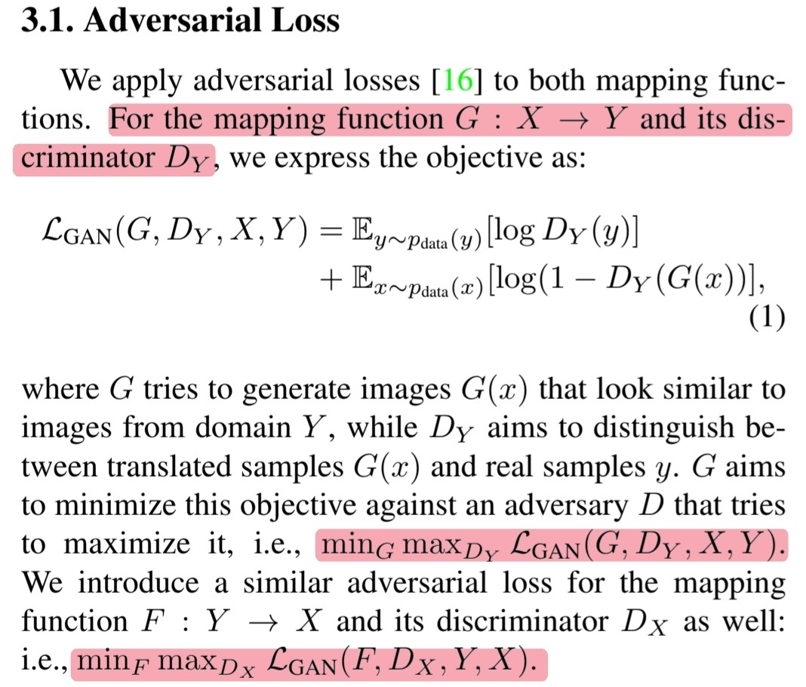{: width="400" .left}

🔎 Mapping function $G : X \rightarrow Y$와 $D_Y$를 학습하는 objective function은 아래와 같습니다.

$$\begin{align} \mathcal{L}_{GAN}(G, D_Y, X, Y) = &\mathbb{E}_{y \sim p_{data(y)}}[\log D_Y(y)]\ + \\ &\mathbb{E}_{x \sim p_{data(x)}}[\log (1 - D_Y(G(x)))] \end{align}$$

🔎 비슷하게 $F : Y \rightarrow X$를 나타낼 수 있고 $G$와 $F$를 최적화 시키기위한 식은 아래와 같습니다.

$$\text{min}_G\text{max}_{D_Y}\ \mathcal{L}_{GAN}(G, D_Y, X, Y)$$

$$\text{min}_F\text{max}_{D_X}\ \mathcal{L}_{GAN}(F, D_X, Y, X)$$

{: .normal}

### 3.2 Cycle Consistency Loss

{: width="400" .left}

🔎 Cycle consistency loss를 추가하는 이유 : Adversarial loss만 사용할 경우 $x_i$를 대응하는 $y_i$로 독립적으로 mapping한다고 보장할 수 없기 때문

🔎 Forward cycle consistency :

$$x \rightarrow G(x) \rightarrow F(G(x)) \approx x$$

🔎 Backward cycle consistency :

$$y \rightarrow F(y) \rightarrow G(F(y)) \approx y$$

🔎 Cycle consistency loss :

$$\begin{align} \mathcal{L}_{cyc}(G, F) = & \mathbb{E}_{x \sim p_{data}(x)}[||F(G(x)) - x||_1]\ + \\ & \mathbb{E}_{y \sim p_{data}(y)}[||G(F(y)) - y||_1]\end{align}$$

🔎 L1 norm을 $F(G(x))$와 $G(F(y))$의 adversarial loss로 대체했을 때 좋지 않은 결과를 얻었습니다.

{: .normal}

### 3.3 Full Objective

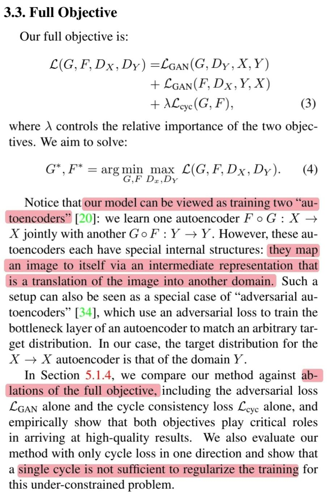{: width="400" .left}

🔎 최종적으로 CycleGAN의 objective function과 목표는 아래와 같습니다.

$$\begin{align} \mathcal{L}(G, F, D_X, D_Y) = &\mathcal{L}_{GAN}(G, D_Y, X, Y)\ + \\ &\mathcal{L}_{GAN}(F, D_X, Y, X)\ + \\ &\lambda\mathcal{L}_{cyc}(G, F) \end{align}$$

$$G^{*}, F^{*} = \text{arg}\ \underset{G, F}{\text{min}}\ \underset{D_x, D_y}{\text{max}}\ \mathcal{L}(G, F, D_X, D_Y)$$

🔎 CycleGAN을 두 개의 특별한 autoencoder를 학습한다고 볼 수 있습니다.

🔎 $F \circ G : X \rightarrow X$

🔎 $G \circ F : Y \rightarrow Y$

{: .normal}

## 4. Implementation

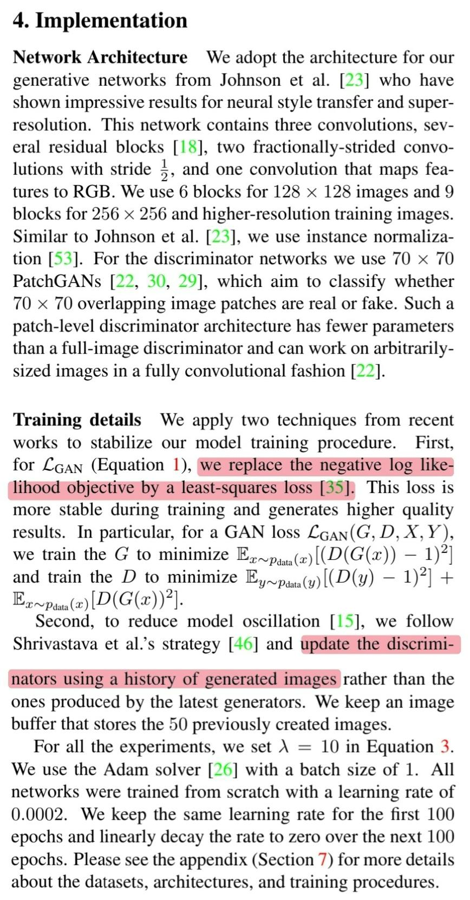{: width="400" .left}

🔎 Model training을 안정화 시키기위해 두 가지 technique을 적용합니다.

🔎 첫 번째, NLL을 least-squares loss로 변경합니다.

🔎 $\mathcal{L}_{GAN}(G, D, X, Y)$는 아래와 같이 변경됩니다.

$$G^{*} = \underset{G}{\text{min}}\ \mathbb{E}_{x\sim p_{data}(x)}[(D(G(x)) - 1)^2]$$

$$\begin{align} D^{*} = \underset{G}{\text{min}}\ &\mathbb{E}_{y\sim p_{data}(y)}[(D(y) - 1)^2]\ + \\ &\mathbb{E}_{x\sim p_{data}(x)}[D(G(x))^2]\end{align}$$

🔎 두 번째, 모델의 osillation을 줄이기 위해 SimGAN의 전략인 이전에 만들어진 이미지 중 랜덤하게 뽑아 discriminator를 update하는 방법을 사용합니다.

{: .normal}

## 5. Results

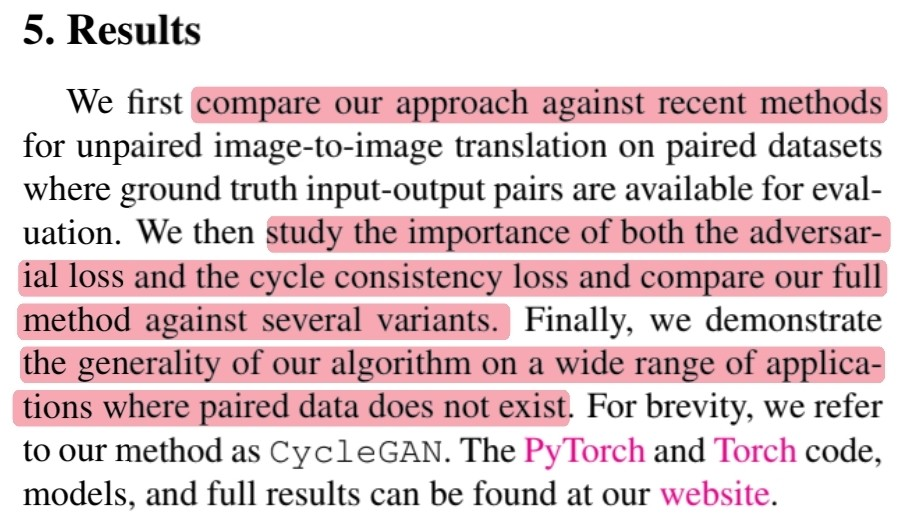{: width="400" .left}

🔎 첫 번째, 최근 연구들과 CycleGAN을 비교합니다.

🔎 두 번째, Ablations of the full objective를 통해 각 term의 중요성을 파악합니다.

🔎 세 번째, paired training data가 없을 때 넓게 적용될 수 있는 application임을 확인합니다.

{: .normal}

### 5.1 Evaluation

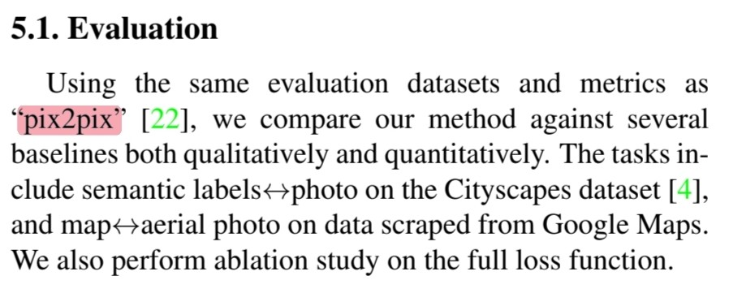{: width="400" .left}

🔎 Pix2Pix에서 사용한 evaluation datasets와 metrics를 사용합니다.

{: .normal}

#### 5.1.1 Evaluation Metrics

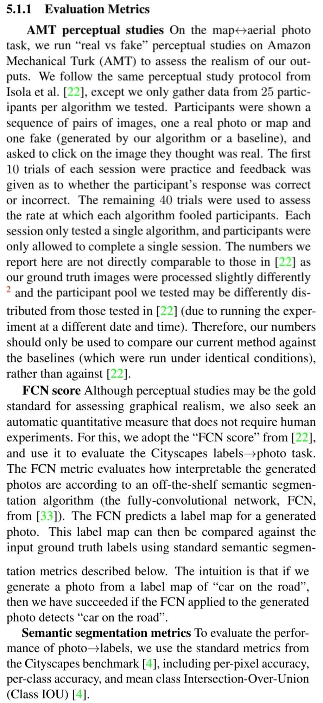{: width="400" .left}

🔎 `AMT perceptual studies`

🔎 `FCN score`를 통해 수치적으로 이미지의 품질이 좋은지 확인

{: .normal}

#### 5.1.2 Baselines

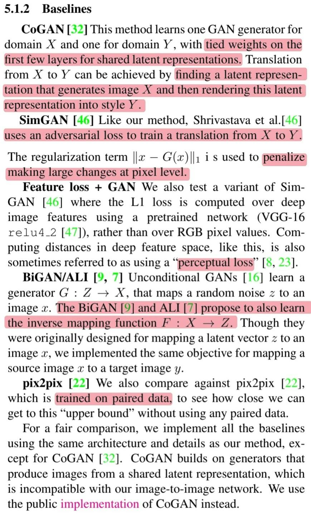{: width="400" .left}

🔎 `CoGAN` : Domain $X$를 학습하는 generator와 domain $Y$를 학습하는 generator는 latent representation을 위한 처음 몇 개의 layer가 연결된 상태로 학습을 진행합니다.

🔎 $X$에서 $Y$로 translation을 할 때 $X$를 생성하는 latent representation을 찾은 다음 찾은 latent representation을 style $Y$로 rendering 하면 됩니다.

🔎 `SimGAN` : CycleGAN처럼 $X \rightarrow Y$를 학습하기위해 adeversarial loss를 사용했습니다.

🔎 추가적으로 pixel level에서의 regularization term을 추가했습니다.

🔎 `Perceptual loss` : Deep feature space에서의 거리를 비교

🔎 `BiGAN / ALI` : Image-to-image가 아닌 latent vector-to-image를 학습합니다.

🔎 `Pix2Pix` : CycleGAN과 달리 paired data를 학습 data로 사용합니다.

{: .normal}

#### 5.1.3 Comparison against baselines

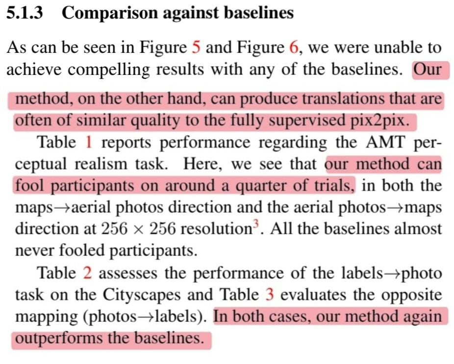{: width="400" .left}

🔎 모든 baseline에서 만족할만한 결과를 얻지 못했지만 CycleGAN은 좋은 결과를 얻었으며 종종 supervised pix2pix와 견줄만한 결과를 얻을 수 있었습니다.

🔎 `AMT` : Baseline보다 많은 사람들을 속였습니다.

🔎 `FCN-scores` : Pix2Pix를 넘기는 쉽지 않았지만 나머지 baseline에 대해서는 매우 좋은 결과를 얻었습니다.

{: .normal}

#### 5.1.4 Analysis of the loss function

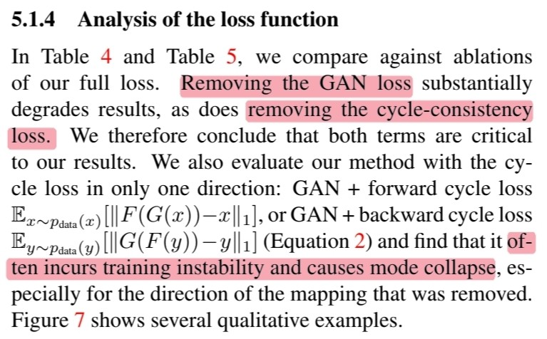{: width="400" .left}

🔎 Cycle consistency loss만 사용했을 때 그리고 adversarial loss만 사용했을 때 매우 안좋은 결과를 얻었기 때문에 두 term은 CycleGAN에서 매우 중요한 term인 것을 알 수 있습니다.

🔎 One cycle consistency loss를 사용해 실험했을 때 학습 불안정성으로 인해 mode collapse 현상이 나타났습니다.

{: .normal}

#### 5.1.5 Image reconstruction quality

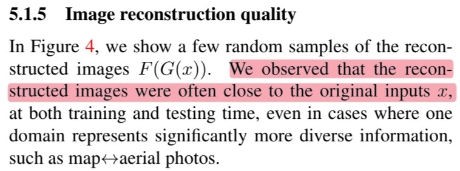{: width="400" .left}

🔎 Reconstructed image가 종종 original image $x$와 비슷한 것을 발견할 수 있었습니다.

🤔 대부분의 reconstructed image는 original image와 다를 것으로 예상합니다.

{: .normal}

### 5.2 Applications

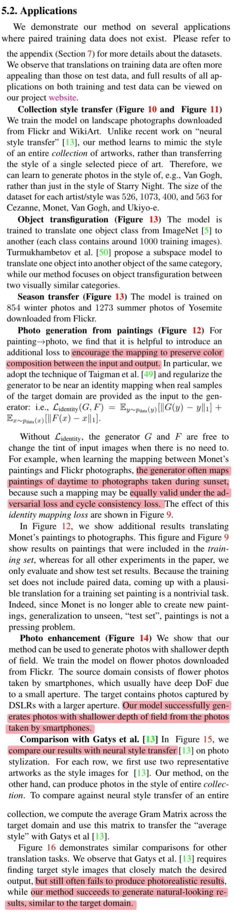{: width="400" .left}

🔎 `Collection style transfer` : 서로 다른 화가의 작품

🔎 `Object transfiguration` : 말과 얼룩말

🔎 `Season transfer` : 여름과 겨울

🔎 `Photo generation from paintings` : 사진과 화가의 작품

🔎 CycleGAN은 collection을 학습하기 때문에 낮인 이미지를 넣어도 일몰의 이미지가 결과로 나올 수 있다. 하지만, 해당 task의 경우 같은 색감을 유지해야 하므로 $\mathcal{L}_{identity}(G, F)$을 사용합니다.

$$\begin{align} \mathcal{L}_{identity}(G, F) = &\mathbb{E}_{y \sim p_{data}(y)}[||G(y) - y||_1]\ + \\ &\mathbb{E}_{x \sim p_{data}(x)}[||F(x) - x||_1] \end{align}$$

🔎 `Photo enhancement` : 물체 강조

🔎 `Comparison with Gatys et al.` : Neural style transfer와 비교

🔎 Neural style transfer는 종종 실패한 결과물을 만들지만 CycleGAN은 target domain과 유사한 결과물을 만듭니다.

{: .normal}

## 6. Limitations and Discussion

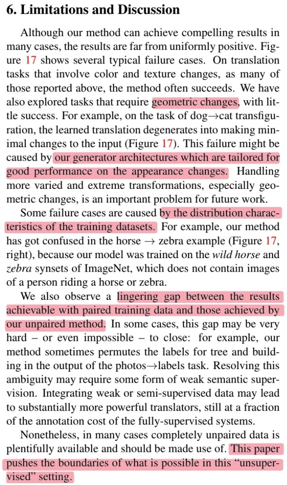{: width="400" .left}

🔎 설득력 있는 결과를 얻기는 했지만 여전히 부족한 부분이 있습니다.

🔎 `Geometric` : 개와 고양이 같이 기하학적으로 다른 형태를 띄는 object를 translation 할 때 좋지 않은 결과를 보이는데 이것은 외관을 변경하는데 좋은 성능을 보인 generator architecture를 사용했기 때문일 수 있습니다.

🔎 `Ditribution of training data` : 말과 얼룩말에 대해서 학습한 경우 test image로 말을 타고 있는 사람의 이미지를 보여주면 사람까지 얼룩말로 바꿔버리는 결과를 초래합니다. 왜냐하면 training data에는 그러한 이미지가 존재하지 않았기 때문입니다.

🔎 `Supervised VS Unsupervised` : 여전한 gap이 존재하지만 semi-supervised data를 사용한다면 supervised보다 적은 비용으로 비슷한 결과를 얻을 수 있습니다.

{: .normal}
