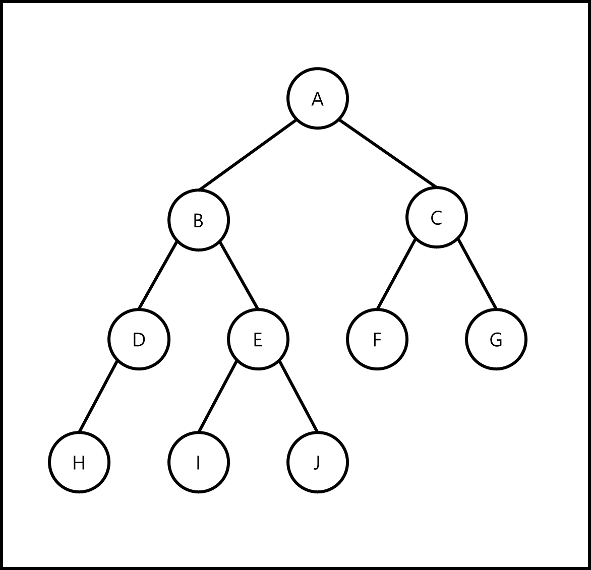
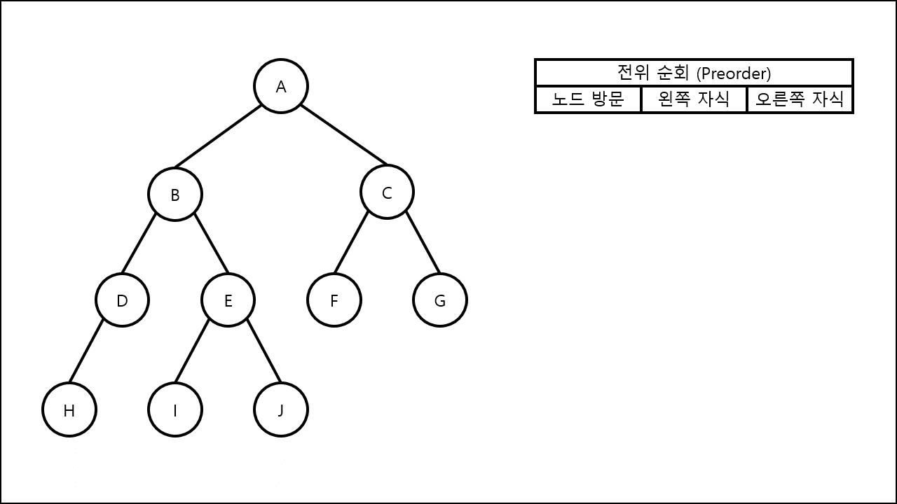
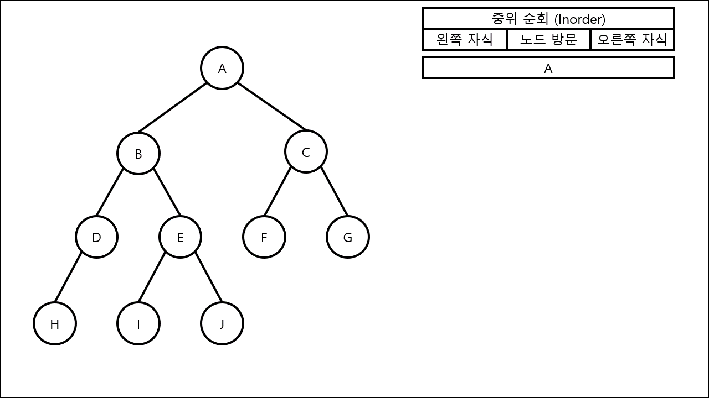

Python에서 Order Tree를 탐색하는 방법은 DFS와 BFS 크게 2가지로 나눌 수 있습니다. 이번에는 그 중 DFS로 대표되는 3가지 방법에 대해서 알아볼 것입니다.

---

- Tree 자료구조를 탐색하는 방법을 알아보기 위해 앞으로 사용할 그래프를 먼저 설정

{: class="align-center"}

- Tree 구조를 Dictionary로 표현

  ```python
  tree = {'A' : ['B', 'C'],
          'B' : ['D', 'E'],
          'C' : ['F', 'G'],
          'D' : ['H', None],
          'E' : ['I', 'J'],
          'F' : [None, None],
          'G' : [None, None],
          'H' : [None, None],
          'I' : [None, None],
          'J' : [None, None]}
  ```

1. 전위 순회(Preorder)

- 전위 순회는 **노드 방문 → 왼쪽 자식 → 오른쪽 자식** 순서로 Tree 구조를 스캔합니다.
  {: class="align-center"}

  ```python
  def preorder(node):
      if node != None:
          print(node, end = '  ')
          preorder(tree[node][0])
          preorder(tree[node][1])
  ```

2. 중위 순회(Inorder)

- 중위 순회는 **왼쪽 자식 → 노드 방문 → 오른쪽 자식** 순서로 Tree 구조를 스캔합니다.
  {: class="align-center"}

  ```python
  def inorder(node):
      if node != None:
          preorder(tree[node][0])
          print(node, end = '  ')
          preorder(tree[node][1])
  ```

3. 후위 순회(Postorder)

- 전위 순회는 **왼쪽 자식 → 오른쪽 자식 → 노드 방문** 순서로 Tree 구조를 스캔합니다.
  {: class="align-center"}

  ```python
  def postorder(node):
      if node != None:
          preorder(tree[node][0])
          preorder(tree[node][1])
          print(node, end = '  ')
  ```
